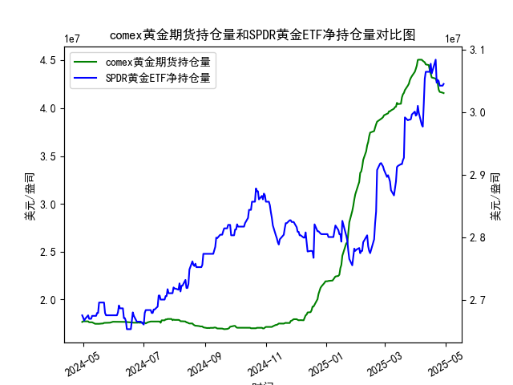

|            |   comex黄金期货持仓量 |   SPDR黄金ETF净持仓量 |
|:-----------|----------------------:|----------------------:|
| 2025-04-01 |           4.41117e+07 |           2.99444e+07 |
| 2025-04-02 |           4.4464e+07  |           2.99628e+07 |
| 2025-04-03 |           4.50467e+07 |           3.01012e+07 |
| 2025-04-04 |           4.50717e+07 |           2.99905e+07 |
| 2025-04-07 |           4.50642e+07 |           2.97969e+07 |
| 2025-04-08 |           4.49537e+07 |           2.97692e+07 |
| 2025-04-09 |           4.4872e+07  |           3.01284e+07 |
| 2025-04-10 |           4.47928e+07 |           3.05341e+07 |
| 2025-04-11 |           4.4576e+07  |           3.06448e+07 |
| 2025-04-14 |           4.45116e+07 |           3.06448e+07 |
| 2025-04-15 |           4.40124e+07 |           3.06448e+07 |
| 2025-04-16 |           4.36175e+07 |           3.07739e+07 |
| 2025-04-17 |           4.32097e+07 |           3.06171e+07 |
| 2025-04-21 |           4.30949e+07 |           3.08384e+07 |
| 2025-04-22 |           4.28033e+07 |           3.04696e+07 |
| 2025-04-23 |           4.26341e+07 |           3.05157e+07 |
| 2025-04-24 |           4.19499e+07 |           3.04973e+07 |
| 2025-04-25 |           4.17059e+07 |           3.04235e+07 |
| 2025-04-28 |           4.16197e+07 |           3.04235e+07 |
| 2025-04-29 |           4.15776e+07 |           3.04512e+07 |

### 问题1：MSCI新兴市场指数和铜价相关性及影响逻辑

#### 相关性
MSCI新兴市场指数与铜价呈现**正相关性**，尤其在长期趋势中较为显著。新兴市场国家（如中国、印度、巴西等）是铜的主要消费国（占全球需求的60%以上），其经济增长直接影响铜的工业需求。MSCI新兴市场指数作为衡量这些国家股市表现的指标，与铜价共同受到以下逻辑驱动：

1. **需求驱动逻辑**  
   - **基建与制造业周期**：新兴市场的工业化、城市化进程需要大量铜用于电力、建筑和制造业。当MSCI指数因经济扩张预期上涨时，铜需求同步上升，推高铜价。
   - **出口导向型经济**：新兴市场的出口增长（如中国机电产品出口）依赖铜作为原材料，经济活跃度与铜价形成正向反馈。

2. **金融属性联动**  
   - **美元与通胀预期**：铜以美元计价，而新兴市场指数对美元汇率敏感。美元走弱时，新兴市场资产吸引力上升（MSCI指数上涨），同时铜价因计价货币贬值而上涨。
   - **全球流动性周期**：美联储宽松政策会同时提振新兴市场风险偏好（推动股市）和大宗商品价格。

3. **产业链传导**  
   - 铜价上涨可能反映工业活动回暖，提升矿业公司盈利预期，推动MSCI指数中资源类股票表现，反之亦然。

4. **宏观周期同步性**  
   全球经济复苏期，新兴市场增长预期增强（MSCI指数上涨），叠加补库周期，铜的供需缺口扩大，价格走强。

---

### 问题2：近期投资或套利机会与策略分析

#### 1. **黄金市场潜在机会**
基于提供的COMEX黄金期货和SPDR黄金ETF持仓数据：
- **持仓趋势**：COMEX黄金期货持仓量近期显著攀升（如数据末端的41.1万手至4380万盎司），SPDR ETF净持仓则呈现震荡（如从2907万盎司降至3045万盎司）。**持仓分化**可能反映短期投机资金（期货）与长期配置资金（ETF）对金价分歧。
- **策略建议**：
  - **多头策略**：若通胀预期回升或地缘风险升温，可押注COMEX持仓增长驱动的短期金价反弹。
  - **跨期套利**：关注近远月合约价差，若库存紧张导致近月升水，可做多近月、做空远月。
  - **期现套利**：若期货溢价（Contango）扩大，可卖期货、买ETF现货锁定价差。

#### 2. **铜与新兴市场联动机会**
- **宏观背景**：美联储加息尾声下，美元走弱或支撑铜价，同时新兴市场股市估值修复（MSCI指数反弹）可能预示铜需求回暖。
- **策略建议**：
  - **多铜空铝**：铜的金融属性强于铝，在流动性宽松周期中更具弹性。
  - **股票-商品对冲**：做多MSCI新兴市场指数中的矿业股（如Freeport-McMoRan），同时做空铜期货对冲商品波动风险。

#### 3. **黄金与铜的比值套利**
- **当前背景**：黄金/铜比价处于历史中高位（约0.2-0.25），若经济复苏预期强化，铜价涨幅可能超越黄金。
- **策略建议**：做空黄金/铜比价（即买铜、卖黄金），需结合工业PMI和美联储政策信号择机入场。

---

### 总结
- **核心逻辑**：新兴市场复苏与全球流动性转向是当前主线，铜的工业属性或阶段性超越黄金的避险属性。
- **风险提示**：需警惕美国经济“软着陆”证伪或新兴市场债务风险引发的流动性冲击。