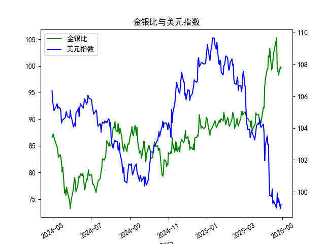

|            |    金价 |   银价 |   美元指数 |   金银比 |
|:-----------|--------:|-------:|-----------:|---------:|
| 2025-03-31 | 3115.1  | 34.055 |   104.192  |  91.4726 |
| 2025-04-01 | 3133.7  | 33.97  |   104.226  |  92.249  |
| 2025-04-02 | 3119.75 | 33.87  |   103.661  |  92.1095 |
| 2025-04-03 | 3118.1  | 32.475 |   101.945  |  96.0154 |
| 2025-04-04 | 3054.5  | 31.34  |   102.919  |  97.4633 |
| 2025-04-07 | 3014.75 | 30.325 |   103.501  |  99.4147 |
| 2025-04-08 | 3015.4  | 30.315 |   102.956  |  99.4689 |
| 2025-04-09 | 3075.5  | 30.18  |   102.971  | 101.905  |
| 2025-04-10 | 3143.15 | 30.925 |   100.937  | 101.638  |
| 2025-04-11 | 3230.5  | 31.27  |    99.769  | 103.31   |
| 2025-04-14 | 3204.2  | 32.275 |    99.692  |  99.2781 |
| 2025-04-15 | 3219.6  | 32.31  |   100.167  |  99.6472 |
| 2025-04-16 | 3322.9  | 32.955 |    99.2667 | 100.831  |
| 2025-04-17 | 3305.65 | 32.31  |    99.424  | 102.31   |
| 2025-04-22 | 3433.55 | 32.61  |    98.9757 | 105.291  |
| 2025-04-23 | 3262.95 | 32.96  |    99.9096 |  98.9973 |
| 2025-04-24 | 3314.75 | 33.395 |    99.288  |  99.2589 |
| 2025-04-25 | 3277.3  | 33.335 |    99.5836 |  98.3141 |
| 2025-04-28 | 3296.3  | 33.01  |    98.9357 |  99.8576 |
| 2025-04-29 | 3305.05 | 33.225 |    99.21   |  99.4748 |

### 金银比与美元指数的相关性及影响逻辑

#### 1. 相关性分析
金银比（黄金价格/白银价格）与美元指数（DXY）通常呈现**负相关性**。从历史数据来看：
- **美元走强时**，金银比倾向于扩大。因为美元作为全球储备货币，其升值会压制以美元计价的黄金和白银价格，但白银的工业属性更强，其价格对经济周期更敏感，在美元强势时可能跌幅更大，导致金银比上升。
- **美元走弱时**，金银比可能收窄。美元贬值会推动贵金属整体上涨，而白银因兼具避险和工业需求，反弹力度可能超过黄金，导致金银比下降。

#### 2. 影响逻辑
- **定价机制**：黄金和白银均以美元计价，美元指数上涨直接提高非美投资者持有成本，抑制需求。
- **避险属性差异**：黄金的货币属性更强，受地缘风险和货币宽松政策驱动；白银则与工业需求（如新能源、光伏）挂钩，经济复苏期表现更优。
- **利率与通胀预期**：美元走强常伴随美联储加息预期，实际利率上升压制黄金，而白银可能因经济前景改善获得支撑，导致金银比扩大。

---

### 近期投资或套利机会分析

#### 1. 当前市场信号
- **金银比高位震荡**：近一年金银比从约86升至最高101以上，近期回落至90-100区间，处于历史高位（长期均值约60-80）。
- **美元指数回调**：美元指数从114（2022年高点）回落至近期103-108区间，短期呈现震荡偏弱。

#### 2. 潜在策略
**机会一：做空金银比（多白银/空黄金）**
- **逻辑**：若美元指数延续回调，叠加工业需求回暖（如新能源政策刺激），白银可能跑赢黄金。当前金银比接近100，存在均值回归动力。
- **操作**：买入白银期货/ETF，同时等值做空黄金期货/ETF，目标金银比回落至85-90区间。

**机会二：美元弱势下的贵金属多头**
- **逻辑**：若美联储加息周期结束或降息预期升温，美元可能进一步走弱，推动金银同步上涨。白银因低库存和工业需求弹性更大。
- **操作**：直接做多白银期货或ETF（如SLV），或配置黄金（如GLD）对冲尾部风险。

**机会三：跨期套利**
- **逻辑**：观察金银比短期波动规律（如近期日内高频震荡），利用期货合约价差进行区间操作。
- **操作**：在金银比突破100时做空，跌破90时平仓；结合美元指数技术支撑/压力位（如103和108）动态调整仓位。

#### 3. 风险提示
- **美元反弹风险**：若美国经济数据超预期或地缘风险推升避险需求，美元可能短期走强，压制贵金属。
- **工业需求不及预期**：白银对光伏/电子产业链依赖度高，需关注全球制造业PMI及新能源政策落地进度。
- **流动性冲击**：极端行情下金银比可能继续偏离均值，需设置止损（如金银比突破105时止损空头仓位）。

---

### 总结
当前金银比与美元指数的背离（金银比高位+美元震荡）提供了均值回归的交易窗口。优先关注做空金银比的套利机会，并密切跟踪美联储政策转向信号及工业金属需求变化。风险控制上需结合技术面关键点位（如美元指数105、金银比95）动态调整仓位。