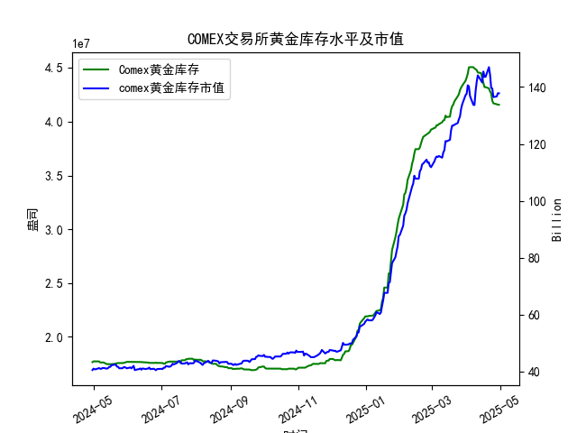

|            |   comex黄金库存量 |   comex黄金库存市值(billion) |   伦敦金现货价 |   上海金交所黄金现货价 |   美元兑人民币汇率 |
|:-----------|------------------:|-----------------------------:|---------------:|-----------------------:|-------------------:|
| 2025-04-03 |       4.50467e+07 |                       3112.6 |        3118.1  |                 738.94 |             7.1889 |
| 2025-04-04 |       4.50717e+07 |                       3035.6 |        3054.5  |                 738.94 |             7.1889 |
| 2025-04-07 |       4.50642e+07 |                       2968   |        3014.75 |                 713.98 |             7.198  |
| 2025-04-08 |       4.49537e+07 |                       2973.3 |        3015.4  |                 717.5  |             7.2038 |
| 2025-04-09 |       4.4872e+07  |                       3087.2 |        3075.5  |                 728.88 |             7.2066 |
| 2025-04-10 |       4.47928e+07 |                       3166   |        3143.15 |                 741.26 |             7.2092 |
| 2025-04-11 |       4.4576e+07  |                       3233   |        3230.5  |                 757.1  |             7.2087 |
| 2025-04-14 |       4.45116e+07 |                       3195   |        3204.2  |                 762.47 |             7.211  |
| 2025-04-15 |       4.40124e+07 |                       3216.5 |        3219.6  |                 762.9  |             7.2096 |
| 2025-04-16 |       4.36175e+07 |                       3334.3 |        3322.9  |                 781.62 |             7.2133 |
| 2025-04-17 |       4.32097e+07 |                       3323.1 |        3305.65 |                 786    |             7.2085 |
| 2025-04-18 |       4.32097e+07 |                       3323.1 |        3305.65 |                 788.62 |             7.2069 |
| 2025-04-21 |       4.30949e+07 |                       3411.1 |        3305.65 |                 804.11 |             7.2055 |
| 2025-04-22 |       4.28033e+07 |                       3371.6 |        3433.55 |                 825.8  |             7.2074 |
| 2025-04-23 |       4.26341e+07 |                       3276.9 |        3262.95 |                 786.99 |             7.2116 |
| 2025-04-24 |       4.19499e+07 |                       3325.5 |        3314.75 |                 792.47 |             7.2098 |
| 2025-04-25 |       4.17059e+07 |                       3272.2 |        3277.3  |                 785.6  |             7.2066 |
| 2025-04-28 |       4.16197e+07 |                       3284.5 |        3296.3  |                 778.4  |             7.2043 |
| 2025-04-29 |       4.15776e+07 |                       3314.5 |        3305.05 |                 780.05 |             7.2029 |
| 2025-04-30 |       4.15776e+07 |                       3314.5 |        3305.05 |                 780.05 |             7.2014 |

### 近期COMEX黄金库存与套利机会分析

#### 1. **COMEX库存变化趋势**
- **整体趋势**：近一年COMEX黄金库存从1.76e+07（2024年4月）飙升至4.16e+07（2025年4月），增幅超135%，但**最近一个月（2025年3月底至4月底）库存连续下降**，从4.19e+07降至4.16e+07（降幅0.7%），显示短期供应端收缩信号。
- **关键节点**：  
  - 2025-04-24至04-30：库存从4.19e+07降至4.16e+07（降幅0.8%），为近一个月最大单周降幅。  
  - 与伦敦/上海金价对比：同期伦敦金价从3314.75→3305.05美元/盎司，上海金价从792.47→780.05元/克，显示**库存下降未直接推升金价**，但需关注市场情绪滞后效应。

#### 2. **跨市场价差套利机会**
- **伦敦vs上海（汇率调整后）**：  
  - **最新价差（2025-04-30）**：  
    - 伦敦金价：3305.05美元/盎司 → 人民币计价为 **3305.05 × 7.2014（汇率） ÷ 31.1035（克/盎司） ≈ 765.6元/克**  
    - 上海金价：780.05元/克  
    - **价差：780.05 - 765.6 = 14.45元/克**（扣除交易/运输成本后仍具套利空间）。  
  - **趋势**：近一个月价差从23.77元/克（04-24）收窄至14.45元/克（04-30），反映套利活动可能已部分平抑价差，但需持续监测。

- **策略建议**：  
  - **正向套利**：买入伦敦现货黄金，同时在上海市场卖出等量合约，锁定约10-15元/克利润（需考虑约5-8元/克的物流及交割成本）。  
  - **风险对冲**：通过外汇远期合约锁定美元兑人民币汇率，避免人民币波动侵蚀利润。

#### 3. **库存下降与期现结构联动**
- **COMEX库存与市值关系**：  
  - 近一个月库存下降0.7%，但黄金市值从140.61→137.81（单位：十亿美元），降幅1.9%，显示**库存下降未支撑市值**，可能与美元走强或市场避险情绪降温有关。  
  - **隐含信号**：若库存持续下降且市值反弹，可能触发“逼仓”预期，需关注期货合约升贴水结构。

- **策略建议**：  
  - **期现正套**：若COMEX期货出现贴水（期货价格＜现货），可买入现货并卖出期货，等待交割获利。  
  - **库存敏感度监测**：重点跟踪库存降速与金价的相关性，若出现背离（库存降、金价涨），可布局多头。

#### 4. **人民币汇率波动影响**
- **汇率趋势**：美元兑人民币从7.1063→7.2014（近一年升值1.3%），**人民币贬值加大进口成本**，间接支撑上海金价。  
- **套利成本敏感点**：  
  - 当汇率突破7.2时，伦敦→上海的套利成本边际上升，需动态计算阈值（如价差需＞15元/克才可覆盖成本）。

#### 5. **近期操作建议**
1. **跨市场套利窗口仍在**：  
   - 优先执行伦敦→上海正向套利，但需缩短持仓周期（价差收窄趋势下）。  
   - 关注COMEX库存是否加速下降，若触发市场情绪反转，可同步做多COMEX期货。  

2. **库存敏感策略**：  
   - 若COMEX库存单周降幅扩大至1%以上，可短线布局黄金多头（配合技术面突破信号）。  

3. **风险提示**：  
   - 地缘冲突缓和或美联储加息预期升温可能压制金价，需设置止损。  
   - 上海金交所交割规则（如品牌限制）可能增加套利复杂性，需提前验证流动性。

### 结论
近期COMEX库存的边际下降与中沪伦价差收窄共同指向**套利机会从“显性”转向“结构性”**，需更精细化测算成本与持仓周期。建议以跨市场套利为主，辅以库存驱动的波段多头，并严格管理汇率与政策风险。