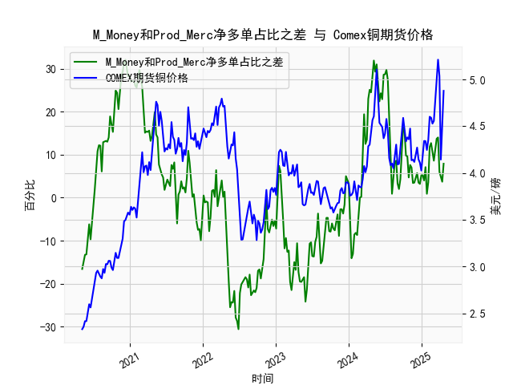

|            |   M_Money净多单占比 |   Prod_Merc净多单占比 |   Comex铜期货价格 |   M_Money和Prod_Merc净多单占比之差 |
|:-----------|--------------------:|----------------------:|------------------:|-----------------------------------:|
| 2024-12-10 |                34.9 |                  40.6 |            4.272  |                                5.7 |
| 2024-12-17 |                35.8 |                  39.3 |            4.1465 |                                3.5 |
| 2024-12-24 |                35.7 |                  38.9 |            4.11   |                                3.2 |
| 2024-12-31 |                35   |                  40.2 |            4.0265 |                                5.2 |
| 2025-01-07 |                35.8 |                  41   |            4.1955 |                                5.2 |
| 2025-01-14 |                36.6 |                  40.6 |            4.3425 |                                4   |
| 2025-01-21 |                33.8 |                  40.9 |            4.341  |                                7.1 |
| 2025-01-28 |                36.1 |                  37   |            4.2465 |                                0.9 |
| 2025-02-04 |                35.5 |                  39.1 |            4.3535 |                                3.6 |
| 2025-02-11 |                30.8 |                  42.6 |            4.601  |                               11.8 |
| 2025-02-18 |                29.9 |                  42.6 |            4.591  |                               12.7 |
| 2025-02-25 |                30.7 |                  41.3 |            4.5275 |                               10.6 |
| 2025-03-04 |                32.1 |                  40.7 |            4.5565 |                                8.6 |
| 2025-03-11 |                30.3 |                  41.8 |            4.766  |                               11.5 |
| 2025-03-18 |                28.8 |                  42.5 |            5.0165 |                               13.7 |
| 2025-03-25 |                28.1 |                  42.1 |            5.2105 |                               14   |
| 2025-04-01 |                32.4 |                  38.4 |            5.035  |                                6   |
| 2025-04-08 |                32.2 |                  36.8 |            4.144  |                                4.6 |
| 2025-04-15 |                33.5 |                  37.2 |            4.626  |                                3.7 |
| 2025-04-22 |                32.1 |                  40   |            4.878  |                                7.9 |

### 1. M_Money和Prod_Merc净多单占比之差与Comex铜期货价格的相关性及影响逻辑

#### 相关性分析
M_Money（非商业多头持仓占比）代表投机资金（如对冲基金、资管机构）对铜价的预期，而Prod_Merc（商业多头持仓占比）反映实体企业（如矿商、加工商）的套保需求。两者的净多单占比之差（M_Money - Prod_Merc）可视为市场情绪与基本面预期的博弈结果。  
- **正向差值扩大**（M_Money占比显著高于Prod_Merc）：通常伴随铜价上涨，因投机资金押注短期供需紧张或宏观利好（如通胀预期、美元走弱）。  
- **负向差值扩大**（Prod_Merc占比更高）：常预示铜价承压，因实体企业通过套保锁定价格，可能隐含对远期供应过剩或需求疲软的预期。  

从数据看，两者的差值变化与铜价走势呈现以下规律：  
- **差值由负转正**（如从-25.5升至31.3）：铜价从3.2美元/磅涨至4.8美元/磅，反映投机资金主导的看涨情绪推动价格。  
- **差值高位回落**（如从31.3降至-30.6）：铜价从4.8美元/磅跌至3.2美元/磅，显示商业套保力量压制投机泡沫。  

#### 影响逻辑
- **投机资金驱动短期波动**：M_Money的快速增减会放大价格波动（如2020年疫情后流动性宽松推升铜价）。  
- **商业持仓反映长期供需**：Prod_Merc的占比变化通常滞后于价格，但能验证基本面趋势（如矿商增产时套保增加）。  
- **背离信号**：若铜价创新高但差值未同步扩大，可能预示价格见顶（如2021年差值见顶后铜价回调）。  

---

### 2. 近期投资或套利机会与策略分析

#### 当前数据特征
- **差值近期回升**：从-19.6升至7.9，显示投机资金重新入场，但商业套保占比未同步下降，暗示市场分歧。  
- **铜价反弹**：从4.08美元/磅升至4.87美元/磅，但未突破前高（5.21美元/磅），需警惕上方阻力。  

#### 潜在机会与策略
1. **趋势跟踪策略**  
   - **多头机会**：若差值持续扩大且铜价突破5.0美元/磅，可跟随投机资金做多，目标价5.3-5.5美元/磅。  
   - **空头机会**：若差值再度转负且铜价跌破4.5美元/磅，可布局空单，目标价4.0-4.2美元/磅。  

2. **套利策略**  
   - **跨期套利**：关注近远月价差。若近月合约溢价（Backwardation）扩大，反映短期供应紧张，可做多近月、做空远月。  
   - **跨市场套利**：若LME铜价与Comex铜价出现显著背离（如LME库存骤降而Comex库存上升），可进行跨市场价差回归交易。  

3. **事件驱动策略**  
   - **宏观政策博弈**：美联储降息预期升温可能推高铜价，但需警惕商业套保抛压。可结合差值变化与美元指数动态调整仓位。  
   - **供需事件**：关注南美矿端罢工、中国基建刺激政策等事件，若差值快速响应，可短线参与波动。  

#### 风险提示
- **流动性风险**：投机资金快速撤离可能导致价格剧烈波动（如2022年差值骤降引发铜价暴跌）。  
- **基本面证伪**：若全球经济增长不及预期，商业套保力量可能压制铜价反弹空间。  

---

### 总结
M_Money与Prod_Merc的差值变化是铜价的重要领先指标，但需结合宏观环境与供需基本面综合判断。当前市场处于投机情绪回暖与商业套保压制的博弈阶段，建议以波段交易为主，严格止损，并关注库存、美元指数等辅助信号。