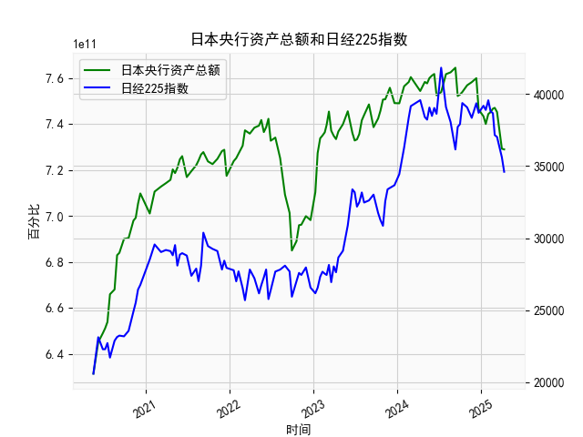

|            |   日本央行资产总额 |   日经225指数 |
|:-----------|-------------------:|--------------:|
| 2024-07-10 |        7.53868e+11 |       41832   |
| 2024-07-31 |        7.61714e+11 |       39101.8 |
| 2024-08-20 |        7.62497e+11 |       38062.9 |
| 2024-09-10 |        7.64503e+11 |       36159.2 |
| 2024-09-20 |        7.52201e+11 |       37723.9 |
| 2024-09-30 |        7.52847e+11 |       37919.6 |
| 2024-10-10 |        7.53936e+11 |       39380.9 |
| 2024-10-31 |        7.56864e+11 |       39081.2 |
| 2024-11-20 |        7.58232e+11 |       38352.3 |
| 2024-12-10 |        7.59957e+11 |       39367.6 |
| 2024-12-20 |        7.46306e+11 |       38701.9 |
| 2025-01-10 |        7.43361e+11 |       39190.4 |
| 2025-01-20 |        7.40022e+11 |       38902.5 |
| 2025-01-31 |        7.44346e+11 |       39572.5 |
| 2025-02-10 |        7.45188e+11 |       38801.2 |
| 2025-02-20 |        7.46669e+11 |       38678   |
| 2025-02-28 |        7.47052e+11 |       37155.5 |
| 2025-03-10 |        7.45231e+11 |       37028.3 |
| 2025-03-31 |        7.29239e+11 |       35617.6 |
| 2025-04-10 |        7.28954e+11 |       34609   |




### 日本央行资产总额与日经225指数的相关性及影响逻辑

#### 1. 相关性分析
从数据趋势看，日本央行资产总额与日经225指数呈现**中度正相关**。具体表现为：
- **货币政策驱动流动性**：日本央行通过量化宽松（QE）或购买ETF等方式扩表时，市场流动性增加，直接压低利率并推高股票估值。例如，2020年央行资产规模突破700万亿日元后，日经指数同步从2万点附近升至2021年的3万点以上。
- **风险偏好传导**：央行扩表释放政策宽松信号，投资者风险偏好提升，资金从债券等低风险资产转向股市。数据中2021-2022年央行资产增速放缓时，日经指数也出现回调。
- **汇率联动效应**：宽松政策可能导致日元贬值（如2022年日元兑美元贬值超20%），出口企业利润改善，利好日经指数中权重较高的制造业公司。

#### 2. 影响逻辑链条
```
央行扩表 → 市场流动性增加 → 利率下行 → 企业融资成本降低/股票估值提升 → 日经指数上涨
央行购债/ETF → 直接支撑股市 → 市场情绪改善 → 资金流入股市 → 日经指数上涨
日元贬值（宽松政策副作用） → 出口企业盈利改善 → 日经指数成分股业绩预期上调 → 指数上行
```

---

### 近期投资或套利机会及策略

#### 1. 趋势性机会
- **宽松政策延续的做多窗口**：2023年日本央行维持负利率和YCC政策，若资产总额继续温和扩张（如近期数据中从7.3万亿升至7.6万亿），可逢低布局日经225指数ETF（如1321.HK）或期货。
- **板块分化机会**：关注央行持有ETF中的重点行业（如金融、科技），其成分股可能因政策托底获得超额收益。

#### 2. 套利策略
- **股债联动套利**：若央行扩表速度快于市场预期，可做多日经指数期货（如NKD）同时做空日本国债期货（如JGB），押注流动性外溢至股市。
- **跨境汇率套利**：若日元因宽松政策走弱，可构建“做多日经指数+做空日元（如USD/JPY）”组合，捕捉汇率贬值和股市上涨的双重收益。

#### 3. 风险提示
- **政策转向风险**：若日本央行意外收紧政策（如调整YCC区间），可能导致资产规模收缩和股市回调。
- **外部冲击**：美联储加息周期延长可能引发全球流动性收紧，削弱日股吸引力。需结合VIX指数和美元指数动态调整仓位。

---

### 操作建议
- **短期（1-3个月）**：关注7.5万亿日元以上的央行资产支撑位，若数据站稳该水平且日经指数突破38,000点（近期阻力位），可加仓。
- **中长期（6个月+）**：若日本通胀持续超预期，央行可能边际收紧政策，需在日经指数接近历史高位（41,000点）时逐步止盈。