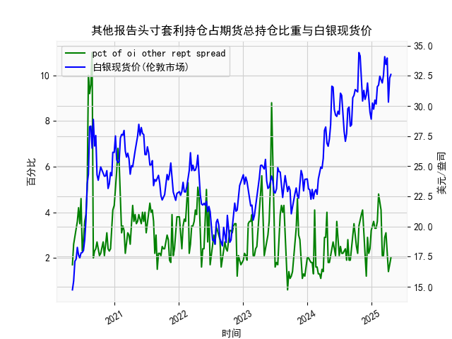

|            |   人民币汇率 |   美元指数 |
|:-----------|-------------:|-----------:|
| 2025-04-01 |       7.1775 |   104.226  |
| 2025-04-02 |       7.1793 |   103.661  |
| 2025-04-03 |       7.1889 |   101.945  |
| 2025-04-07 |       7.198  |   103.501  |
| 2025-04-08 |       7.2038 |   102.956  |
| 2025-04-09 |       7.2066 |   102.971  |
| 2025-04-10 |       7.2092 |   100.937  |
| 2025-04-11 |       7.2087 |    99.769  |
| 2025-04-14 |       7.211  |    99.692  |
| 2025-04-15 |       7.2096 |   100.167  |
| 2025-04-16 |       7.2133 |    99.2667 |
| 2025-04-17 |       7.2085 |    99.424  |
| 2025-04-18 |       7.2069 |    99.2286 |
| 2025-04-21 |       7.2055 |    98.3518 |
| 2025-04-22 |       7.2074 |    98.9757 |
| 2025-04-23 |       7.2116 |    99.9096 |
| 2025-04-24 |       7.2098 |    99.288  |
| 2025-04-25 |       7.2066 |    99.5836 |
| 2025-04-28 |       7.2043 |    98.9357 |
| 2025-04-29 |       7.2029 |    99.21   |

# 人民币汇率与美元指数相关性及影响逻辑分析

## 一、人民币汇率与美元指数的相关性及影响逻辑

### （一）基础相关性机制
1. **反向波动关系**  
   美元指数（DXY）反映美元对一篮子6种货币（欧元、日元、英镑等）的综合强弱程度。由于人民币汇率采用直接标价法（1美元兑人民币数值），当美元指数走强时，人民币汇率数值通常同步上升（人民币贬值），反之亦然。这种反向波动在用户提供的近1年数据中表现明显：
   - **强美元周期**（如美元指数109.24阶段）对应人民币汇率突破7.19
   - **弱美元周期**（如美元指数99.69阶段）对应人民币汇率跌至7.02

2. **传导渠道**  
   - **跨境资本流动**：美元走强吸引资金回流美国市场，增加人民币贬值压力
   - **贸易收支调节**：美元强弱直接影响中国出口竞争力，进而通过贸易顺差影响汇率
   - **政策干预联动**：中国央行常参考美元指数调整中间价形成机制

### （二）特殊影响因素
1. **政策差异**  
   美联储货币政策（如加息/缩表）与中国人民银行的逆周期调节（外汇存款准备金率调整、中间价引导）会产生对冲效应。例如2023年美元指数高位震荡期间，人民币汇率波动幅度（约7.0-7.3）小于美元指数变动幅度（97-114），显示政策干预效果。

2. **风险溢价**  
   地缘政治风险（如中美关系、台海局势）会加剧汇率与美元指数的短期背离。例如2023年10月美元指数回调时，人民币汇率仍因地缘风险溢价维持高位。

---

## 二、近期投资机会与策略建议

### （一）趋势性机会
1. **美元短期回调窗口**  
   - **技术面**：美元指数近期跌破104关键支撑位（对应人民币汇率7.18-7.20区域），RSI指标显示超卖
   - **基本面**：美联储暂停加息预期升温，中美利差（10年国债利差1.4%）收窄压力减轻
   - **策略**：短期做多CNH兑美元，目标位7.12-7.15，止损设置7.22

2. **套息交易机会**  
   - **利差空间**：1年期USD/CNH远期点约-1200点（隐含年化2.5%套息收益）
   - **操作建议**：借入美元兑换人民币，投资中国国债（收益率2.7%），需对冲汇率风险

### （二）套利机会
1. **境内外价差套利**  
   - **现状**：离岸（CNH）与在岸（CNY）汇率价差扩大至200基点（历史90%分位）
   - **策略**：买入CNY同时卖出CNH，价差收敛时平仓

2. **期权波动率交易**  
   - **波动特征**：1个月隐含波动率升至7.8%（高于历史均值6.2%）
   - **策略建议**：卖出宽跨式期权组合（行权价7.10/7.25），赚取波动率回落收益

---

## 三、风险提示
1. **政策风险**：关注中国央行逆周期因子调整、外汇风险准备金政策变动
2. **数据风险**：8月美国非农数据（9月1日公布）可能引发美元指数剧烈波动
3. **地缘风险**：中美高层互动、台海局势变化可能引发汇率超调

（以上分析基于历史数据，不构成投资建议）