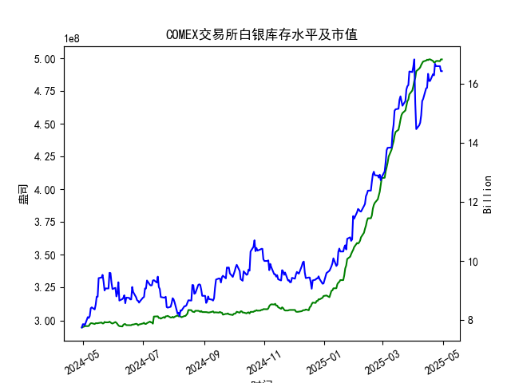

|            |   comex白银库存量 |   comex白银库存市值(billion) |   伦敦银现货价 |   上海金交所白银现货价 |   美元兑人民币汇率 |
|:-----------|------------------:|-----------------------------:|---------------:|-----------------------:|-------------------:|
| 2025-04-03 |       4.84931e+08 |                       31.625 |         32.475 |                   8263 |             7.1889 |
| 2025-04-04 |       4.90077e+08 |                       29.515 |         31.34  |                   8263 |             7.1889 |
| 2025-04-07 |       4.92042e+08 |                       29.65  |         30.325 |                   7606 |             7.198  |
| 2025-04-08 |       4.92994e+08 |                       29.775 |         30.315 |                   7689 |             7.2038 |
| 2025-04-09 |       4.94816e+08 |                       30.17  |         30.18  |                   7746 |             7.2066 |
| 2025-04-10 |       4.96236e+08 |                       31.05  |         30.925 |                   7939 |             7.2092 |
| 2025-04-11 |       4.97475e+08 |                       31.115 |         31.27  |                   7984 |             7.2087 |
| 2025-04-14 |       4.98195e+08 |                       31.8   |         32.275 |                   8107 |             7.211  |
| 2025-04-15 |       4.98847e+08 |                       31.8   |         32.31  |                   8139 |             7.2096 |
| 2025-04-16 |       4.98569e+08 |                       32.755 |         32.955 |                   8230 |             7.2133 |
| 2025-04-17 |       4.99104e+08 |                       32.23  |         32.31  |                   8143 |             7.2085 |
| 2025-04-18 |       4.99104e+08 |                       32.23  |         32.31  |                   8142 |             7.2069 |
| 2025-04-21 |       4.97895e+08 |                       32.785 |         32.31  |                   8227 |             7.2055 |
| 2025-04-22 |       4.96698e+08 |                       32.785 |         32.61  |                   8154 |             7.2074 |
| 2025-04-23 |       4.96891e+08 |                       33.55  |         32.96  |                   8191 |             7.2116 |
| 2025-04-24 |       4.97741e+08 |                       33.325 |         33.395 |                   8295 |             7.2098 |
| 2025-04-25 |       4.97908e+08 |                       33.325 |         33.335 |                   8270 |             7.2066 |
| 2025-04-28 |       4.97746e+08 |                       33.325 |         33.01  |                   8173 |             7.2043 |
| 2025-04-29 |       4.99098e+08 |                       32.89  |         33.225 |                   8197 |             7.2029 |
| 2025-04-30 |       4.99098e+08 |                       32.89  |         33.225 |                   8197 |             7.2014 |

### COMEX白银库存及市场数据近期变化分析（2025年3月-4月）

#### 1. **COMEX库存与市值动态**
- **库存量**：近一个月（2025年3月底至4月底）COMEX白银库存量从约4.977亿盎司微升至4.991亿盎司，整体呈现**稳中略增**，但4月28日出现短暂下降（4.977亿→4.990亿），可能反映短期交割或需求波动。
- **库存市值**：同期市值从约15.34 billion飙升至16.42 billion，增幅达7%，主要受**白银价格快速上涨**驱动（伦敦银价同期从33.395→33.225美元/盎司）。市值与库存量背离，表明**价格是核心驱动因素**，市场存在投机情绪或避险需求升温。

#### 2. **跨市场价差套利机会**
- **伦敦-上海价差**：
  - **伦敦银价**（美元计价）：33.225美元/盎司（2025-04-30）。
  - **上海银价**（人民币计价）：8197元/千克（≈8.197元/克），按汇率7.2014和1盎司≈31.1035克计算，伦敦银价换算为人民币约**7.69元/克**（33.225×7.2014/31.1035）。
  - **价差**：上海较伦敦溢价**0.507元/克**（8.197-7.69），扣除物流、关税等成本（假设0.3-0.4元/克），仍存在**微弱正套利空间**。
- **策略建议**：
  - **正向套利**：买入伦敦现货白银，同时卖出上海白银合约，锁定价差收益。
  - **风险提示**：需关注中国白银进口政策（如关税、配额）及汇率波动（人民币近月微贬0.1%）。

#### 3. **库存与价格背离的潜在信号**
- **现象**：COMEX库存量稳定，但市值与银价同步攀升，反映**市场看涨情绪浓厚**，可能与地缘风险（如避险需求）或通胀预期相关。
- **策略建议**：
  - **短期对冲**：若持有白银多头头寸，可搭配卖出COMEX白银期货对冲库存增量的潜在抛压。
  - **趋势跟踪**：若库存未随价格上涨显著累积，或进一步验证供需紧张，可逢低布局多头。

#### 4. **汇率与内外盘联动**
- **美元兑人民币汇率**：近月汇率从7.2098微降至7.2014，人民币升值0.1%，对跨市场套利收益影响有限，但需警惕**汇率波动放大价差风险**。
- **策略建议**：
  - **汇率对冲**：通过外汇远期合约锁定套利交易成本，减少汇兑损失。

#### 5. **近期操作建议**
- **优先策略**：跨市场套利（伦敦-上海），需精细化计算实际交割成本。
- **辅助策略**：关注COMEX库存与价格背离后的回调机会，若库存加速累积且价格滞涨，可轻仓试空。
- **风险提示**：地缘冲突、美联储政策及中国需求变化可能引发价格剧烈波动，需严格止损。

---

### 总结
近期白银市场呈现**强价格驱动**特征，跨市场价差套利为较稳健机会，但需严控成本和政策风险。建议以**短线套利为主**，中长期关注库存与宏观情绪联动信号。