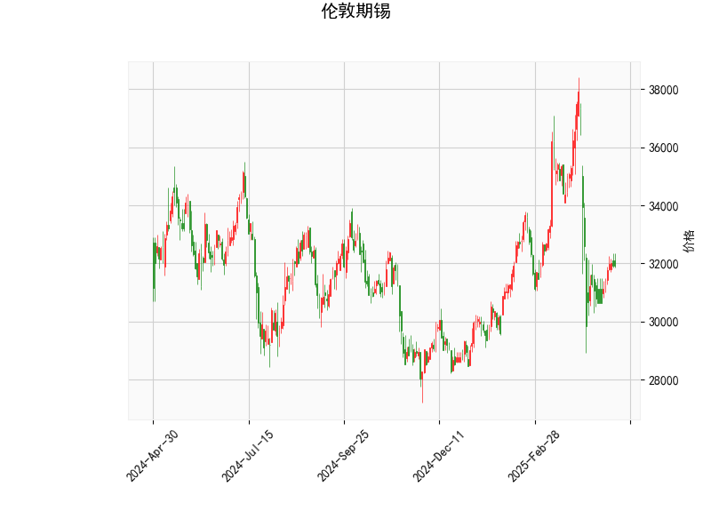

# 伦敦期锡技术分析及投资策略

## 一、技术指标分析

### 1. 价格与布林轨道
- **当前价（31,919）**位于布林轨道中轨（33,072）和下轨（29,125）之间，靠近中轨但未突破，显示短期价格处于**弱势震荡区间**。
- **布林带开口收缩**（上轨37,020-下轨29,125）：价格波动率近期下降，需警惕未来可能的方向选择。

### 2. RSI指标
- **RSI（46.4）**略低于50中轴线，反映市场情绪**中性偏弱**，但未进入超卖区域（<30），暗示下跌动能未完全释放。

### 3. MACD指标
- **MACD（-513.7）上穿信号线（-617.1）**，形成**底部金叉**，柱状图（103.5）由负转正，短期存在**反弹动能**。
- 但MACD绝对值仍为负值，表明**长期趋势尚未反转**，需警惕反弹后二次探底。

### 4. K线形态
- **CDLMATCHINGLOW（匹配低形态）**：在下跌趋势中出现两根实体相近的阴线，暗示空头力量减弱，短期可能企稳。需结合量能验证有效性。

---

## 二、投资机会与策略

### 1. 短期策略（1-5日）
- **反弹交易机会**：
  - **入场条件**：若价格站稳中轨33,072且MACD持续上行，可轻仓试多。
  - **目标位**：上轨37,020附近（潜在涨幅16%）。
  - **止损位**：中轨下方1-2%（约32,500）。

- **破位对冲策略**：
  - 若价格跌破下轨29,125，可能触发加速下跌，可配合RSI超卖信号（<30）反向布局多单。

### 2. 中期策略（1-3周）
- **区间套利**：
  - 当前价接近布林带下轨，可采取**网格交易**：在29,125-33,072区间分批建仓，利用价格波动赚取差价。
  - 需监控库存数据及美元指数变动（负相关性强）。

### 3. 风险提示
- **假突破风险**：MACD金叉可能受制于零轴压力（长期趋势压制），若反弹未能突破中轨33,072，可能重回下跌通道。
- **宏观事件敏感性**：需关注中国工业需求数据（锡消费占比60%）、印尼出口政策变化等基本面驱动因素。

---

## 三、关键信号验证
| 信号类型       | 看涨确认条件             | 看跌确认条件             |
|----------------|--------------------------|--------------------------|
| 趋势反转       | 周线收盘价突破37,020     | 日线收盘价跌破29,125     |
| 量能配合       | 反弹时成交量放大20%+     | 下跌时缩量后突然放量     |
| 指标共振       | RSI突破50且MACD站上零轴 | MACD柱状图再次转负       |

**建议优先等待价格突破中轨后再布局趋势单，当前宜以短线波段操作为主。**