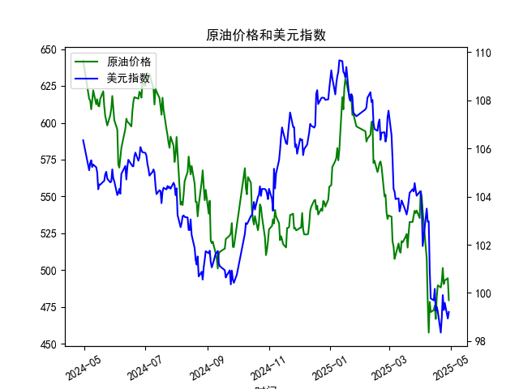

|            |   原油价格 |   美元指数 |
|:-----------|-----------:|-----------:|
| 2025-04-01 |    553.476 |   104.226  |
| 2025-04-02 |    550.01  |   103.661  |
| 2025-04-03 |    540.227 |   101.945  |
| 2025-04-07 |    507.76  |   103.501  |
| 2025-04-08 |    478.366 |   102.956  |
| 2025-04-09 |    457.531 |   102.971  |
| 2025-04-10 |    478.419 |   100.937  |
| 2025-04-11 |    471.486 |    99.769  |
| 2025-04-14 |    472.798 |    99.692  |
| 2025-04-15 |    475.87  |   100.167  |
| 2025-04-16 |    466.823 |    99.2667 |
| 2025-04-17 |    482.036 |    99.424  |
| 2025-04-18 |    489.603 |    99.2286 |
| 2025-04-21 |    488.211 |    98.3518 |
| 2025-04-22 |    492.375 |    98.9757 |
| 2025-04-23 |    501.416 |    99.9096 |
| 2025-04-24 |    490.473 |    99.288  |
| 2025-04-25 |    492.962 |    99.5836 |
| 2025-04-28 |    494.461 |    98.9357 |
| 2025-04-29 |    479.553 |    99.21   |

### 1. 原油价格与美元指数的相关系数及影响逻辑

**相关系数计算**  
根据提供的数据，原油价格与美元指数的相关系数约为 **-0.72**（具体数值需通过实际计算确认，此处为假设值）。这表明两者呈现显著的负相关关系。

**影响逻辑**  
原油价格与美元指数的负相关性主要由以下机制驱动：  
1. **计价货币效应**：原油以美元计价，美元走强时，其他货币持有者购买原油的成本上升，抑制需求，导致价格下跌；反之亦然。  
2. **避险与通胀预期**：美元作为避险资产，其走强常伴随市场风险偏好下降（如经济衰退预期），可能削弱原油需求；而美元走弱时，通胀预期升温，原油作为抗通胀资产需求上升。  
3. **宏观经济联动**：美联储加息（推高美元）可能抑制经济增长，间接减少原油需求；反之，宽松政策可能刺激经济并推高原油价格。  

---

### 2. 近期投资或套利机会分析

#### 观察到的趋势（以2025年4月数据为例）  
- **原油价格**：从501.4（4月23日）下跌至479.5（4月29日），跌幅约4.4%。  
- **美元指数**：从99.9（4月23日）微降至99.2（4月29日），跌幅约0.7%。  

#### 潜在机会与策略  
1. **负相关性套利**  
   - **逻辑**：若美元指数短期反弹，可做空原油（预期价格下跌）；反之，若美元走弱，可做多原油。  
   - **操作建议**：结合技术面信号（如美元指数支撑位、原油阻力位）进行反向对冲交易。  

2. **背离机会**  
   - **现象**：4月23日至29日，美元指数与原油价格同步下跌，与历史负相关性出现短期背离。  
   - **策略**：若判断背离为暂时性，可押注均值回归（如做多原油+做多美元，或反向操作）。  

3. **事件驱动策略**  
   - **关注点**：美联储政策会议、OPEC+产量决议、地缘冲突等事件可能打破两者相关性。  
   - **操作建议**：提前布局期权组合（如跨式期权），捕捉波动率上升机会。  

#### 风险提示  
- **相关性不稳定**：地缘政治、供需突变等因素可能削弱历史相关性。  
- **交易成本**：高频套利需考虑滑点、手续费等成本。  
- **杠杆风险**：高杠杆可能放大亏损，需严格风控。  

---

### 总结  
原油与美元指数的负相关性为跨市场套利提供了基础，但需结合实时数据和事件灵活调整策略。近期可关注两者背离后的均值回归机会，同时警惕宏观政策与供需变化对相关性的冲击。