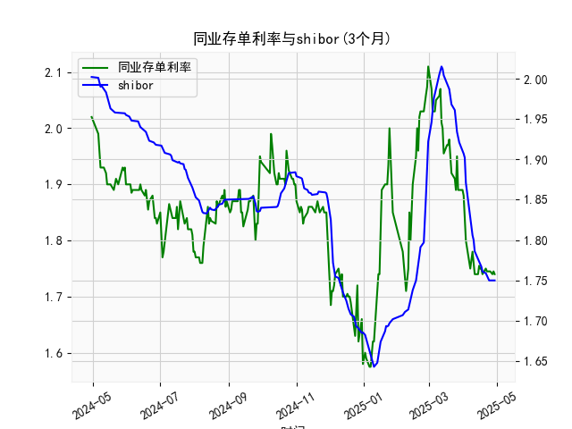

|            |   同业存单利率(3个月) |   shibor(3个月) |
|:-----------|----------------------:|----------------:|
| 2025-04-02 |                 1.85  |           1.902 |
| 2025-04-03 |                 1.8   |           1.871 |
| 2025-04-07 |                 1.75  |           1.824 |
| 2025-04-08 |                 1.77  |           1.81  |
| 2025-04-09 |                 1.78  |           1.806 |
| 2025-04-10 |                 1.76  |           1.8   |
| 2025-04-11 |                 1.74  |           1.786 |
| 2025-04-14 |                 1.74  |           1.777 |
| 2025-04-15 |                 1.755 |           1.775 |
| 2025-04-16 |                 1.75  |           1.772 |
| 2025-04-17 |                 1.75  |           1.767 |
| 2025-04-18 |                 1.74  |           1.761 |
| 2025-04-21 |                 1.75  |           1.759 |
| 2025-04-22 |                 1.745 |           1.755 |
| 2025-04-23 |                 1.745 |           1.753 |
| 2025-04-24 |                 1.745 |           1.75  |
| 2025-04-25 |                 1.745 |           1.75  |
| 2025-04-27 |                 1.74  |           1.75  |
| 2025-04-28 |                 1.745 |           1.75  |
| 2025-04-29 |                 1.74  |           1.75  |

### 同业存单利率与SHIBOR的相关性及影响逻辑

#### 1. **相关性分析**
同业存单利率（AAA）与SHIBOR（3个月）均反映银行间市场的短期资金成本，但二者形成机制不同：
- **同业存单利率**：由市场供需决定，体现银行通过发行存单融资的实际成本，受银行信用资质、流动性需求及市场情绪直接影响。
- **SHIBOR**：基于报价行报价的“意愿利率”，反映银行体系对资金松紧的预期，但可能因报价机制存在一定滞后或偏差。

**数据表现**（从近1年数据观察）：
- **趋势同步性**：两者长期走势基本一致（如均从年初2%逐步下行至年中低点1.6%-1.7%，年末回升至2%附近），表明均受货币政策（如流动性投放）和宏观经济（如信贷需求）的共同影响。
- **短期分化**：同业存单利率波动更大（如8-9月存单利率骤降至1.58%，SHIBOR最低1.64%），可能因存单发行受季节性、信用分层或机构负债结构调整影响更敏感。

#### 2. **影响逻辑**
- **货币政策传导**：央行通过公开市场操作（如MLF、逆回购）调节流动性，直接影响SHIBOR报价，进而通过市场交易传导至存单利率。
- **银行负债管理**：当银行面临存款竞争或监管考核压力时，可能加大存单发行，推高存单利率，与SHIBOR形成短期利差。
- **风险溢价差异**：同业存单隐含发行主体的信用风险（AAA评级），而SHIBOR为无抵押利率，存单利率通常略高于SHIBOR以补偿风险。
- **市场预期博弈**：SHIBOR反映报价行对未来资金面的预期，存单利率则体现当前实际成交结果，两者差异可能反映市场对流动性松紧的分歧。

---

### 近期投资或套利机会分析

#### 1. **利差套利机会**
**现象**：年末数据显示同业存单利率（2.11%）显著高于SHIBOR（1.75%），利差达36BP，高于历史中位数（通常10-20BP）。  
**逻辑**：若利差持续走阔，可通过“买入高收益存单+通过SHIBOR融资”锁定套利空间。  
**策略**：  
- **正向套利**：以SHIBOR利率拆入资金（如质押式回购），购买AAA存单，赚取利差（需覆盖交易成本和税费）。  
- **期限匹配**：需确保融资期限与存单到期日匹配，避免流动性错配风险。  

**风险提示**：  
- 流动性冲击（如季末资金紧张导致SHIBOR跳升）。  
- 存单信用风险（尽管AAA评级，但需关注尾部风险）。  

#### 2. **趋势交易机会**
**现象**：存单利率近期从1.7%反弹至2.0%以上，SHIBOR同步回升但斜率较缓，或反映银行年末资金需求激增。  
**逻辑**：若预期流动性收紧持续，可做空存单（如通过利率互换）或增持短久期资产；若判断反弹过度（如央行加大投放），可反向买入存单。  
**策略**：  
- **方向性交易**：结合央行公开市场操作信号（如MLF续作规模），博弈存单利率短期回调。  
- **跨品种对冲**：做多存单利率与做空SHIBOR期货，捕捉利差回归。  

#### 3. **监管政策博弈**
**背景**：近期存单发行量回升可能受监管指标（如LCR流动性覆盖率）驱动。  
**策略**：跟踪监管动态（如对同业负债占比的窗口指导），预判银行发行需求变化，提前布局存单利率波段交易。  

---

### 总结建议
- **短期**：关注年末流动性分层带来的存单-SHIBOR利差套利窗口，但需严控杠杆和久期。  
- **中期**：若经济复苏弱于预期，央行可能维持宽松，存单利率或再次下行，可逢高配置。  
- **风险提示**：警惕信用事件（如中小银行流动性压力）和货币政策边际转向信号。