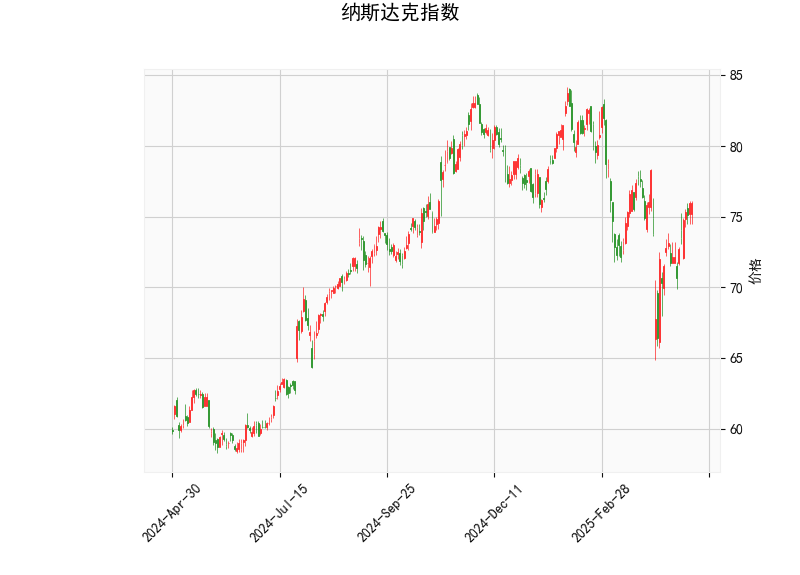

### 纳斯达克指数技术分析解读

#### 1. 技术指标分析
- **当前价（75.94）与布林轨道**：
  - 当前价（75.94）**略低于布林中轨（75.97）**，但**接近中轨**，表明价格处于短期均衡状态，未形成明显趋势。
  - **布林带收窄**（上轨83.71，下轨68.24）：上下轨间距较小，反映市场波动性较低，可能进入盘整阶段。若后续突破中轨，可能触发方向性选择。

- **RSI（55.79）**：
  - 处于**中性区域（50-60）**，未超买（>70）或超卖（<30），短期动能平衡，但略偏多头。若RSI持续上行至60以上，可能预示上涨动能增强。

- **MACD指标**：
  - **MACD线（0.067）上穿信号线（-0.594）**，形成“金叉”，柱状图（0.66）由负转正，显示短期反弹信号。
  - MACD仍位于零轴下方，需关注能否突破零轴确认趋势反转。

- **K线形态**：
  - 未识别到典型反转或持续形态（如十字星、吞没等），价格走势暂未给出明确信号。

---

#### 2. 潜在投资机会与策略

##### **短期看涨策略**（需结合量能验证）：
- **入场条件**：
  - 价格站稳布林中轨（75.97）并放量突破，目标看向上轨（83.71）。
  - MACD柱状图持续扩大且MACD线站稳零轴上方。
- **止损设置**：
  - 若价格跌破布林下轨（68.24）或MACD柱状图转弱，需止损离场。

##### **区间套利策略**：
- **高抛低吸**：
  - 在布林下轨（68.24）附近分批买入，中轨（75.97）附近止盈；若反弹至中轨后遇阻，可轻仓做空。
- **突破跟随**：
  - 若放量突破中轨并站稳，可追加多单；若跌破下轨且RSI进入超卖（<30），可博弈超跌反弹。

##### **风险提示**：
- **假突破风险**：布林带收窄后可能伴随剧烈波动，需警惕虚假信号。
- **指标背离风险**：若价格创新高但RSI/MACD未同步走强，可能暗示上涨动能不足。

---

### 总结
当前纳斯达克指数处于**震荡收敛阶段**，MACD金叉和价格贴近中轨显示短期偏多，但需量能配合确认趋势。建议以**区间交易为主**，突破后跟进趋势，严格设置止损。中长期需关注基本面（如美联储政策、科技股财报）对趋势的催化作用。