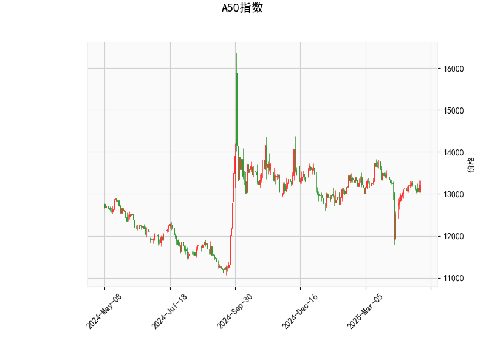

# A50指数技术分析及投资策略

## 一、技术指标分析

### 1. **价格与RSI**
- **当前价13226**：位于布林带中轨（13219.62）附近，显示市场处于短期均衡状态，未形成明确趋势。
- **RSI 53.58**：处于中性区间（50附近），未超买（>70）或超卖（<30），表明多空力量暂时平衡。

### 2. **MACD指标**
- **MACD线（5.75）上穿信号线（-16.34）**：形成“金叉”，柱状图（22.09）大幅放大，显示短期看涨动能增强。
- **信号线仍为负值**：提示长期趋势尚未完全转多，需警惕反弹持续性。

### 3. **布林带**
- **价格贴近中轨**：短期方向待突破确认，若站稳中轨可能向上轨（13798.1）靠近，反之可能测试下轨（12641.13）。
- **布林带收窄**：上下轨间距较大（13798-12641≈1157点），表明波动率较低，未来可能出现趋势性行情。

### 4. **K线形态**
- **无明确形态**：未出现吞没、十字星等典型反转信号，市场缺乏短期催化剂。

---

## 二、投资机会与策略建议

### 1. **趋势跟随策略**
- **做多条件**：若价格站稳中轨（13220）且MACD柱持续扩张，可尝试轻仓做多，目标看向上轨（13798），止损设于中轨下方（如13000）。
- **做空条件**：若价格跌破中轨并伴随MACD柱缩量，可考虑短空，目标下轨（12641），止损设于中轨上方（如13300）。

### 2. **均值回归策略**
- **区间操作**：若价格回落至下轨（12641）附近且RSI<30，可逢低买入，目标中轨（13220）；若反弹至上轨（13798）附近且RSI>70，可逢高做空。

### 3. **套利机会**
- **波动率套利**：布林带收窄后可能伴随波动率上升，可布局跨式期权组合（同时买入看涨和看跌期权），押注突破行情。

### 4. **风险提示**
- **MACD信号滞后性**：需结合成交量验证趋势强度。
- **外部事件冲击**：A50指数受中国宏观经济及政策影响较大，需关注PMI、利率决议等关键数据。

---

**结论**：当前技术面偏中性但隐含短期反弹动能，建议以中轨为分水岭轻仓试多，若突破失败则转向防守。中长期需等待布林带开口或MACD信号线转正确认趋势。