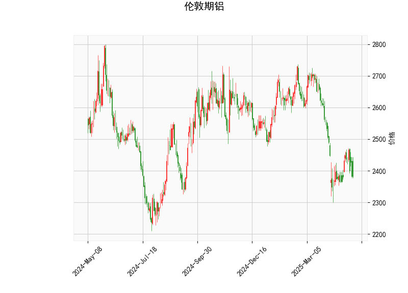

### 伦敦期铝技术分析解读

#### 1. 技术指标分析
- **当前价（2382.5）与布林轨道**：
  - 价格位于布林下轨（2280.18）与中轨（2541.3）之间，**贴近下轨**，表明短期处于**超卖区域**，存在潜在反弹需求。
  - 布林带整体呈**向下开口**形态（中轨2541.3明显高于当前价），显示**中长期趋势偏空**，但短期可能因超卖出现修正。

- **RSI（40.26）**：
  - 处于**中性偏低区域**（未低于30），未确认极端超卖，但结合价格接近布林下轨，需警惕短期反弹信号。

- **MACD指标**：
  - MACD线（-29.41）与信号线（-37.39）均位于零轴下方，显示**空头主导**。
  - **MACD柱（7.98）转正且向上发散**，表明空头动能减弱，**短期可能形成底背离**，需关注潜在反弹机会。

- **K线形态（CDLMATCHINGLOW）**：
  - 该形态通常出现在下跌趋势末期，暗示**卖方力量衰竭**，若后续出现放量阳线，可能确认短期底部。

---

#### 2. 投资机会与策略建议

##### **短期机会（反弹策略）**：
- **做多信号**：
  - **条件**：价格站稳布林下轨（2280）且MACD柱持续扩大，或RSI回升至50以上。
  - **目标**：中轨2541附近（潜在6.6%涨幅），需结合成交量确认突破有效性。
  - **止损**：下破布林下轨（例如2270下方）或MACD柱重新转负。

- **套利策略**：
  - **跨期套利**：若近月合约贴水（Backwardation）收窄，可做多近月、做空远月，博弈超卖修复。
  - **波动率交易**：布林带收窄后若价格突破中轨，可买入看涨期权，押注波动率回升。

##### **中长期风险与空头策略**：
- **趋势延续风险**：
  - 若价格反弹未能突破中轨（2541），且MACD重回零轴下方，可能延续下跌趋势，目标看向前低或更低的支撑位。
  - **做空信号**：价格跌破布林下轨且RSI跌破30后反弹无力，可布局空单，目标2200-2150区域。

- **对冲建议**：
  - 持有铝相关多头的投资者可买入虚值看跌期权，防范价格跌破2200的系统性风险。

---

### 关键结论
- **短期超卖反弹可能性较高**，但需结合量能及MACD柱变化确认。
- **中长期空头趋势未改**，反弹至中轨（2541）附近或是空头加仓机会。
- **风险提示**：需关注宏观事件（如美联储政策、铝库存变化）对技术信号的干扰，建议轻仓试单并严格止损。