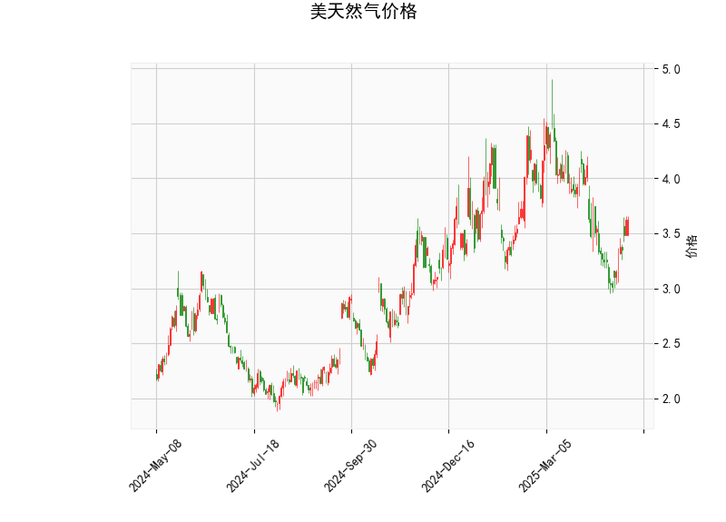

# 美国天然气价格技术分析及策略建议

## 一、技术指标解析
### 1. 价格与布林轨道
- **当前价（3.626）**低于布林中轨（3.8095），但接近布林下轨（2.9976），显示短期价格处于弱势区间，但下行空间可能有限。
- **布林带宽度（4.62→2.9976）**差距较大，表明市场波动性较高，价格存在回归中轨或上轨的可能性。

### 2. RSI指标
- **RSI（55.24）**位于50中性线上方，但未超买（<70），暗示市场存在温和的买方动能，但未形成明显趋势。

### 3. MACD指标
- **MACD线（-0.0776）**上穿信号线（-0.1496），柱状图转正（0.0719），形成“潜在金叉”，短期可能反弹。
- 但MACD与信号线均处于负值区，需警惕反弹力度不足。

### 4. K线形态
- **CDLBELTHOLD（捉腰带线）**：若出现在下跌末端，可能预示反转；但结合当前价格低于中轨，需验证其有效性。
- **CDLLONGLINE（长实体线/十字星）**：反映多空争夺激烈，若伴随成交量放大，可能成为趋势转折信号。

---

## 二、投资机会与策略建议
### 1. 短期波段交易
- **多头机会**：若价格站稳布林下轨（2.99附近）且MACD金叉确认，可轻仓做多，目标看向中轨（3.81）及上轨（4.62），止损设于下轨下方（如2.95）。
- **空头机会**：若价格反弹至中轨（3.81）受阻且RSI跌破50，可尝试短空，目标下轨（2.99），止损3.85。

### 2. 套利策略
- **跨期套利**：关注近月合约贴水（假设库存压力较大），可做空近月、做多远月，但需结合库存数据验证。
- **波动率策略**：布林带扩张显示波动率上升，可考虑卖出宽跨式期权组合（Sell Strangle），赚取时间价值。

### 3. 风险提示
- **基本面干扰**：需关注天气（如寒潮）、库存报告（EIA数据）及地缘事件对供需的冲击。
- **技术面失效风险**：MACD金叉在负值区可能为“假信号”，需配合价格突破中轨确认趋势。

---

## 三、关键信号验证点
1. **趋势反转确认**：价格连续3日站稳中轨（3.81）且RSI突破60。
2. **下跌延续信号**：若价格跌破布林下轨（2.99）且MACD柱状图转负，需止损观望。

（注：以上分析基于静态技术指标，动态交易需结合实时数据调整。）