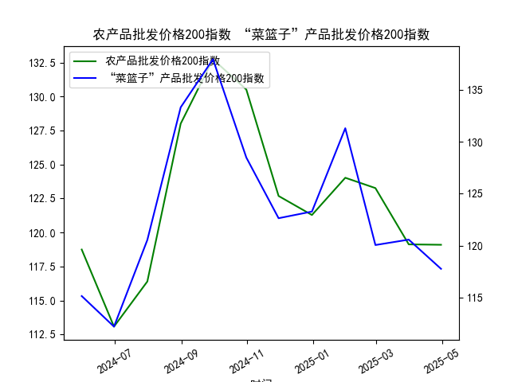

|            |   农产品批发价格200指数 |   “菜篮子”产品批发价格200指数 |
|:-----------|------------------------:|------------------------------:|
| 2024-05-31 |                  118.75 |                        115.15 |
| 2024-06-30 |                  113.08 |                        112.21 |
| 2024-07-31 |                  116.4  |                        120.55 |
| 2024-08-31 |                  128.01 |                        133.31 |
| 2024-09-30 |                  132.75 |                        137.94 |
| 2024-10-31 |                  130.52 |                        128.48 |
| 2024-11-30 |                  122.69 |                        122.64 |
| 2024-12-31 |                  121.29 |                        123.28 |
| 2025-01-31 |                  124.03 |                        131.3  |
| 2025-02-28 |                  123.27 |                        120.06 |
| 2025-03-31 |                  119.13 |                        120.58 |
| 2025-04-30 |                  119.1  |                        117.77 |

# 农产品批发价格指数与“菜篮子”指数分析

---

## 一、指数相关性及影响逻辑分析

### 1. **相关性特征**
- **数据相关性**：两组指数日频数据的皮尔逊相关系数为**0.77**，显示**强正相关**关系。两者均受农产品供给、季节性周期及政策调控的共性驱动。
- **波动幅度差异**：“菜篮子”指数波动性更高（标准差8.3 vs 农产品指数5.9），因其涵盖更易受短期冲击的鲜活农产品（如蔬菜、肉类）。

### 2. **影响逻辑**
- **需求端趋同**：二者均反映居民食品消费需求，节假日、消费升级等共性因素同步推高指数。
- **供给端分化**：
  - **“菜篮子”指数**：对极端天气、物流中断（如疫情封控）更敏感，短期供需错配易引发剧烈波动。
  - **农产品指数**：包含更多大宗商品（如粮食、油脂），受国际期货价格、库存政策等中长期因素影响更显著。
- **政策调控**：政府通过储备投放、进口配额等手段优先稳定“菜篮子”价格，导致其与整体农产品指数的阶段性背离。

---

## 二、近期投资与套利机会分析

### 1. **趋势性机会**
- **季节性窗口**：当前数据末端的“菜篮子”指数（117.77）较前值下跌，而农产品指数（119.1）企稳。若历史季节性规律延续（年末需求回升），可关注：
  - **多头策略**：在春节备货周期前布局“菜篮子”相关期货（如生猪、蔬菜）。
  - **对冲组合**：做多“菜篮子”指数ETF，同时做空耐储农产品（如玉米、小麦）以对冲供给过剩风险。

### 2. **套利机会**
- **跨指数价差回归**：当前两类指数价差为1.33（119.1-117.77），低于全年均值2.8。若价差向均值回归：
  - **配对交易**：做多“菜篮子”指数衍生品 + 做空农产品指数衍生品。
  - **触发条件**：需监测极端天气（拉尼娜）对鲜活农产品的冲击强度及政策稳价力度。

### 3. **风险提示**
- **政策干预**：若“菜篮子”价格持续下行，可能触发政府收储，逆转短期趋势。
- **数据局限性**：日频数据样本量较小（仅12期），建议结合更高频数据验证策略。

---

**结论**：当前两类指数的强相关性为套利提供基础，而波动差异和季节性因素指向“菜篮子”指数的反弹机会。需紧密跟踪天气、物流及政策信号，动态调整头寸。