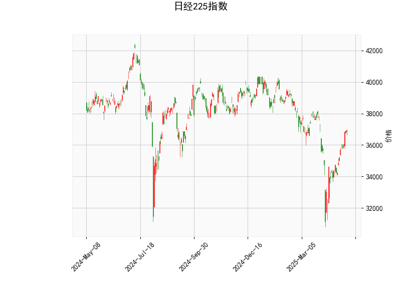

# 日经225指数技术分析及投资策略

---

## 一、技术分析结果解读

### 1. **价格与布林带**
- **当前价36,928.63**略高于**中轨36,425.84**，处于**布林带中上轨区间**（上轨40,141.13，下轨32,710.55）。
- **布林带开口较大**（上下轨间距约7,430点），表明**市场波动性显著升高**，但价格尚未突破关键压力或支撑位。
- **潜在信号**：若价格站稳中轨并向上突破，可能测试上轨；若跌破中轨，可能向下轨回调。

### 2. **RSI指标**
- **RSI 60.13**处于中性偏多区域，接近超买阈值（70），但未触发明确反转信号。
- **趋势解读**：短期动能偏强，但需警惕高位回调风险，尤其在价格接近上轨时。

### 3. **MACD指标**
- **MACD线（206.3）远高于信号线（-193.0）**，形成**强烈看涨金叉**，且**柱状图（399.3）持续扩大**，显示**多头动能强劲**。
- **矛盾点**：MACD绝对值异常高（可能与参数设定有关），需结合其他指标验证趋势持续性。

### 4. **K线形态**
- 当前无明确反转或持续形态（如十字星、吞没等），暗示趋势可能延续。

---

## 二、投资机会与策略建议

### 1. **趋势跟踪策略**
- **多头机会**（中轨支撑有效）：
  - **入场条件**：价格站稳中轨（36,425）后反弹，MACD柱状图维持扩张。
  - **目标**：布林带上轨40,141附近，潜在空间约**3,200点**。
  - **止损**：中轨下方1-2%区间（约35,800-36,000）。

- **空头机会**（突破失败）：
  - **入场条件**：价格跌破中轨且RSI回落至50以下，MACD柱状图缩量。
  - **目标**：布林带下轨32,710附近，潜在空间约**4,200点**。
  - **止损**：中轨上方1%区间（约36,800）。

### 2. **均值回归策略**
- **区间震荡假设**：若价格维持中轨附近波动，可结合RSI超买/超卖信号操作。
  - **超买（RSI>70）**：轻仓做空，目标中轨。
  - **超卖（RSI<30）**：轻仓做多，目标中轨。

### 3. **套利机会**
- **波动率套利**：布林带开口扩大隐含波动率上升，可考虑：
  - **期权策略**：买入跨式组合（Long Straddle），押注价格突破关键位。
  - **期货对冲**：多空双向持仓，捕捉短期波动。

---

## 三、风险提示
1. **MACD异常值**：需验证参数合理性（默认周期为12/26/9），避免误判。
2. **宏观事件**：日本央行政策、日元汇率波动可能加剧指数波动。
3. **流动性风险**：高波动行情下需严格设置止损，控制仓位。

---

**结论**：当前技术面偏多，但需警惕高位回调风险。建议优先关注**趋势突破机会**（多空均可），辅以**波动率套利**策略，并密切跟踪RSI与MACD的背离信号。