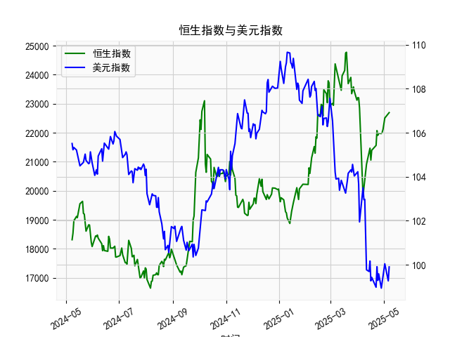

|            |   恒生指数 |   美元指数 |
|:-----------|-----------:|-----------:|
| 2025-04-03 |    22849.8 |   101.945  |
| 2025-04-07 |    19828.3 |   103.501  |
| 2025-04-08 |    20127.7 |   102.956  |
| 2025-04-09 |    20264.5 |   102.971  |
| 2025-04-10 |    20681.8 |   100.937  |
| 2025-04-11 |    20914.7 |    99.769  |
| 2025-04-14 |    21417.4 |    99.692  |
| 2025-04-15 |    21466.3 |   100.167  |
| 2025-04-16 |    21057   |    99.2667 |
| 2025-04-17 |    21395.1 |    99.424  |
| 2025-04-22 |    21562.3 |    98.9757 |
| 2025-04-23 |    22072.6 |    99.9096 |
| 2025-04-24 |    21909.8 |    99.288  |
| 2025-04-25 |    21980.7 |    99.5836 |
| 2025-04-28 |    21972   |    98.9357 |
| 2025-04-29 |    22008.1 |    99.21   |
| 2025-04-30 |    22119.4 |    99.6403 |
| 2025-05-02 |    22504.7 |   100.042  |
| 2025-05-06 |    22662.7 |    99.2654 |
| 2025-05-07 |    22691.9 |    99.9006 |

### 1. 恒生指数与美元指数的相关性及影响逻辑

#### （1）负相关性逻辑
恒生指数与美元指数通常呈现**负相关性**，核心逻辑如下：
- **资本流动效应**：美元走强时，全球资金倾向于回流美国市场（因美元资产吸引力上升），导致新兴市场（包括港股）面临资金外流压力，恒生指数承压；反之，美元走弱时，资金可能流入港股，推动指数上涨。
- **港元联系汇率制度**：港元与美元挂钩，美元指数上升会间接导致港元汇率被动升值，可能抑制香港出口和资产价格（如股市、房地产），反之则利好。
- **企业盈利影响**：恒指成分股中许多企业（如金融、能源、科技）的营收与美元汇率密切相关。美元走强可能增加外债成本或压缩海外利润（如人民币收入折算为港元时缩水）。

#### （2）例外情景
负相关性可能被以下因素打破：
- **全球风险偏好**：若美元因避险情绪上涨（如地缘冲突），而港股因中国政策利好反弹，两者可能短暂同向波动。
- **中国内地经济周期**：若中国推出强刺激政策（如降息、财政扩张），即使美元走强，恒生指数也可能因内需改善而上涨。

---

### 2. 近期投资或套利机会与策略

#### （1）当前市场信号
- **美元指数趋势**：从数据看，美元指数近期从高位（如109.24）回落至103-106区间震荡，表明美联储加息预期降温，但尚未形成单边趋势。
- **恒生指数波动**：结合人民币存贷差数据（近期差值扩大至24,369.71，反映贷款需求可能回暖），若内地经济复苏信号增强，恒生指数或受益于流动性改善。

#### （2）潜在机会与策略
##### 机会1：美元回调+港股估值修复
- **逻辑**：若美元指数进一步走弱（如跌破103），叠加中国稳增长政策发力，恒生指数可能迎来估值修复。
- **策略**：
  - **做多恒指期货/ETF**：重点布局金融（受益于贷款增速）、消费（政策刺激方向）板块。
  - **对冲汇率风险**：通过离岸人民币（CNH）远期合约锁定汇率波动。

##### 机会2：跨市场套利
- **逻辑**：美元指数与恒生指数的负相关性可能因政策分化加剧（如美联储暂停加息、中国降息）。
- **策略**：
  - **多恒指/空美元指数**：通过恒指期货与美元指数期货构建对冲组合，捕捉两者价差回归。
  - **港股与A股价差套利**：若港股相对A股折价扩大（如恒生AH溢价指数走高），可做多H股、做空A股。

##### 机会3：事件驱动交易
- **逻辑**：关注美联储议息会议（2023年9月）及中国政治局会议对经济政策的定调。
- **策略**：
  - **波动率交易**：买入恒指波动率指数（VHSI）期权，博弈政策窗口期市场波动加剧。
  - **板块轮动**：若美元走弱+大宗商品反弹，加码能源、材料板块；若美元反弹，转向防御性公用事业。

---

#### （3）风险提示
- **汇率政策风险**：香港金管局可能干预汇市稳定联系汇率，导致资金流动短期逆转。
- **内地政策滞后**：若人民币存贷差扩大但实体经济复苏不及预期，港股反弹或受限。
- **全球流动性冲击**：美债收益率飙升或引发跨市场流动性危机，需动态监控美债与港股联动性。