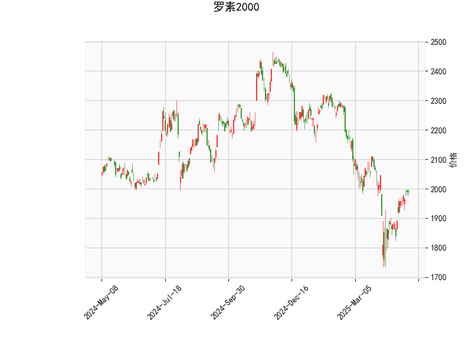

# 罗素2000指数技术分析及策略建议

## 一、技术指标解析

### 1. 价格与布林轨道
- **当前价1989.66**低于中轨2024.33，处于布林带下半区（下轨1778.19/上轨2270.46），显示短期弱势但未触达下轨支撑；
- **布林带宽收窄**（上中轨差246点，中下轨差246点），暗示波动率降低，需警惕突破行情。

### 2. MACD指标
- **MACD线(-2.71)上穿信号线(-21.64)**形成金叉，柱状图18.93连续放大，显示空头动能衰减；
- **MACD与价格底背离**：指数创新低时MACD柱显著回升，预示潜在反弹动能。

### 3. RSI指标
- **54.6中性区域**未现超买/超卖信号，但近期从30超卖区快速回升，显示资金回流小盘股。

### 4. K线形态
- **匹配低形态**：连续两日低点重合，确认1778下轨支撑有效性；
- **纺锤线**：多空博弈加剧，配合MACD金叉构成底部反转组合。

---

## 二、交易机会与策略

### 1. 多头策略
- **突破交易**：站稳中轨2024后建仓，目标上轨2270（14%空间），止损1980；
- **波段反弹**：现价轻仓试多，短期目标2100（5.5%），破下轨1778止损；
- **期权保护**：买入看涨期权+卖出虚值看跌期权，锁定下行风险。

### 2. 套利机会
- **跨期套利**：做多近月期货/做空远月，押注短期超跌反弹；
- **ETF配对**：多罗素2000ETF(IWM)+空道指ETF(DIA)，博弈小盘股补涨；
- **波动率交易**：买入跨式期权组合，捕捉布林带收窄后的突破行情。

---

## 三、风险提示
1. 美联储政策转向预期可能引发流动性波动
2. 中小型企业盈利受通胀冲击存在基本面风险
3. 需关注成交量配合（当前分析缺乏量能验证）
4. 有效跌破1778支撑需立即止损

（注：以上分析基于历史数据，实际交易需结合实时市场动态调整）