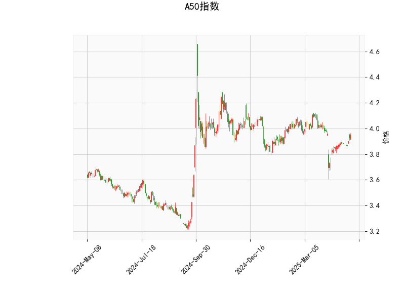

### 一、A50指数技术分析结果解读

#### 1. **价格与布林轨道**  
- **当前价**（3.95）略低于布林中轨（3.9629），表明短期处于中性区间，但接近中轨可能暗示方向选择。  
- **布林带收窄**（上轨4.1576，下轨3.7682）：波动率降低，需警惕突破行情。若价格站稳中轨并向上轨靠近，可能开启反弹；若跌破下轨，则可能加速下跌。

#### 2. **RSI指标**  
- **RSI值59.25**：处于中性区间（30-70），未超买或超卖，但接近60分水岭。若持续上行突破70，可能触发短期回调压力；若回落至50以下，则需警惕空头信号。

#### 3. **MACD指标**  
- **MACD线（-0.0075）上穿信号线（-0.02177）**，柱状图转正（0.01426）：形成“金叉”，短期动能转向多头。但绝对值较小，需结合价格确认趋势强度。

#### 4. **K线形态**  
- **CDLBELTHOLD（捉腰带线）**：当前形态需结合位置判断。若出现在下跌后，可能预示反转；若在震荡区间，则需更多验证信号。当前价格接近中轨，显示多空博弈。

---

### 二、潜在机会与策略建议

#### 1. **短期趋势跟踪**  
- **多头策略**：若价格站稳中轨（3.9629）并放量突破前高，可轻仓试多，目标看向布林上轨（4.15），止损设于下轨（3.768）下方。  
- **空头策略**：若价格跌破下轨且MACD死叉，可尝试短空，目标看向3.7-3.6区间。

#### 2. **波段套利机会**  
- **布林带收敛突破**：若价格突破上轨后回踩中轨支撑有效，可参与反弹波段；若假突破后重回中轨下方，可反向操作。  
- **MACD与RSI背离**：若价格新高但RSI未同步（顶背离），或价格新低但RSI未破前低（底背离），可捕捉反转机会。

#### 3. **风险提示**  
- **假突破风险**：布林带收窄后若缺乏成交量配合，可能反复震荡。  
- **宏观事件扰动**：A50指数受外围市场和政策影响较大，需关注经济数据及地缘政治事件。

---

### 三、总结  
**短期谨慎看多**，关注MACD金叉与价格能否站稳中轨，若突破上轨可顺势而为；若跌破下轨则需止损。**中长线**需等待更明确的趋势信号（如放量突破或政策利好）。