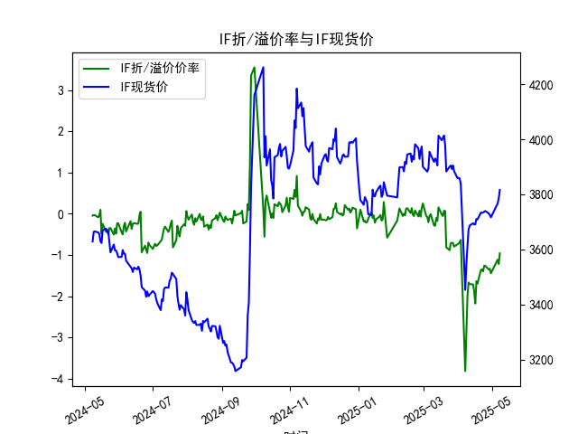
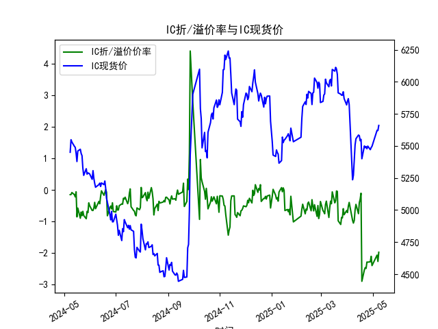
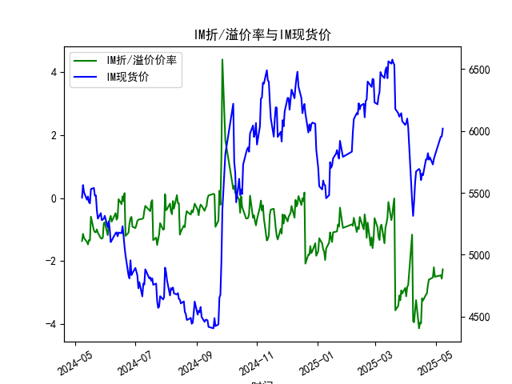

|            |   IF折/溢价率 |   IF现货价 |   IH折/溢价率 |   IH现货价 |   IC折/溢价率 |   IC现货价 |   IH折/溢价率 |   IH现货价 |
|:-----------|--------------:|-----------:|--------------:|-----------:|--------------:|-----------:|--------------:|-----------:|
| 2025-04-08 |     -2.92977  |     3543.8 |     -1.04965  |     5271   |     -1.04965  |     5271   |      -3.91353 |     5313.6 |
| 2025-04-09 |     -1.97446  |     3614   |     -0.96643  |     5387.2 |     -0.96643  |     5387.2 |      -3.9405  |     5429.6 |
| 2025-04-10 |     -1.663    |     3673   |     -0.632471 |     5509   |     -0.632471 |     5509   |      -3.56785 |     5578.2 |
| 2025-04-11 |     -1.70421  |     3686.6 |     -0.457211 |     5555.8 |     -0.457211 |     5555.8 |      -3.2409  |     5672.2 |
| 2025-04-14 |     -1.71162  |     3694.8 |     -0.752381 |     5584.8 |     -0.752381 |     5584.8 |      -4.13446 |     5693   |
| 2025-04-15 |     -1.88329  |     3690.4 |     -0.402211 |     5580   |     -0.402211 |     5580   |      -3.95041 |     5680.4 |
| 2025-04-16 |     -2.17398  |     3690.8 |     -0.296286 |     5540.4 |     -0.296286 |     5540.4 |      -3.98173 |     5603   |
| 2025-04-17 |     -1.63358  |     3710.6 |     -0.104562 |     5551.2 |     -0.104562 |     5551.2 |      -3.18113 |     5653.8 |
| 2025-04-18 |     -1.68913  |     3708.8 |     -2.89029  |     5400   |     -2.89029  |     5400   |      -3.25269 |     5642   |
| 2025-04-21 |     -1.36545  |     3733.2 |     -2.52696  |     5499.8 |     -2.52696  |     5499.8 |      -3.06818 |     5770   |
| 2025-04-22 |     -1.34653  |     3733   |     -2.45739  |     5486   |     -2.45739  |     5486   |      -3.02072 |     5769.6 |
| 2025-04-23 |     -1.39646  |     3734   |     -2.48358  |     5495   |     -2.48358  |     5495   |      -2.75012 |     5820   |
| 2025-04-24 |     -1.25668  |     3736.8 |     -2.28117  |     5478   |     -2.28117  |     5478   |      -2.58556 |     5767.4 |
| 2025-04-25 |     -1.26205  |     3739.2 |     -2.28499  |     5498.6 |     -2.28499  |     5498.6 |      -2.57433 |     5786.6 |
| 2025-04-28 |     -1.34913  |     3730.6 |     -2.27382  |     5471   |     -2.27382  |     5471   |      -2.51923 |     5729   |
| 2025-04-29 |     -1.33181  |     3724.8 |     -2.10005  |     5487.2 |     -2.10005  |     5487.2 |      -2.19842 |     5773.6 |
| 2025-04-30 |     -1.44197  |     3716.2 |     -2.39398  |     5497   |     -2.39398  |     5497   |      -2.49939 |     5801.4 |
| 2025-05-06 |     -1.11177  |     3766.2 |     -2.06144  |     5622   |     -2.06144  |     5622   |      -2.45329 |     5953.2 |
| 2025-05-07 |     -1.2169   |     3785   |     -2.26234  |     5620.2 |     -2.26234  |     5620.2 |      -2.55739 |     5955.2 |
| 2025-05-08 |     -0.957625 |     3816   |     -1.97107  |     5660   |     -1.97107  |     5660   |      -2.2617  |     6018.8 |

# 股指期货折/溢价率与现货价的相关性及影响逻辑分析

## 1. 折/溢价率与现货价的相关性及影响逻辑

### （1）基本定义
- **折价（贴水）**：期货价格低于现货价格（`ANAL_BASISPERCENT`为负），反映市场对未来的悲观预期或套利力量压制。
- **溢价（升水）**：期货价格高于现货价格（`ANAL_BASISPERCENT`为正），反映市场对未来的乐观预期或套利需求推升。

### （2）相关性分析
从数据可见：
- **IF/IH/IC/IM长期贴水**：四类股指期货近1年均以贴水为主（如IM贴水率常超-2%），表明市场整体偏向防御或存在结构性卖压（如对冲需求）。
- **贴水率与现货价负相关**：贴水率加深时（如2025-04-30 IH贴水-2.39%），现货价多处于低位（如5497.0）；贴水收敛时（如2025-05-08 IF贴水-0.95%），现货价显著回升（3816.0）。说明贴水可能抑制短期现货上涨动能。

### （3）影响逻辑
- **市场预期驱动**：贴水加深反映投资者对指数未来下跌的预期（如经济下行担忧），导致期货价格被压低。
- **套利机制传导**：期现套利者通过“买入期货+卖出现货”锁定价差，可能压制现货价格（尤其在流动性不足时）。
- **资金成本与分红因素**：IH（上证50）成分股分红率高，贴水部分反映股息折现，但极端贴水（如-2%）可能隐含超调。

---

## 2. 近期投资或套利机会及策略

### （1）期现套利机会
- **贴水收敛策略**：近期贴水率普遍收窄（如IM从2025-04-30的-2.49%降至2025-05-08的-2.26%），可布局“多期货+空现货”组合，待交割日价差收敛获利。
  - **标的筛选**：优先选择贴水率高且交割日临近的合约（如2025-05-08到期的IF贴水-0.95%）。
  - **风险提示**：需考虑现货卖空成本（如融券费率）及基差波动风险。

### （2）跨期套利机会
- **近远月价差策略**：观察不同到期合约贴水率差异（如2025-05-06与2025-05-08的IM贴水差达0.29%），可做空高贴水合约+做多低贴水合约。
  - **适用场景**：当近月贴水显著大于远月时，预期价差回归。

### （3）趋势性机会
- **贴水反转博弈**：若现货市场出现超跌反弹信号（如政策利好），可单边做多深度贴水期货品种（如IH贴水-2.39%时现货价5497.0，随后反弹至5660.0），利用期货弹性放大收益。

### （4）风险提示
- **流动性风险**：IC/IM等小盘股指期货流动性较低，可能影响套利平仓效率。
- **事件冲击**：宏观经济数据（如PMI）、政策调整（如降息）可能引发基差非线性波动。
- **展期成本**：跨期套利需频繁展期，可能因合约流动性差异产生额外损耗。

---

**结论**：当前贴水率处于历史较高水平（如IH超-2%），结合现货价企稳回升趋势，期现套利和贴水反转策略具备较高性价比，但需严格管理基差波动和流动性风险。

