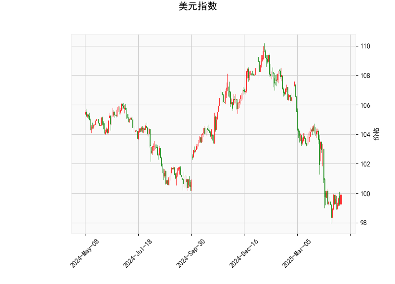

### 一、美元指数技术分析解读

#### 1. **价格与布林带关系**
- **当前价（99.90）**：位于布林带下轨（97.54）和中轨（103.01）之间，且明显低于中轨，表明美元指数处于**短期弱势区域**，可能接近超卖状态。
- **布林带形态**：下轨与当前价接近，若价格持续低于中轨，可能进一步向下跌破下轨，但需警惕技术性反弹（因超卖可能触发买盘）。

#### 2. **RSI指标（43.62）**
- 处于中性区间（30-70），未进入超卖区域（<30），但接近中性下沿，反映**短期下跌动能趋缓**，但尚未形成明确反转信号。

#### 3. **MACD指标**
- **MACD线（-0.95）**与**信号线（-1.17）**：MACD柱状图（0.23）由负转正，显示**短期空头动能减弱**，可能酝酿反弹。但MACD仍位于零轴下方，整体趋势仍偏空。

#### 4. **K线形态**
- **CDLBELTHOLD**（多头抵抗形态）：下跌趋势中出现的看涨信号，暗示卖压减弱。
- **CDLCLOSINGMARUBOZU**（收盘光头阳线）：短周期内买方力量占优。
- **CDLLONGLINE**（长腿十字线）与**CDLMARUBOZU**（光头光脚阳线）：反映多空博弈后买方占优。
- **综合判断**：短期技术面有反弹需求，但需关注布林带中轨（103.01）的阻力是否突破。

---

### 二、A股与港股投资机会及策略

#### 1. **美元弱势对市场的影响**
- **资金流动**：美元指数走弱可能推动资金流入新兴市场，利好港股（外资依赖度高）及A股（北向资金敏感）。
- **汇率联动**：人民币若升值，对港股（H股）及中资美元债企业（如地产、航空）构成利好。

#### 2. **A股潜在机会**
- **行业选择**：
  - **科技与消费**：受益于流动性宽松预期（如半导体、新能源、食品饮料）。
  - **金融板块**：若美元反弹乏力，低估值银行、保险股可能修复。
- **策略建议**：
  - **波段操作**：关注超跌板块（如医药、互联网）的反弹机会。
  - **事件驱动**：政策支持领域（如“专精特新”企业、基建）。

#### 3. **港股套利机会**
- **AH溢价套利**：AH股溢价指数若扩大，可做多H股/做空A股对冲。
- **行业聚焦**：
  - **科技股**：美元流动性敏感度高，若美元延续弱势，腾讯、美团等龙头或受益。
  - **地产与消费**：政策放松预期下，优质房企（如保利、华润）及消费龙头存在估值修复空间。

#### 4. **风险提示**
- **美元反弹风险**：若美国通胀数据超预期或美联储释放鹰派信号，美元可能反弹，压制新兴市场。
- **政策不确定性**：国内经济复苏节奏及监管政策变化需密切关注。

---

### 三、总结
- **美元指数**：短期技术性反弹概率上升，但趋势反转需突破中轨（103.01）。
- **A股/港股策略**：优先配置受益于美元弱势的科技、消费及低估值金融板块，同时关注AH溢价套利窗口。建议结合技术面信号（如布林带突破）与基本面政策动态灵活调整仓位。