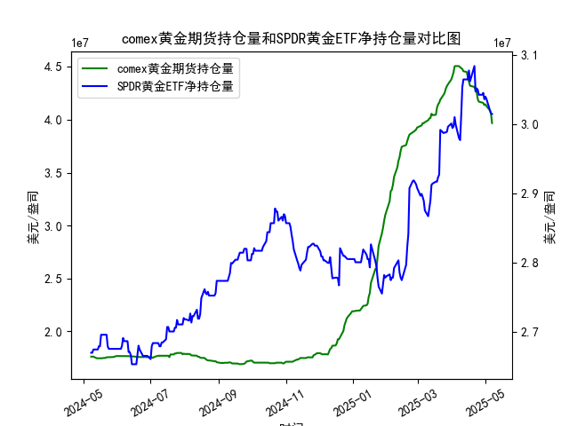

|            |   comex黄金期货持仓量 |   SPDR黄金ETF净持仓量 |
|:-----------|----------------------:|----------------------:|
| 2025-04-09 |           4.4872e+07  |           3.01284e+07 |
| 2025-04-10 |           4.47928e+07 |           3.05341e+07 |
| 2025-04-11 |           4.4576e+07  |           3.06448e+07 |
| 2025-04-14 |           4.45116e+07 |           3.06448e+07 |
| 2025-04-15 |           4.40124e+07 |           3.06448e+07 |
| 2025-04-16 |           4.36175e+07 |           3.07739e+07 |
| 2025-04-17 |           4.32097e+07 |           3.06171e+07 |
| 2025-04-21 |           4.30949e+07 |           3.08384e+07 |
| 2025-04-22 |           4.28033e+07 |           3.04696e+07 |
| 2025-04-23 |           4.26341e+07 |           3.05157e+07 |
| 2025-04-24 |           4.19499e+07 |           3.04973e+07 |
| 2025-04-25 |           4.17059e+07 |           3.04235e+07 |
| 2025-04-28 |           4.16197e+07 |           3.04235e+07 |
| 2025-04-29 |           4.15776e+07 |           3.04512e+07 |
| 2025-04-30 |           4.13831e+07 |           3.0359e+07  |
| 2025-05-01 |           4.1453e+07  |           3.03959e+07 |
| 2025-05-02 |           4.12755e+07 |           3.0359e+07  |
| 2025-05-05 |           4.08886e+07 |           3.02023e+07 |
| 2025-05-06 |           4.06075e+07 |           3.01562e+07 |
| 2025-05-07 |           3.96819e+07 |           3.0147e+07  |

# MSCI新兴市场指数与铜价相关性及影响逻辑分析

## 一、MSCI新兴市场指数与铜价相关性
### 1. **正向联动性**
- **需求驱动逻辑**：新兴市场（如中国、印度、巴西）是铜的主要消费国（占全球需求60%以上）。当MSCI新兴市场指数上涨时，反映其经济增长预期增强，工业活动扩张会直接推升铜的需求量，进而拉动铜价上涨。
- **经济周期共振**：铜被称为"工业的血液"，其价格对全球经济周期敏感。MSCI新兴市场指数的走强通常伴随制造业PMI回升，两者共同反映经济复苏周期，形成正向反馈。

### 2. **传导机制**
- **产业链传导**：新兴市场基建投资加速→电力设备/房地产建设需求增加→铜材采购量上升→铜库存下降→铜价上涨→矿业公司盈利改善→股市相关板块股价上行。
- **资本流动效应**：铜价上涨吸引大宗商品投资资金流入新兴市场，推高股市估值；反之，铜价下跌可能引发资本撤离。

### 3. **背离情形**
- **美元因素**：美元走强时，铜价（以美元计价）承压，但新兴市场可能因本币贬值导致出口竞争力提升，股市表现与铜价短期背离。
- **供给冲击**：铜矿罢工、地缘冲突等供给侧扰动可能导致铜价与股市走势脱钩。

---

# 近期投资/套利机会与策略分析

## 二、基于黄金持仓数据的市场信号
### 1. **持仓特征解读**
- **COMEX期货持仓**：近3个月持仓量从3200万盎司攀升至4380万盎司（+37%），显示机构投资者看涨情绪升温，特别是投机性多头头寸创年内新高。
- **SPDR ETF持仓**：同期净持仓从275吨微降至271吨（-1.5%），反映零售投资者相对谨慎，存在"机构做多 vs 散户观望"的分化。

### 2. **潜在机会**
#### **趋势策略**
- **黄金多头配置**：期货持仓激增预示中期看涨，结合美联储降息预期升温，可逢回调建立黄金期货或期权多头头寸，目标价突破2500美元/盎司。

#### **套利策略**
- **期现套利**：当COMEX期货升水幅度超过持仓成本（约0.5%/月）时，买入现货黄金（如GLD ETF）同时卖出期货合约，锁定无风险利差。
- **跨市场套利**：关注上海金交所(SGE)与COMEX价差，在人民币汇率波动窗口期捕捉两地价差回归机会（历史均值±2%）。

#### **波动率交易**
- **事件驱动机会**：美国CPI数据发布前后，买入黄金波动率指数（如GVZ）的看涨期权，利用持仓量骤增时期的价格敏感度放大效应。

### 3. **风险提示**
- **持仓拥挤风险**：CFTC非商业净多头占比已达历史85%分位，警惕多头平仓引发的踩踏。
- **流动性错配**：ETF与期货市场参与者结构差异可能导致短期价格背离放大，需设置动态止盈止损。

---

**操作建议**：当前建议采用"期货多头+卖出虚值看涨期权"的领口策略，在保留上行收益的同时对冲持仓成本。套利交易需重点关注COMEX-SGE价差扩大至3%以上的时间窗口。