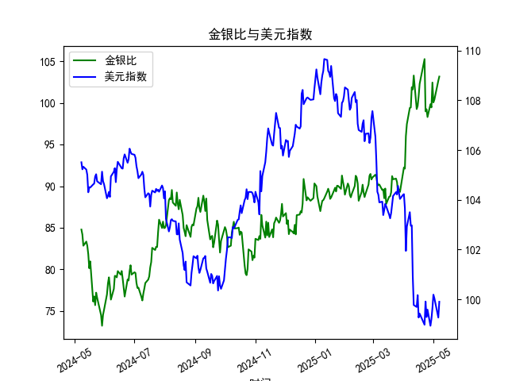

|            |    金价 |   银价 |   美元指数 |   金银比 |
|:-----------|--------:|-------:|-----------:|---------:|
| 2025-04-07 | 3014.75 | 30.325 |   103.501  |  99.4147 |
| 2025-04-08 | 3015.4  | 30.315 |   102.956  |  99.4689 |
| 2025-04-09 | 3075.5  | 30.18  |   102.971  | 101.905  |
| 2025-04-10 | 3143.15 | 30.925 |   100.937  | 101.638  |
| 2025-04-11 | 3230.5  | 31.27  |    99.769  | 103.31   |
| 2025-04-14 | 3204.2  | 32.275 |    99.692  |  99.2781 |
| 2025-04-15 | 3219.6  | 32.31  |   100.167  |  99.6472 |
| 2025-04-16 | 3322.9  | 32.955 |    99.2667 | 100.831  |
| 2025-04-17 | 3305.65 | 32.31  |    99.424  | 102.31   |
| 2025-04-22 | 3433.55 | 32.61  |    98.9757 | 105.291  |
| 2025-04-23 | 3262.95 | 32.96  |    99.9096 |  98.9973 |
| 2025-04-24 | 3314.75 | 33.395 |    99.288  |  99.2589 |
| 2025-04-25 | 3277.3  | 33.335 |    99.5836 |  98.3141 |
| 2025-04-28 | 3296.3  | 33.01  |    98.9357 |  99.8576 |
| 2025-04-29 | 3305.05 | 33.225 |    99.21   |  99.4748 |
| 2025-04-30 | 3302.05 | 32.225 |    99.6403 | 102.469  |
| 2025-05-01 | 3214.75 | 32.125 |   100.187  | 100.07   |
| 2025-05-02 | 3249.7  | 32.365 |   100.042  | 100.408  |
| 2025-05-06 | 3391.45 | 33.025 |    99.2654 | 102.693  |
| 2025-05-07 | 3392.25 | 32.875 |    99.9006 | 103.186  |

### 1. 金银比与美元指数的相关性及影响逻辑

#### 相关性分析
金银比（黄金价格/白银价格）与美元指数通常呈现**负相关性**，但具体关系需结合市场背景：
- **美元走强时**：以美元计价的黄金和白银价格承压，但黄金的避险属性可能使其跌幅小于白银，导致金银比**上升**。
- **美元走弱时**：贵金属价格普遍上涨，白银因工业属性（如经济复苏预期）可能涨幅更大，导致金银比**下降**。

#### 影响逻辑
- **美元指数对金银比的双向影响**：
  - **避险驱动**：若美元因避险需求上涨（如地缘冲突），黄金的避险需求可能强于白银，推高金银比。
  - **货币政策驱动**：若美元因美联储宽松政策下跌，白银的工业需求可能随经济复苏增长更快，压低金银比。
- **其他因素**：
  - **实际利率**：负利率环境利好黄金，可能推高金银比。
  - **工业需求**：新能源等领域对白银的需求激增可能压低金银比。

---

### 2. 近期投资或套利机会与策略

#### 当前市场信号
- **数据观察**：
  - **金银比**：近1年从73升至109（历史高位），近期回落至90-100区间。
  - **美元指数**：从99升至109后震荡回落，近期在104-108波动。
- **关键驱动因素**：
  - 美联储加息周期接近尾声，美元上行压力减弱。
  - 白银工业需求（如光伏、新能源）长期增长预期。

#### 潜在机会与策略
1. **做空金银比（多白银/空黄金）**：
   - **逻辑**：美元指数可能震荡偏弱+白银工业需求支撑，白银或跑赢黄金。
   - **操作**：
     - 期货：买入白银期货+卖出黄金期货。
     - ETF：做多白银ETF（如SLV）+做空黄金ETF（如GLD）。
   - **风险点**：经济衰退引发黄金避险需求激增，白银工业需求不及预期。

2. **美元指数与金银比背离套利**：
   - **逻辑**：若美元指数反弹但金银比未同步上升（白银抗跌），可做多白银。
   - **操作**：监测美元短线反弹时白银的支撑位（如23-24美元/盎司）布局多单。

3. **长线配置白银**：
   - **逻辑**：绿色能源转型（光伏用银占全球需求15%）或推动白银长期供需缺口。
   - **操作**：定投白银ETF或矿业股（如First Majestic Silver）。

#### 辅助策略
- **对冲组合**：做多黄金（对冲地缘风险）+做多白银（押注工业需求），动态平衡仓位。
- **事件驱动**：关注美国CPI数据、美联储议息会议对美元和实际利率的冲击。

---

### 总结
当前金银比处于历史高位且美元指数边际走弱，**做空金银比**（多白银/空黄金）是较优策略，需结合美元走势和工业需求数据动态调整。长线投资者可逐步布局白银，对冲短期波动风险。