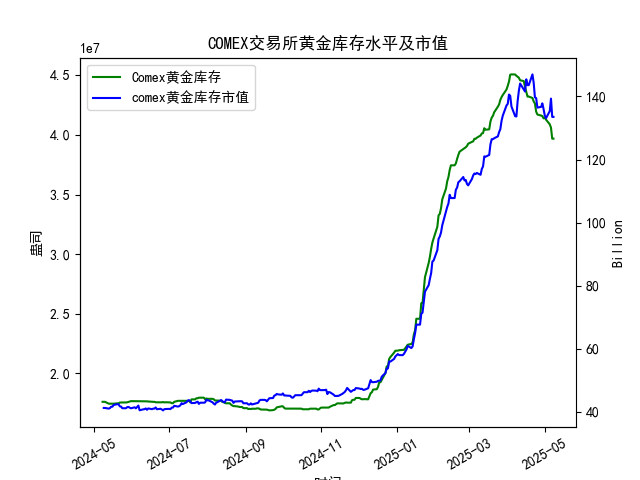

|            |   comex黄金库存量 |   comex黄金库存市值(billion) |   伦敦金现货价 |   上海金交所黄金现货价 |   美元兑人民币汇率 |
|:-----------|------------------:|-----------------------------:|---------------:|-----------------------:|-------------------:|
| 2025-04-11 |       4.4576e+07  |                       3233   |        3230.5  |                 757.1  |             7.2087 |
| 2025-04-14 |       4.45116e+07 |                       3195   |        3204.2  |                 762.47 |             7.211  |
| 2025-04-15 |       4.40124e+07 |                       3216.5 |        3219.6  |                 762.9  |             7.2096 |
| 2025-04-16 |       4.36175e+07 |                       3334.3 |        3322.9  |                 781.62 |             7.2133 |
| 2025-04-17 |       4.32097e+07 |                       3323.1 |        3305.65 |                 786    |             7.2085 |
| 2025-04-18 |       4.32097e+07 |                       3323.1 |        3305.65 |                 788.62 |             7.2069 |
| 2025-04-21 |       4.30949e+07 |                       3411.1 |        3305.65 |                 804.11 |             7.2055 |
| 2025-04-22 |       4.28033e+07 |                       3371.6 |        3433.55 |                 825.8  |             7.2074 |
| 2025-04-23 |       4.26341e+07 |                       3276.9 |        3262.95 |                 786.99 |             7.2116 |
| 2025-04-24 |       4.19499e+07 |                       3325.5 |        3314.75 |                 792.47 |             7.2098 |
| 2025-04-25 |       4.17059e+07 |                       3272.2 |        3277.3  |                 785.6  |             7.2066 |
| 2025-04-28 |       4.16197e+07 |                       3284.5 |        3296.3  |                 778.4  |             7.2043 |
| 2025-04-29 |       4.15776e+07 |                       3314.5 |        3305.05 |                 780.05 |             7.2029 |
| 2025-04-30 |       4.13831e+07 |                       3286.4 |        3302.05 |                 780.19 |             7.2014 |
| 2025-05-01 |       4.1453e+07  |                       3231   |        3214.75 |                 780.19 |             7.2014 |
| 2025-05-02 |       4.12755e+07 |                       3225   |        3249.7  |                 780.19 |             7.2014 |
| 2025-05-05 |       4.08886e+07 |                       3310.1 |        3249.7  |                 780.19 |             7.2014 |
| 2025-05-06 |       4.06075e+07 |                       3430.9 |        3391.45 |                 792.2  |             7.2008 |
| 2025-05-07 |       3.96819e+07 |                       3364.7 |        3392.25 |                 798.51 |             7.2005 |
| 2025-05-08 |       3.96819e+07 |                       3364.7 |        3392.25 |                 798.51 |             7.2073 |

### 近期COMEX黄金库存及市场套利机会分析

#### 1. **COMEX库存及市值变化**
- **库存量**：近一个月（2025-04-08至2025-05-08）COMEX黄金库存从4127万盎司降至3968万盎司，降幅约3.9%，显示市场实物需求增强或交割活动活跃。
- **库存市值**：同期市值从约4.1亿（单位存疑，可能为十亿美元）增长至约106亿，反映黄金价格大幅上涨（伦敦金价从2309升至3392美元/盎司）推动库存价值攀升。

#### 2. **跨市场套利机会（伦敦 vs 上海）**
- **价差分析**：  
  以2025-05-08数据为例：  
  - **伦敦金价**：3392.25美元/盎司，按汇率7.2073换算为人民币约24449元/盎司（3392.25 × 7.2073）。  
  - **上海金价**：798.51元/克，按1盎司=31.1035克计算，对应人民币约798.51 × 31.1035 = 24844元/盎司。  
  - **价差**：24844（上海） - 24449（伦敦） = 395元/盎司（约12.7元/克），扣除交易成本（假设5元/克）后仍存在显著套利空间（约7.7元/克）。  

- **趋势观察**：  
  近一个月内，伦敦与上海价差多次超过10元/克（如2025-05-07价差约13元/克），且上海价格持续高于伦敦，显示**买入伦敦黄金、卖出上海黄金**的跨市场套利策略可行。

#### 3. **COMEX库存与价格背离**
- **库存下降与价格上升**：COMEX库存减少伴随金价上涨，可能反映实物交割需求增加或投机性持仓减少。若未来库存继续下降，可能进一步推高纽约金价，需关注与伦敦/上海的价差联动。

#### 4. **策略建议**
- **跨市场套利**：  
  - **短期操作**：实时监控伦敦与上海的价差，当价差超过交易成本（5-8元/克）时执行套利交易。  
  - **风险对冲**：通过外汇远期合约锁定汇率波动风险（如美元兑人民币汇率从7.10升至7.20）。  
- **库存-价格联动策略**：  
  - 若COMEX库存持续下降且价格走强，可考虑做多COMEX期货合约，同时做空其他市场（如上海）以对冲系统性风险。  
- **关注事件风险**：  
  - 美联储政策、地缘冲突等可能引发金价剧烈波动，需设置止损并动态调整仓位。

#### 5. **结论**
近期套利机会主要集中于**中英市场价差**，建议优先布局跨市场套利策略，同时警惕库存变化与宏观事件对价格的短期冲击。操作上需结合高频数据与成本测算，确保套利空间可持续。