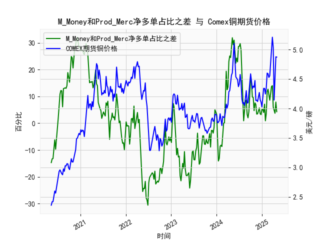

|            |   M_Money净多单占比 |   Prod_Merc净多单占比 |   Comex铜期货价格 |   M_Money和Prod_Merc净多单占比之差 |
|:-----------|--------------------:|----------------------:|------------------:|-----------------------------------:|
| 2024-12-17 |                35.8 |                  39.3 |            4.1465 |                                3.5 |
| 2024-12-24 |                35.7 |                  38.9 |            4.11   |                                3.2 |
| 2024-12-31 |                35   |                  40.2 |            4.0265 |                                5.2 |
| 2025-01-07 |                35.8 |                  41   |            4.1955 |                                5.2 |
| 2025-01-14 |                36.6 |                  40.6 |            4.3425 |                                4   |
| 2025-01-21 |                33.8 |                  40.9 |            4.341  |                                7.1 |
| 2025-01-28 |                36.1 |                  37   |            4.2465 |                                0.9 |
| 2025-02-04 |                35.5 |                  39.1 |            4.3535 |                                3.6 |
| 2025-02-11 |                30.8 |                  42.6 |            4.601  |                               11.8 |
| 2025-02-18 |                29.9 |                  42.6 |            4.591  |                               12.7 |
| 2025-02-25 |                30.7 |                  41.3 |            4.5275 |                               10.6 |
| 2025-03-04 |                32.1 |                  40.7 |            4.5565 |                                8.6 |
| 2025-03-11 |                30.3 |                  41.8 |            4.766  |                               11.5 |
| 2025-03-18 |                28.8 |                  42.5 |            5.0165 |                               13.7 |
| 2025-03-25 |                28.1 |                  42.1 |            5.2105 |                               14   |
| 2025-04-01 |                32.4 |                  38.4 |            5.035  |                                6   |
| 2025-04-08 |                32.2 |                  36.8 |            4.144  |                                4.6 |
| 2025-04-15 |                33.5 |                  37.2 |            4.626  |                                3.7 |
| 2025-04-22 |                32.1 |                  40   |            4.878  |                                7.9 |
| 2025-04-29 |                33   |                  37.3 |            4.8725 |                                4.3 |

### 1. M_Money与Prod_Merc净多单占比之差与Comex铜期货价格的相关性及影响逻辑

#### 相关性分析
从数据来看，**M_Money（非商业多头持仓占比）与Prod_Merc（商业多头持仓占比）的差值**与**Comex铜期货价格**呈现显著的正相关性。具体表现为：
- **差值扩大（正值增加或负值收敛）**时，铜价往往上涨。例如，当差值从早期的-14.7逐步升至32.1（历史高点）时，铜价从2.359美元/磅攀升至4.895美元/磅。
- **差值收窄（正值减少或负值扩大）**时，铜价倾向于下跌。例如，差值从32.1回落至-30.6的过程中，铜价从高位回落至3.288美元/磅。

#### 影响逻辑
1. **市场参与者行为差异**：
   - **非商业持仓（M_Money）**：以投机资金为主，反映市场情绪和短期预期。当差值扩大（投机者净多单占比上升），表明资金涌入推动铜价上涨。
   - **商业持仓（Prod_Merc）**：以实体企业套期保值为核心，通常逆势操作（如生产商在价格上涨时增加套保空单）。当差值收窄（商业净多单占比上升），可能预示价格见顶或触底。

2. **价格拐点信号**：
   - **极端差值（如>30或<-20）**：往往对应铜价的阶段性高点或低点。例如，差值升至32.1时铜价接近5美元/磅（历史高位），随后差值回落引发价格调整。
   - **背离现象**：若铜价创新高但差值未同步扩大，可能暗示上涨动力衰竭，反之亦然。

3. **基本面与资金面共振**：
   - 差值持续扩大时，投机资金与实体需求（如新能源、基建）的叠加效应会强化铜价趋势；反之，若商业持仓占比上升（差值收窄），可能反映供应压力或需求疲软。

---

### 2. 近期投资或套利机会与策略

#### 当前数据观察
- **最新差值**：4.3（从前期-30.6逐步回升），**铜价**：4.8725美元/磅（处于近5年高位）。
- **差值趋势**：近期差值从负值区间回升，但绝对值较低，显示投机情绪温和复苏，而商业套保压力仍存。

#### 潜在机会与策略
1. **短期看多机会**：
   - **逻辑**：差值从深度负值（-30.6）反弹至正值，表明投机资金开始回流，且铜价尚未突破前高（5.21美元/磅）。若差值继续扩大，可能推动铜价测试前高。
   - **策略**：轻仓做多铜期货，止损设于4.5美元/磅以下，目标5.1-5.3美元/磅。

2. **中期回调风险**：
   - **逻辑**：当前差值（4.3）远低于历史高位（32.1），且商业持仓占比仍较高（差值绝对值小），暗示实体企业套保压力可能限制上行空间。
   - **策略**：在铜价接近5美元/磅时逐步减仓，或买入看跌期权对冲。

3. **跨期套利**：
   - **逻辑**：若近月合约受投机情绪推动涨幅更大，而远月合约受商业套保压制，可做多近月合约、做空远月合约。
   - **策略**：选择价差较大的合约（如近月-远月价差>0.2美元/磅时），滚动操作。

4. **事件驱动策略**：
   - **逻辑**：关注美联储政策、中国基建投资等事件。若宏观宽松预期升温，可能放大差值回升对铜价的推动作用。
   - **策略**：结合持仓差值与宏观数据，在政策窗口期前布局多单。

#### 风险提示
- **持仓差值波动**：当前差值仍处低位，若再度转负可能引发铜价急跌。
- **库存与供需**：需同步跟踪LME库存及中国进口数据，若库存回升或需求走弱，可能抵消持仓差值的利多影响。

---

### 总结
M_Money与Prod_Merc净多单占比之差是铜价的重要领先指标，反映市场情绪与实体预期的博弈。当前数据暗示铜价短期存在反弹空间，但中期需警惕商业套保压力和宏观风险。投资者可结合差值趋势与基本面数据，灵活布局多空策略或套利组合。