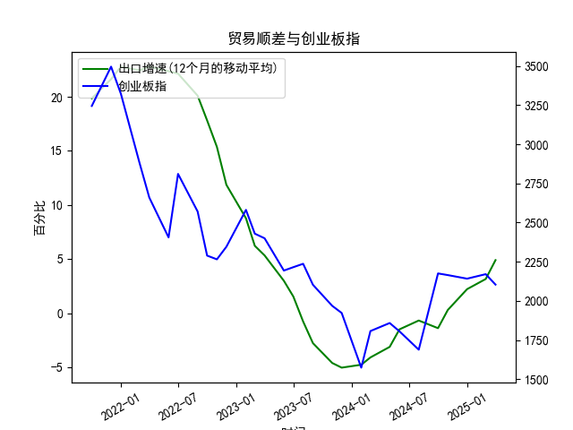

|            |   出口增速 |   创业板指 |   出口增速(12个月的移动平均) |
|:-----------|-----------:|-----------:|-----------------------------:|
| 2022-11-30 | -10.38     |    2345.31 |                    11.86     |
| 2023-01-31 | -12.0231   |    2580.84 |                     8.76724  |
| 2023-02-28 |  -2.86551  |    2429.03 |                     6.22011  |
| 2023-03-31 |  10.84     |    2399.5  |                     5.33261  |
| 2023-05-31 |  -7.56172  |    2193.41 |                     2.98747  |
| 2023-06-30 | -12.3776   |    2215    |                     1.53184  |
| 2023-07-31 | -14.2563   |    2236.67 |                    -0.776185 |
| 2023-08-31 |  -8.5529   |    2102.58 |                    -2.77643  |
| 2023-10-31 |  -6.61276  |    1968.23 |                    -4.60916  |
| 2023-11-30 |   0.693013 |    1922.59 |                    -5.04057  |
| 2024-01-31 |   7.69     |    1573.37 |                    -4.77057  |
| 2024-02-29 |   6.25     |    1807.03 |                    -4.09641  |
| 2024-04-30 |   1.33     |    1858.39 |                    -3.12057  |
| 2024-05-31 |   7.42     |    1805.11 |                    -1.50031  |
| 2024-07-31 |   6.93     |    1688.14 |                    -0.684019 |
| 2024-09-30 |   2.35     |    2175.09 |                    -1.39152  |
| 2024-10-31 |  12.65     |    2164.46 |                     0.292791 |
| 2024-12-31 |  10.69     |    2141.6  |                     2.21509  |
| 2025-02-28 |  -3        |    2170.39 |                     3.15311  |
| 2025-03-31 |  12.4      |    2103.7  |                     4.89919  |

### 中国出口增速与创业板指的相关性及影响逻辑

#### 1. 相关性分析
从数据趋势来看，中国出口增速与创业板指在中期（近2-3年）呈现**阶段性正相关**，但短期波动中存在一定分化。具体表现为：
- **出口增速高位阶段**（前10个月增速>15%）：创业板指同步处于高位（3000点以上），反映出口增长对科技、制造业企业的盈利预期支撑。
- **出口增速快速下滑阶段**（后续12个月增速由正转负）：创业板指同步下跌至低位（最低1573点），显示出口疲软对市场风险偏好的压制。
- **出口增速触底回升阶段**（近8个月增速由-5%回升至4.9%）：创业板指逐步反弹（1800→2100点），但反弹幅度弱于出口增速，可能存在滞后效应或市场信心修复较慢。

#### 2. 影响逻辑
- **直接传导路径**：创业板中电子、新能源等出口导向型行业占比高（约40%），出口增速回升直接改善企业营收预期。
- **汇率与成本联动**：出口回暖常伴随人民币汇率阶段性贬值压力（提升出口竞争力），同时降低企业外汇结算成本，利好创业板中小型出口企业。
- **政策协同效应**：出口复苏常伴随国内稳增长政策（如退税、信贷支持），间接改善创业板企业的融资环境和市场流动性。

---

### 近期投资或套利机会及策略

#### 1. 机会判断
- **出口增速与创业板指的背离修复**：当前出口增速已连续8个月回升（接近5%），但创业板指仍处2100点低位（较历史中枢低30%），存在估值修复空间。
- **结构性行业机会**：新能源车、光伏等出口高增行业（2023年出口同比+60%以上）的创业板龙头公司或超跌反弹。

#### 2. 策略建议
- **趋势跟踪策略**：
  - **多头配置**：在出口增速连续3个月高于前值时，增持创业板50ETF（159949）或出口占比超30%的创业板个股。
  - **止损条件**：若出口增速环比回落且创业板指跌破2000点，触发止损。
- **套利机会**：
  - **跨市场套利**：当出口增速回升但创业板指未同步反应时，做多创业板指期货（IH）/做空沪深300期货（IF），利用板块间弹性差异获利。
  - **行业轮动**：出口增速触底阶段超配创业板中的消费电子（如立讯精密）、医疗器械（如迈瑞医疗）等滞后修复板块。

#### 3. 风险提示
- **外部需求不确定性**：欧美经济衰退风险可能压制出口持续性。
- **创业板流动性风险**：注册制全面落地后，小市值创业板个股波动率可能放大。
- **汇率反向波动**：若人民币快速升值，可能削弱出口企业利润修复预期。