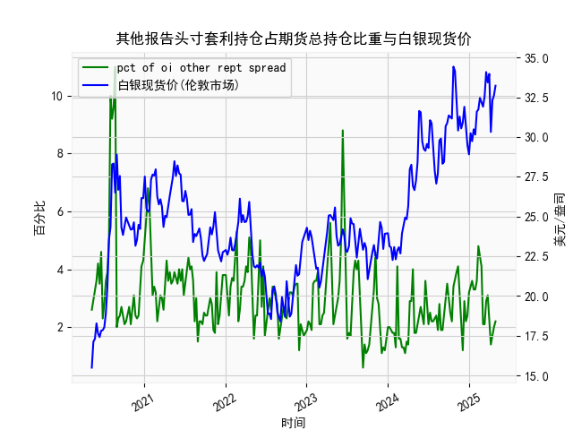

|            |   其他报告头寸套利持仓占期货总持仓比重 |   白银现货价 |
|:-----------|---------------------------------------:|-------------:|
| 2024-12-17 |                                    2.2 |       30.31  |
| 2024-12-24 |                                    2.4 |       29.48  |
| 2024-12-31 |                                    3.2 |       28.905 |
| 2025-01-07 |                                    3.4 |       30.235 |
| 2025-01-14 |                                    3.6 |       29.735 |
| 2025-01-21 |                                    3.3 |       30.485 |
| 2025-01-28 |                                    3.3 |       30.15  |
| 2025-02-04 |                                    3.6 |       31.595 |
| 2025-02-11 |                                    4.8 |       31.73  |
| 2025-02-18 |                                    4.5 |       32.46  |
| 2025-02-25 |                                    4.1 |       32.145 |
| 2025-03-04 |                                    2.1 |       31.905 |
| 2025-03-11 |                                    2.1 |       32.55  |
| 2025-03-18 |                                    2.9 |       34.085 |
| 2025-03-25 |                                    3.1 |       33.435 |
| 2025-04-01 |                                    2.1 |       33.97  |
| 2025-04-08 |                                    1.4 |       30.315 |
| 2025-04-15 |                                    1.8 |       32.31  |
| 2025-04-22 |                                    2   |       32.61  |
| 2025-04-29 |                                    2.2 |       33.225 |

### 1. 其他报告头寸套利持仓比重与白银现货价的相关性及影响逻辑

#### （1）相关性分析  
从数据趋势看，套利持仓比重与白银现货价存在**阶段性正相关**，但并非线性关系。例如：  
- **高套利持仓阶段**（如占比超10%时）往往对应白银价格的快速上涨（如28-34美元/盎司区间），表明市场波动加大，套利资金活跃。  
- **低套利持仓阶段**（如占比低于3%时）多出现在白银价格横盘或下跌期（如20-25美元/盎司区间），反映市场观望情绪浓厚。  

#### （2）影响逻辑  
- **套利持仓的驱动因素**：  
  套利持仓上升通常源于期货与现货价差（基差）扩大或跨期价差波动，吸引资金通过同时买卖不同合约或现货对冲风险。  
- **对现货价的影响**：  
  - **正向反馈**：套利资金涌入可能加速期货市场流动性提升，间接推升现货价格预期（如通过跨市套利买入现货、卖出期货）。  
  - **收敛效应**：套利活动会促使期货与现货价差回归合理区间，抑制现货价格的单边波动。  
- **市场情绪信号**：  
  套利持仓占比的骤升可能预示市场分歧加剧（如多空博弈），而持续低位则暗示趋势性行情临近（如白银突破前高或触底反弹）。

---

### 2. 近期投资或套利机会及策略建议

#### （1）当前数据特征  
- **套利持仓比重**：近期数据末段显示比重从低位（1.2%-2.2%）回升至3.2%-3.6%，但仍低于历史高点（10%）。  
- **白银现货价**：最新价格约33.225美元/盎司，处于近5年高位区间（28-34美元）。  

#### （2）潜在机会分析  
- **跨期套利机会**：  
  若白银期货远月合约升水显著（如远月价格高于近月+持仓成本），可做空远月、做多近月，赚取价差收敛收益。需关注美联储利率政策对远期合约的影响。  
- **期现套利窗口**：  
  若期货价格持续高于现货价格+仓储成本，可买入现货白银并做空期货锁定利润。当前高位需警惕交割风险，建议轻仓操作。  
- **趋势跟踪策略**：  
  套利持仓比重回升至中位（3%-4%），且白银价格接近前高，若突破34美元可能触发趋势资金入场，可逢低布局多头头寸，止损设于31美元下方。  

#### （3）风险提示  
- **宏观扰动**：美国通胀数据及美元指数波动可能压制白银上行空间。  
- **持仓结构变化**：若套利占比快速突破5%，需警惕多头获利了结引发的回调风险。  

#### （4）策略优先级  
短期优先关注**跨期套利**（价差波动率提升），中期结合美联储政策信号布局**趋势性多单**（通胀预期支撑）。