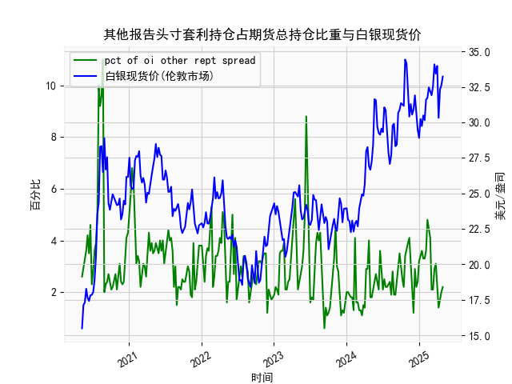

|            |   人民币汇率 |   美元指数 |
|:-----------|-------------:|-----------:|
| 2025-04-07 |       7.198  |   103.501  |
| 2025-04-08 |       7.2038 |   102.956  |
| 2025-04-09 |       7.2066 |   102.971  |
| 2025-04-10 |       7.2092 |   100.937  |
| 2025-04-11 |       7.2087 |    99.769  |
| 2025-04-14 |       7.211  |    99.692  |
| 2025-04-15 |       7.2096 |   100.167  |
| 2025-04-16 |       7.2133 |    99.2667 |
| 2025-04-17 |       7.2085 |    99.424  |
| 2025-04-18 |       7.2069 |    99.2286 |
| 2025-04-21 |       7.2055 |    98.3518 |
| 2025-04-22 |       7.2074 |    98.9757 |
| 2025-04-23 |       7.2116 |    99.9096 |
| 2025-04-24 |       7.2098 |    99.288  |
| 2025-04-25 |       7.2066 |    99.5836 |
| 2025-04-28 |       7.2043 |    98.9357 |
| 2025-04-29 |       7.2029 |    99.21   |
| 2025-04-30 |       7.2014 |    99.6403 |
| 2025-05-06 |       7.2008 |    99.2654 |
| 2025-05-07 |       7.2005 |    99.9006 |

### 一、人民币汇率与美元指数的相关性及影响逻辑

#### 1. **基础逻辑**  
人民币汇率（CNY/USD）与美元指数（DXY）通常呈现**正相关性**，但具体联动程度受以下因素影响：  
- **美元指数的定义**：美元指数衡量美元对一篮子货币（欧元、日元等）的强弱，其中欧元权重占比最大（约57.6%）。当美元指数走强时，美元对其他货币普遍升值，可能带动人民币被动贬值（即人民币汇率数值升高）。  
- **直接传导机制**：若美元指数因美联储加息或避险需求而上涨，人民币对美元汇率可能同步承压。例如，近期美元指数从103升至107时，人民币汇率从7.10升至7.20附近。  
- **政策干预**：中国央行可能通过中间价调整或外汇干预抵消美元波动的影响，导致短期相关性弱化（如2023年四季度美元指数回落，但人民币汇率未明显反弹）。  

#### 2. **近期数据验证**  
- **正相关阶段**：从用户提供的数据看，人民币汇率（如从7.10升至7.21）与美元指数（如从103升至107）在多数时间保持同步波动，尤其在美元快速走强时（例如美元指数突破106后人民币突破7.15）。  
- **阶段性背离**：在美元指数回调时（如从108跌至105），人民币汇率未同步反弹（仍维持在7.17-7.19），可能反映中国国内经济预期偏弱或资本外流压力。  

#### 3. **影响逻辑深化**  
- **利差驱动**：中美利差扩大（如美联储加息、中国降息）会加剧资本外流，推高美元需求，进一步强化正相关性。  
- **风险情绪**：全球避险情绪升温时，美元作为避险货币走强，同时人民币因跨境资本流动承压。  
- **政策分化**：若中国推出稳增长政策（如降准、财政刺激），可能短暂削弱美元指数对人民币的影响。  

---

### 二、近期投资或套利机会与策略

#### 1. **趋势跟踪策略**  
- **方向性交易**：  
  若美元指数因美联储鹰派预期或地缘风险再度走强（如突破108），可做多USD/CNY（押注人民币贬值至7.25-7.30）。需关注美国CPI数据及美联储会议。  
- **反向博弈**：  
  若美元指数超涨后回调（如跌至105以下），且中国政策发力（如地产政策加码），可短线做空USD/CNY（目标7.15以下）。  

#### 2. **套利机会**  
- **跨市场套利**：  
  利用CNH（离岸人民币）与CNY（在岸人民币）价差。例如，当CNH较CNY贬值幅度更大时（价差扩大至300点以上），可做多CNH、做空CNY，等待价差收敛。  
- **利差套利**：  
  通过外汇掉期锁定利差。例如，借入低息美元（利率约5.5%），兑换为人民币后投资中国高收益债券（如政策性银行债，收益率约2.5%），需对冲汇率风险。  

#### 3. **事件驱动策略**  
- **政策窗口期**：  
  中国重要会议（如政治局会议）前押注政策宽松预期，做空USD/CNY；若政策力度不及预期，则快速平仓。  
- **数据发布**：  
  美国非农就业或中国贸易数据公布后，若人民币汇率与美元指数出现短期背离（如美元跌但人民币未升），可进行日内波段交易。  

---

### 三、风险提示  
1. **政策干预风险**：中国央行可能通过逆周期因子或外汇储备操作干预汇率波动。  
2. **流动性风险**：离岸市场（CNH）流动性较低，极端行情下可能出现点差扩大。  
3. **全球宏观风险**：地缘冲突或美国经济衰退可能打破传统相关性逻辑。  

（注：以上分析基于用户提供的数据及公开市场信息，具体操作需结合实时动态。）