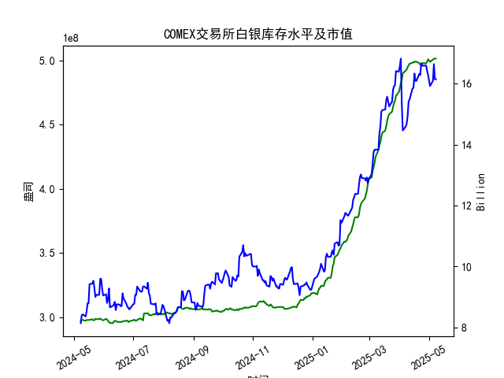

|            |   comex白银库存量 |   comex白银库存市值(billion) |   伦敦银现货价 |   上海金交所白银现货价 |   美元兑人民币汇率 |
|:-----------|------------------:|-----------------------------:|---------------:|-----------------------:|-------------------:|
| 2025-04-11 |       4.97475e+08 |                       31.115 |         31.27  |                   7984 |             7.2087 |
| 2025-04-14 |       4.98195e+08 |                       31.8   |         32.275 |                   8107 |             7.211  |
| 2025-04-15 |       4.98847e+08 |                       31.8   |         32.31  |                   8139 |             7.2096 |
| 2025-04-16 |       4.98569e+08 |                       32.755 |         32.955 |                   8230 |             7.2133 |
| 2025-04-17 |       4.99104e+08 |                       32.23  |         32.31  |                   8143 |             7.2085 |
| 2025-04-18 |       4.99104e+08 |                       32.23  |         32.31  |                   8142 |             7.2069 |
| 2025-04-21 |       4.97895e+08 |                       32.785 |         32.31  |                   8227 |             7.2055 |
| 2025-04-22 |       4.96698e+08 |                       32.785 |         32.61  |                   8154 |             7.2074 |
| 2025-04-23 |       4.96891e+08 |                       33.55  |         32.96  |                   8191 |             7.2116 |
| 2025-04-24 |       4.97741e+08 |                       33.325 |         33.395 |                   8295 |             7.2098 |
| 2025-04-25 |       4.97908e+08 |                       33.325 |         33.335 |                   8270 |             7.2066 |
| 2025-04-28 |       4.97746e+08 |                       33.325 |         33.01  |                   8173 |             7.2043 |
| 2025-04-29 |       4.99098e+08 |                       32.89  |         33.225 |                   8197 |             7.2029 |
| 2025-04-30 |       5.00876e+08 |                       32.51  |         32.225 |                   8163 |             7.2014 |
| 2025-05-01 |       5.00128e+08 |                       32.205 |         32.125 |                   8163 |             7.2014 |
| 2025-05-02 |       4.98978e+08 |                       31.91  |         32.365 |                   8163 |             7.2014 |
| 2025-05-05 |       5.00644e+08 |                       32.14  |         32.365 |                   8163 |             7.2014 |
| 2025-05-06 |       5.01317e+08 |                       33.19  |         33.025 |                   8221 |             7.2008 |
| 2025-05-07 |       5.01469e+08 |                       32.195 |         32.875 |                   8229 |             7.2005 |
| 2025-05-08 |       5.01469e+08 |                       32.195 |         32.875 |                   8229 |             7.2073 |

### 近期COMEX白银库存及套利机会分析

#### **1. 库存变化趋势**
- **COMEX库存持续攀升**：近一个月（2025年4月-5月）库存量从约4.99亿盎司增至5.01亿盎司，增速有所放缓，但整体维持高位。库存积累可能反映实物交割需求疲软或隐性库存显性化，需警惕供需错配风险。
- **市值同步增长**：库存市值从15.08十亿美元增至16.14十亿美元，表明价格对市值的推动强于库存增量，隐含市场对白银的看涨预期。

#### **2. 跨市场套利机会**
- **伦敦与上海价差**：
  - **伦敦白银价格（美元计价）**：近期约32.875美元/盎司，换算为人民币约7619元/千克（按汇率7.2073）。
  - **上海白银价格**：同期约8229元/千克，两地价差达**610元/千克**，扣除物流、税费等成本（假设约400元/千克），仍存在约**210元/千克**的无风险套利空间。
  - **建议**：买入伦敦现货，同时在上海市场卖出，锁定价差收益；需关注汇率波动风险，可搭配外汇远期合约对冲。
  
- **汇率影响**：美元兑人民币汇率近一个月从7.20小幅升至7.21，波动平缓，对套利成本影响有限，但需警惕政策变动风险。

#### **3. 库存与价格背离信号**
- **库存增而价格涨**：近一个月库存增加0.2%，但伦敦白银价格上涨约5.3%（32.365→32.875美元），上海价格上涨0.8%（8163→8229元）。库存与价格同步上行或反映**投机性囤货**或**通胀避险需求**，需警惕库存集中释放带来的抛压。
- **策略建议**：短期可跟随趋势参与多头，但需设置止损；中期关注库存拐点，若库存增速回升而价格滞涨，可布局空单。

#### **4. 期现套利空间**
- **隐含交割成本**：COMEX库存持续高位或压制近月合约贴水幅度，若期货较现货贴水超过仓储成本（约0.5%年化），可买入期货、卖出现货，赚取基差收敛收益。
- **风险提示**：需确认交割规则和仓储费用，避免流动性不足导致的平仓风险。

### **结论与操作建议**
1. **跨市场套利**：优先布局伦敦-上海价差套利，利用当前610元/千克的价差空间，需快速执行以规避汇率波动。
2. **库存拐点监测**：若未来1-2周库存增速突破前高（如单周增超0.5%），可能触发价格回调，可逐步减仓多头。
3. **期现联动策略**：关注COMEX近月合约基差变化，贴水扩大至1%以上时，可入场期现套利。