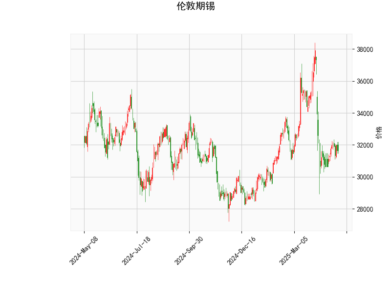

### 伦敦期锡技术分析解读

#### 1. 技术指标分析
**当前价与布林轨道**  
当前价格（31,636）位于布林通道中轨（33,045）和下轨（29,067）之间，接近中轨但未突破，表明市场处于中性偏弱状态。若价格向上突破中轨，可能开启短期反弹；若向下靠近下轨，则可能进一步下跌。

**RSI（45.3）**  
RSI接近中性区域（50），既未超买（>70）也未超卖（<30），显示多空力量暂时平衡，但需警惕方向性突破的可能。

**MACD指标**  
- **MACD线（-439.7）**与**信号线（-546.6）**均为负值，但MACD柱状图（106.9）已转正，表明空头动能减弱，短期可能出现反弹信号。若MACD线持续上穿信号线，可能确认短期底部。

**K线形态（CDLMATCHINGLOW）**  
该形态出现在下跌趋势中，暗示价格在低位出现两次相近的收盘价，可能反映空头力量衰竭，需结合成交量验证是否为反转信号。

---

#### 2. 投资机会与策略建议

**短期趋势策略**  
- **反弹机会**：若价格站稳中轨（33,045）且MACD柱持续扩大，可轻仓试多，目标看向上轨（37,023），止损设于下轨（29,067）下方。  
- **下跌风险**：若价格跌破近期低点并靠近下轨（29,067），可能触发技术性抛售，需警惕进一步下探。

**套利机会**  
- **跨期套利**：观察近月合约是否超跌（当前价低于中轨），若远月合约贴水（价格低于近月），可考虑做多近月、做空远月的正向套利。  
- **波动率策略**：布林通道收窄后可能面临方向突破，可布局波动率衍生品（如期权跨式组合）捕捉潜在行情。

**风险提示**  
- 当前技术面未明确反转信号，需结合基本面（如锡矿供应、工业需求）验证趋势。  
- RSI中性背景下，MACD反弹信号若失效，可能延续震荡，建议严格止损（如3%-5%浮动区间）。