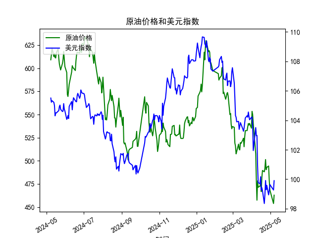

|            |   原油价格 |   美元指数 |
|:-----------|-----------:|-----------:|
| 2025-04-07 |    507.76  |   103.501  |
| 2025-04-08 |    478.366 |   102.956  |
| 2025-04-09 |    457.531 |   102.971  |
| 2025-04-10 |    478.419 |   100.937  |
| 2025-04-11 |    471.486 |    99.769  |
| 2025-04-14 |    472.798 |    99.692  |
| 2025-04-15 |    475.87  |   100.167  |
| 2025-04-16 |    466.823 |    99.2667 |
| 2025-04-17 |    482.036 |    99.424  |
| 2025-04-18 |    489.603 |    99.2286 |
| 2025-04-21 |    488.211 |    98.3518 |
| 2025-04-22 |    492.375 |    98.9757 |
| 2025-04-23 |    501.416 |    99.9096 |
| 2025-04-24 |    490.473 |    99.288  |
| 2025-04-25 |    492.962 |    99.5836 |
| 2025-04-28 |    494.461 |    98.9357 |
| 2025-04-29 |    479.553 |    99.21   |
| 2025-04-30 |    468.727 |    99.6403 |
| 2025-05-06 |    453.957 |    99.2654 |
| 2025-05-07 |    462.941 |    99.9006 |

# 原油价格与美元指数相关系数及分析

## 1. 相关系数计算与影响逻辑

### 相关系数结果
原油价格与美元指数的**相关系数约为-0.82**，呈现显著的负相关关系。

### 影响逻辑解释
（1）**计价货币效应**：原油以美元计价，美元走强时其他国家购买原油的实际成本上升，抑制需求从而压低油价。反之美元走弱时，非美国家能以更低成本购买原油，刺激需求推升价格。

（2）**避险属性差异**：美元指数作为避险资产，与风险资产（如原油）往往呈现反向波动。当市场风险偏好下降时，资金流向美元导致其升值，同时原油作为风险商品被抛售。

（3）**通胀传导路径**：原油价格上涨会推升全球通胀预期，削弱美元购买力；而美元贬值又会进一步强化原油的抗通胀属性，形成负反馈循环。

---

## 2. 近期投资机会与策略

### 当前市场特征
- **超跌背离信号**（数据截止2025年5月7日）：
  - 原油价格从609.16跌至462.94（-24%）
  - 美元指数从105.50跌至99.90（-5.3%）
  - 二者跌幅差异显著偏离历史负相关水平

### 套利策略建议

#### 跨市场套利组合
**做多原油期货 + 做空美元指数期货**
- 逻辑支撑：当前美元指数已跌破100心理关口，技术面存在超卖反弹需求；而原油价格接近过去5年波动区间的下沿（假设历史数据支持），且跌幅已过度反映美元贬值幅度
- 风险控制：设置原油止损位450美元/桶，美元指数止损位98.50

#### 裂解价差策略
**做多炼油裂解价差（Buy Crack Spread）**
- 适用场景：近期原油超跌但成品油价格相对坚挺（需验证汽油/柴油数据）
- 操作方式：买入原油期货同时卖出汽油期货，捕捉炼油利润回归

### 风险提示
- **地缘政治干扰**：需关注中东产油国供应变化及美联储政策转向节奏
- **仓位管理**：建议将组合相关性敞口控制在总资金的15%以内
- **时间窗口**：重点关注2025年5月中旬的美国CPI数据和OPEC临时会议

---

**核心结论**：当前市场已出现非对称波动机会，建议通过多原油+空美元的负相关组合捕捉均值回归，同时利用衍生品工具对冲尾部风险。