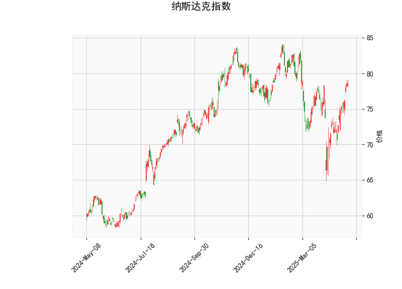

# 纳斯达克指数技术分析及投资策略

---

## **技术指标分析**

### **1. 价格与布林轨道**
- **当前价（78.57）**：位于布林通道中轨（75.84）上方，接近上轨（83.32），表明短期处于**偏强区间**，但需警惕上轨附近的潜在阻力。
- **布林通道形态**：中轨向上倾斜，且价格未触及极端区域，整体趋势**中性偏多**；若价格站稳中轨，可能延续上行。

### **2. RSI指标**
- **RSI（62.25）**：位于50-70区间的中性偏多区域，显示市场**买盘占优但未过热**，短期仍有上行空间。若突破70则需警惕超买回调。

### **3. MACD指标**
- **MACD（0.86）与信号线（0.026）**：MACD在零轴上方且显著高于信号线，柱状线持续扩大（0.837），形成**“金叉”看涨信号**，表明**短期动能强劲**。

### **4. K线形态**
- **CDLGAPSIDESIDEWHITE（向上跳空并列白蜡烛）**：通常出现在上升趋势中，暗示**多头力量延续**，但需关注后续成交量是否配合。

---

## **投资机会与策略**

### **1. 趋势跟踪策略**
- **做多机会**：若价格突破布林上轨（83.32）且RSI未超买（<70），可短期追多，目标价参考前高，止损设于中轨（75.84）下方。
- **回调买入**：若价格回踩中轨（75.84）附近且MACD保持金叉，可视为逢低布局机会。

### **2. 区间波段策略**
- **高抛低吸**：若价格在布林通道内震荡（68.38-83.32），可结合RSI超买/超卖信号操作。例如：
  - **超买（RSI>70）**：靠近上轨时部分止盈。
  - **超卖（RSI<30）**：靠近下轨时轻仓试多。

### **3. 风险提示**
- **短期回调风险**：若MACD柱状线缩短或价格跌破中轨，可能进入整理阶段，需及时止损。
- **外部因素干扰**：美联储政策、科技股财报等事件可能引发波动，需结合基本面动态调整仓位。

---

## **总结**
当前纳斯达克指数技术面**偏多**，MACD金叉与布林通道支撑短期上涨逻辑，但需警惕上轨附近阻力及超买回调风险。建议以**顺势做多为主**，辅以区间波段操作，严格设置止损并关注市场消息。