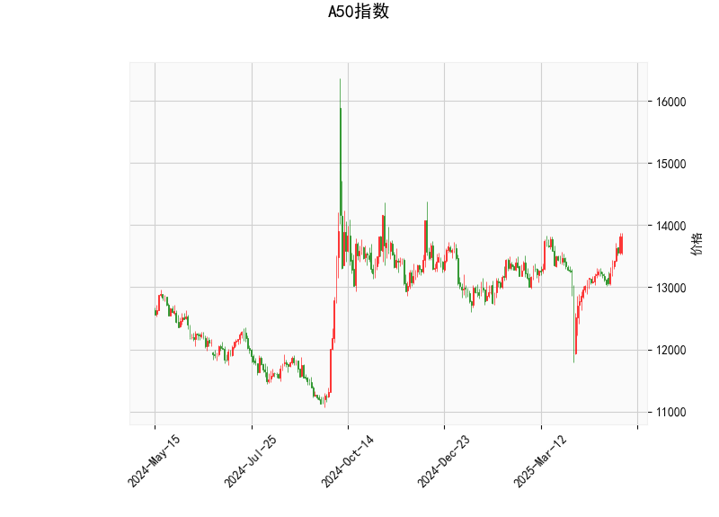

# A50指数技术分析及策略建议

## 一、技术指标分析

### 1. RSI指标（67.67）
- 处于中性偏多区域（50-70），接近超买阈值70但未突破
- 显示短期买盘动能占优，但需警惕超买后的技术性回调风险

### 2. MACD指标
- 柱状图差值达79.98（历史高位）
- MACD线（143.7）显著高于信号线（63.7）
- 构成强势"鸭子张嘴"形态，中期上涨动能强劲

### 3. 布林通道
- 当前价（13,812）紧贴上轨（13,883），距离仅0.5%
- 中轨（13,250）与当前价存在4.2%缓冲空间
- 通道扩张率达4.8%，显示波动率上升

### 4. K线形态（CDLBELTHOLD）
- 孕线形态出现在上涨趋势末端
- 暗示多空力量转换可能，需警惕短期顶部形成

## 二、交易机会与策略

### ▶ 多头策略
**突破交易**
- 条件：日线收盘价突破13,883且成交量放大
- 目标：通道上轨外延1.5%（14,070）
- 止损：突破K线低点（约13,800）

**波段持有**
- 依托中轨（13,250）作为动态支撑
- 结合MACD柱状图缩量作为离场信号

### ▶ 空头策略
**均值回归**
- 触发：价格触及上轨后出现看跌吞没形态
- 目标：中轨13,250（潜在3.8%空间）
- 止损：上轨上方0.5%（13,950）

**期权对冲**
- 买入虚值看跌期权（行权价13,500）
- 对冲时间窗口：RSI突破70后的3个交易日

### ▶ 跨市场套利
1. **期现套利**
   - 当期货溢价超过1.2%时，做空期货+买入ETF组合
   - 需监控基差变化及展期成本

2. **波动率交易**
   - 卖出宽跨式期权组合（Straddle）
   - 行权价选择：上轨+1% vs 中轨-1%
   - 适用场景：通道收窄+MACD柱状图缩量

## 三、风险提示
1. **宏观事件敏感期**：需特别关注中国PMI、美联储议息等事件
2. **量价背离风险**：若创新高时成交量低于20日均量，需减仓
3. **通道失效情形**：连续3日收于上轨外，需重新评估趋势强度

（以上分析基于历史数据，实际交易需结合实时市场动态调整）