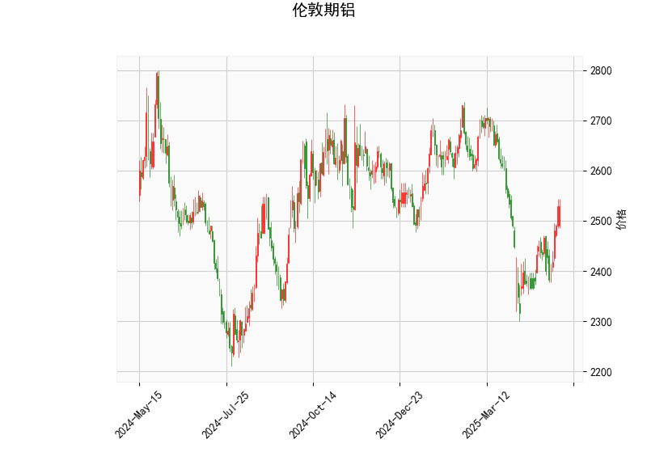

### 伦敦期铝技术分析解读

#### 1. 技术指标分析
- **当前价（2528.5）与布林轨道**：
  - 当前价（2528.5）略高于布林中轨（2524.41），但远低于布林上轨（2770.74），表明价格处于中性区间，尚未突破上行压力，但存在潜在上行空间。
  - 布林带宽度较宽（上轨与下轨差值约492点），显示当前市场波动性较高，需警惕短期价格剧烈波动风险。

- **RSI（60.78）**：
  - RSI接近超买阈值（70），但未进入超买区域，显示短期买盘力量较强，但需关注是否持续放量上涨或出现回调信号。

- **MACD指标**：
  - MACD线（3.52）上穿信号线（-17.17），形成金叉，且柱状图（20.69）显著放大，表明短期动能由空转多，可能开启反弹趋势。
  - 信号线仍处于负值区域，暗示长期趋势尚未完全转多，需结合价格是否站稳中轨确认趋势延续性。

- **K线形态（CDLBELTHOLD）**：
  - “Belt Hold”形态通常分为看涨和看跌两种类型。根据当前价格处于中轨附近且MACD金叉，推测为**看涨Belt Hold**形态，可能预示短期筑底完成，存在反弹机会。

---

#### 2. 投资或套利机会及策略

##### **短期策略（看多为主）**：
- **趋势跟踪**：
  - **入场条件**：若价格站稳布林中轨（2524）并突破前高（如2550-2600区域），可尝试轻仓做多，目标看向布林上轨（2770），止损设于中轨下方（如2500）。
  - **风险提示**：RSI接近超买，若价格未能突破中轨或缩量回调，可能回踩下轨（2278），需严格止损。

- **套利机会**：
  - **跨期套利**：若近月合约价格因短期需求上升而走强，远月合约贴水扩大，可考虑“多近月空远月”策略，捕捉价差收敛收益。
  - **跨市场套利**：关注LME铝与上海期铝（SHFE）价差变化，若价差偏离历史均值，可双向开仓对冲套利。

##### **中长期策略（谨慎观望）**：
- **突破确认后加仓**：若价格有效突破布林上轨（2770）且MACD信号线转正，可视为长期趋势反转信号，逐步加仓。
- **回调布局**：若价格回踩布林下轨（2278）且RSI接近超卖（<30），可左侧布局多单，博弈超跌反弹。

---

### 关键结论
- **短期偏多**：MACD金叉与看涨K线形态共振，短期反弹概率较高，但需警惕高波动性下的假突破。
- **风险预警**：若价格未能站稳中轨或RSI快速进入超买区域（>70），需及时止盈或反手试空。
- **套利窗口**：关注跨期/跨市场价差变化，优先选择低风险对冲策略。