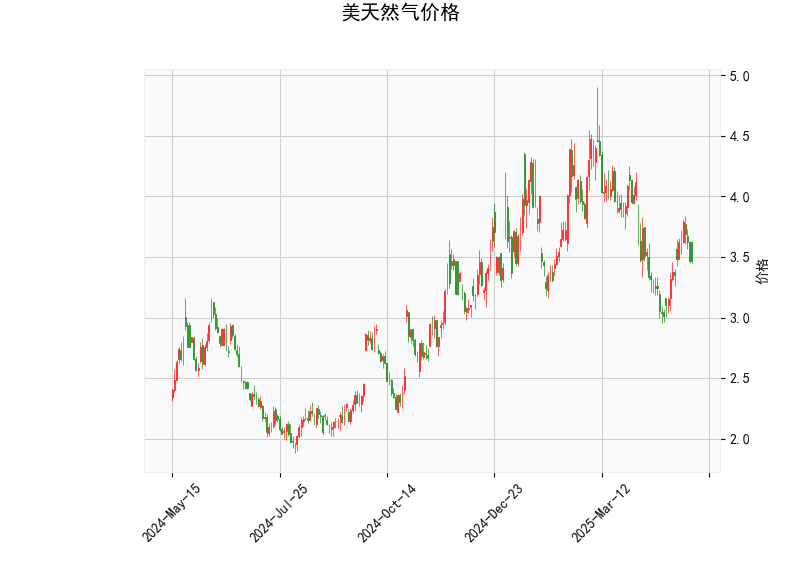

# 美国天然气价格技术分析与投资策略

---

## **一、技术指标分析**

### 1. **价格与布林轨道**
- **当前价**（3.465）位于布林下轨（2.98）与中轨（3.76）之间，**贴近下轨**，表明短期价格处于相对低位，存在超卖可能。
- **布林带开口方向**：中轨（3.76）和下轨（2.98）均呈下行趋势，而上轨（4.55）走平，显示当前价格波动性较低，但需警惕向下突破风险。

### 2. **RSI指标**
- **RSI值47.55**接近中性区域（50），未进入超买（>70）或超卖（<30）区间，暗示市场情绪偏观望，短期方向性信号不明确。

### 3. **MACD指标**
- **MACD线（-0.016）**与**信号线（-0.061）**均位于零轴下方，但MACD柱状图（0.045）为正值，显示空头动能减弱，可能出现短期反弹或底背离信号。
- **潜在金叉**：若MACD线向上突破信号线，可能触发技术性买盘。

### 4. **K线形态**
- **看涨信号**：
  - **CDLBELTHOLD**（多头吞噬形态）：暗示空头力量衰竭。
  - **CDLCLOSINGMARUBOZU**（收盘秃线）：显示买方在收盘时占据主导。
  - **CDLMATCHINGLOW**（匹配低点）：预示底部支撑有效。
- **中性/反转信号**：
  - **CDLLONGLINE**（长脚十字线）：反映多空博弈激烈，可能转向。
  - **CDLMARUBOZU**（光头光脚线）：需结合位置判断，当前低位可能为反转信号。

---

## **二、投资机会与策略**

### 1. **短期反弹机会**
- **做多策略**：
  - **入场条件**：若价格站稳布林下轨（2.98）并伴随RSI回升至50以上，或MACD形成金叉。
  - **目标价**：布林中轨（3.76）附近，潜在涨幅约8.5%。
  - **止损位**：布林下轨下方（如2.95），风险可控。

### 2. **中期趋势跟踪**
- **突破策略**：
  - **向上突破中轨**：确认短期趋势反转，可加仓。
  - **向下跌破下轨**：可能加速下行，需止损并观望。

### 3. **套利机会**
- **跨期套利**：
  - 若近月合约贴水（价格低于远月），可做多近月、做空远月，捕捉价差回归。
- **波动率策略**：
  - 布林带收窄后可能扩大波动，可买入期权（如看涨期权）押注突破。

### 4. **风险提示**
- **基本面因素**：天气（供暖需求）、库存数据、地缘政治（如俄乌冲突影响欧洲能源供应）可能打破技术信号。
- **假突破风险**：布林下轨附近需警惕诱空陷阱，建议结合成交量验证。

---

## **三、总结**
当前技术面显示天然气价格处于超卖区间，短期存在反弹动能，但中期趋势仍需观察布林中轨突破情况。投资者可轻仓试多，严格设置止损，并关注库存报告等事件驱动。套利策略建议以跨期价差回归为主，避免单边风险暴露。