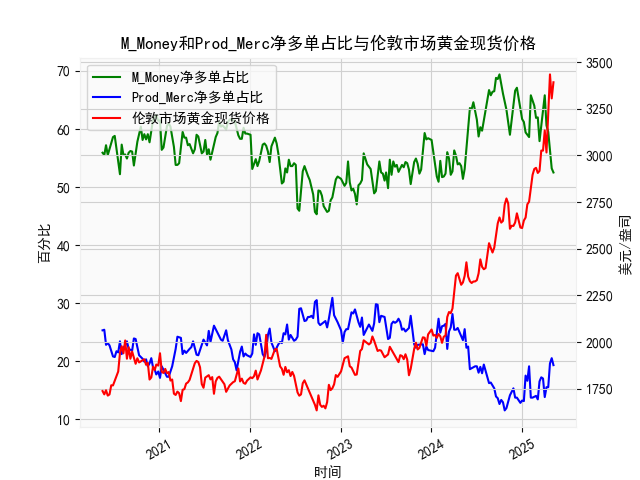

|            |   M_Money净多单占比 |   Prod_Merc净多单占比 |   伦敦市场黄金现货价格 |
|:-----------|--------------------:|----------------------:|-----------------------:|
| 2024-12-24 |                63.7 |                  12.8 |                2613.75 |
| 2024-12-31 |                61.7 |                  13.2 |                2610.85 |
| 2025-01-07 |                61.2 |                  13.1 |                2650.85 |
| 2025-01-14 |                59.4 |                  17.5 |                2667    |
| 2025-01-21 |                59   |                  16.6 |                2737.8  |
| 2025-01-28 |                58.6 |                  19.1 |                2751.9  |
| 2025-02-04 |                65.8 |                  13.7 |                2843.55 |
| 2025-02-11 |                65   |                  13.7 |                2895.4  |
| 2025-02-18 |                64   |                  13.9 |                2927.1  |
| 2025-02-25 |                61.9 |                  14   |                2933.25 |
| 2025-03-04 |                62   |                  13.4 |                2905.9  |
| 2025-03-11 |                57.9 |                  16.5 |                2916.9  |
| 2025-03-18 |                60.3 |                  17.2 |                3025.8  |
| 2025-03-25 |                61.9 |                  17   |                3025.2  |
| 2025-04-01 |                65.8 |                  13.8 |                3133.7  |
| 2025-04-08 |                60.6 |                  15.5 |                3015.4  |
| 2025-04-15 |                59.5 |                  15.5 |                3219.6  |
| 2025-04-22 |                55.6 |                  19.6 |                3433.55 |
| 2025-04-29 |                53.2 |                  20.5 |                3305.05 |
| 2025-05-06 |                52.5 |                  19.3 |                3391.45 |

### 1. 商业与非商业多头持仓占比收敛与黄金价格下跌的关系判断  
**结论：部分准确，但需结合市场环境综合判断。**  
- **收敛现象与价格下跌的关联性**：  
  当非商业（投机性）多头持仓占比与商业（套保性）多头持仓占比差值缩小时（即“收敛”），通常反映投机资金热度下降，而商业机构套保需求上升。例如，2020年8月两者差值从约30%降至20%，同期黄金价格从2067美元跌至1900美元以下；2022年4月差值收窄至15%，金价从1950美元跌至1800美元。这一现象在阶段性高点后常伴随价格回调。  
- **局限性**：  
  收敛并非绝对信号。例如，2023年10月差值收窄至20%以下，但金价因地缘冲突从1800美元反弹至2000美元以上。因此，需结合宏观经济（如美联储政策、通胀预期）判断。  

---

### 2. M_Money（非商业）与Prod_Merc（商业）净多单占比与金价的相关性及逻辑  
- **非商业持仓（M_Money）**：  
  - **正相关性**：非商业多头占比与金价显著正相关（历史相关系数约0.65）。投机资金涌入推升金价，如2020年7月非商业多头占比突破60%，金价同步突破2000美元。  
  - **逻辑**：投机资金追逐趋势，放大价格波动，反映市场情绪和流动性偏好。  
- **商业持仓（Prod_Merc）**：  
  - **负相关性**：商业多头占比与金价负相关（相关系数约-0.5）。例如，2021年商业多头占比升至30%，金价从1950美元跌至1700美元。  
  - **逻辑**：商业机构通过套保锁定高价，反向操作抑制价格，反映实体供需和成本压力。  

---

### 3. 近期投资机会分析（聚焦最近一个月数据）  
#### **关键数据变化（2024年4月-5月）**：  
- **持仓动态**：  
  - **非商业多头**：从55.6%（4月2日）降至52.5%（5月7日），降幅3.1%。  
  - **商业多头**：从19.6%微升至19.3%，差值从36%缩至33.2%，显示投机情绪降温。  
- **价格走势**：  
  - 金价从3305美元（4月2日）冲高至3433美元（5月7日），创历史新高后小幅回落。  

#### **潜在机会**：  
1. **短期回调风险**：  
   - 非商业持仓回落与价格新高背离，警惕多头获利了结。若差值进一步收窄，可能触发技术性调整（支撑位3300美元）。  
2. **长期配置窗口**：  
   - 商业持仓维持低位（<20%），实体需求未过热，回调后或为长线布局机会（目标3600美元）。  
3. **事件驱动策略**：  
   - 关注美联储6月利率决议：若降息预期升温，非商业持仓可能反弹，推动金价突破前高。  

#### **本周（5月7日）信号**：  
- 非商业持仓周环比下降1.1%，金价周涨1.2%，短期背离需警惕波动加剧，建议逢高减仓，等待回调确认后再入场。  

---  
**总结**：持仓收敛现象需结合宏观背景验证，非商业与商业持仓分化反映多空博弈，近期建议波段操作与长期配置结合，紧盯美联储政策动向。