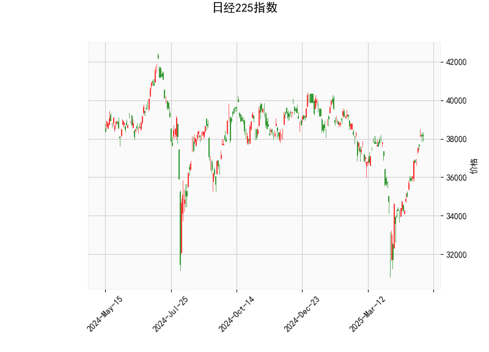

# 日经225指数技术分析及投资策略

---

## 一、技术指标分析

### 1. **价格与布林带**
- **当前价38,128.13**位于布林带中轨（36,326.25）与上轨（39,811.64）之间，距离上轨约4.4%，表明短期处于**多头趋势**，但尚未触及超买区域。
- **布林带开口扩张**（上轨与下轨差值6,970.78），显示市场波动率上升，可能酝酿方向性突破。

### 2. **RSI（相对强弱指数）**
- **RSI 66.58**接近超买阈值（70），但未完全进入超买区，暗示当前上涨动能较强，但需警惕短期回调风险。

### 3. **MACD指标**
- **MACD（674.77）远高于信号线（309.44）**，柱状图（365.33）持续扩大，表明**上涨动量强劲且加速**，多头主导市场。

### 4. **K线形态**
- **CDLMATCHINGLOW（匹配低形态）**：通常出现在下跌趋势末端，暗示空头衰竭后的反转可能。
- **CDLSPINNINGTOP（纺锤线）**：反映多空双方僵持，短期可能进入震荡或趋势放缓。

---

## 二、投资机会与策略

### 1. **趋势跟踪策略**
- **突破上轨追多**：若价格站稳39,811上方，可视为加速上涨信号，目标看向前高40,000-41,000区域，止损设于中轨36,326附近。
- **回调中轨布局多单**：若价格回踩36,300-36,500区间且缩量企稳，可逢低介入，止损设于下轨32,840下方。

### 2. **短期套利机会**
- **超买回调波段**：若RSI突破70后快速回落，且MACD柱状图缩短，可尝试轻仓做空，目标布林带中轨36,326，止损设于39,000上方。
- **事件驱动对冲**：关注日本央行政策动向及日元汇率波动，若日元大幅贬值（利好出口企业），可多配日经指数期货，同时做空日元对冲汇率风险。

### 3. **风险提示**
- **流动性风险**：布林带开口扩大可能伴随剧烈波动，需控制仓位（建议杠杆≤3倍）。
- **技术背离风险**：若价格创新高但MACD柱状图或RSI走弱，需警惕趋势反转，及时止盈。

---

## 三、关键结论
- **短期看涨**：MACD动量支持继续上行，但需关注39,800-40,000阻力区间的抛压。
- **中期震荡风险**：RSI接近超买区且K线出现犹豫信号（纺锤线），若突破失败可能回踩中轨。
- **策略优先级**：**逢低做多 > 突破追多 > 超卖反弹**，避免逆势重仓操作。