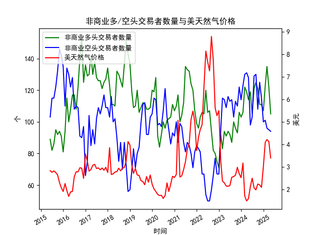

|            |   非商业多头交易者数量 |   非商业空头交易者数量 |   美天然气价格 |
|:-----------|-----------------------:|-----------------------:|---------------:|
| 2023-09-30 |                     96 |                    113 |           2.64 |
| 2023-10-31 |                     93 |                    110 |           2.99 |
| 2023-11-30 |                    106 |                    122 |           2.71 |
| 2023-12-31 |                    103 |                    114 |           2.53 |
| 2024-01-31 |                    106 |                    123 |           3.18 |
| 2024-02-29 |                    122 |                    130 |           1.72 |
| 2024-03-31 |                    119 |                    131 |           1.5  |
| 2024-04-30 |                    114 |                    128 |           1.6  |
| 2024-05-31 |                    119 |                     98 |           2.13 |
| 2024-06-30 |                    105 |                    103 |           2.51 |
| 2024-07-31 |                    121 |                    129 |           2.08 |
| 2024-08-31 |                    125 |                    130 |           1.99 |
| 2024-09-30 |                    121 |                    108 |           2.25 |
| 2024-10-31 |                    111 |                    125 |           2.21 |
| 2024-11-30 |                    111 |                    115 |           2.1  |
| 2024-12-31 |                    107 |                    100 |           3.02 |
| 2025-01-31 |                    123 |                    101 |           4.1  |
| 2025-02-28 |                    135 |                     96 |           4.22 |
| 2025-03-31 |                    122 |                     95 |           4.13 |
| 2025-04-30 |                    105 |                     94 |           3.4  |

### 近期天然气市场数据分析与投资机会判断

#### 1. **最新三个月数据变化（2025年2月-4月）**
- **多头持仓（非商业）**：
  - 2025年2月：135.0 → 3月：122.0（↓9.6%）→ 4月：105.0（↓13.9%）。
  - **趋势**：连续两月显著下降，机构看涨情绪快速降温。

- **空头持仓（非商业）**：
  - 2025年2月：96.0 → 3月：95.0（↓1.0%）→ 4月：94.0（↓1.1%）。
  - **趋势**：空头平仓力度较弱，市场未形成一致性看空预期。

- **天然气价格**：
  - 2025年2月：4.22 → 3月：4.13（↓2.1%）→ 4月：3.40（↓17.7%）。
  - **关键点**：4月价格暴跌，创近一年最大单月跌幅，反映供需矛盾或情绪恶化。

---

#### 2. **本月（2025年4月）关键信号**
- **价格与持仓背离**：
  - 价格暴跌17.7%的同时，空头仅减少1.1%，**未出现空头主动加仓**，暗示抛压可能来自多头止损或基本面恶化。
  
- **多空持仓比（多头/空头）**：
  - 4月降至1.12（105/94），为2025年最低值，显示市场情绪偏向谨慎。

- **价格超跌信号**：
  - 4月价格跌至3.40美元，接近2024年同期水平（2024年4月：3.40），但持仓结构更悲观，需关注是否触底。

---

#### 3. **潜在投资机会**
- **短期反弹博弈**：
  - **逻辑**：价格单月超跌后存在技术性修复需求，若空头未进一步加仓，可能触发空头回补。
  - **风险**：需结合库存数据（如EIA报告）验证是否因供应过剩导致下跌。

- **季节性布局**：
  - **逻辑**：若夏季高温预期增强（空调需求），可能推动价格反弹，但需警惕当前库存水平偏高。
  - **时间窗口**：5-6月为传统需求淡季，关注天气预测与库存变化。

- **中长期反转机会**：
  - **逻辑**：当前价格接近页岩气开采成本线（约3.0-3.5美元），若4月低点确认，可逐步布局多单。
  - **验证指标**：空头持仓是否加速离场，或出现多头增仓迹象。

---

#### 4. **风险提示**
- **基本面风险**：
  - 美国页岩气产量超预期、欧洲LNG进口需求疲软（替代能源竞争）可能压制价格。
- **情绪面风险**：
  - 若多头持仓继续下滑，可能引发恐慌性抛售，价格或下探3.0美元关口。
- **政策风险**：
  - 美国政府能源政策（如出口限制）或地缘冲突（如中东局势）可能引发波动。

---

#### 5. **结论**
- **近期策略**：观望为主，等待价格企稳信号（如持仓比回升至1.2以上或库存增速放缓）。
- **激进策略**：若5月价格站稳3.4美元且空头持仓减少，可轻仓试多，止损3.2美元。
- **保守策略**：关注夏季需求预期与库存数据，布局8-9月季节性旺季合约。