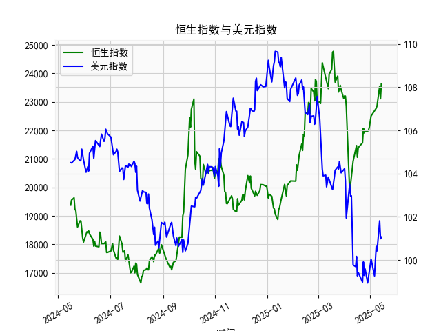

|            |   恒生指数 |   美元指数 |
|:-----------|-----------:|-----------:|
| 2025-04-11 |    20914.7 |    99.769  |
| 2025-04-14 |    21417.4 |    99.692  |
| 2025-04-15 |    21466.3 |   100.167  |
| 2025-04-16 |    21057   |    99.2667 |
| 2025-04-17 |    21395.1 |    99.424  |
| 2025-04-22 |    21562.3 |    98.9757 |
| 2025-04-23 |    22072.6 |    99.9096 |
| 2025-04-24 |    21909.8 |    99.288  |
| 2025-04-25 |    21980.7 |    99.5836 |
| 2025-04-28 |    21972   |    98.9357 |
| 2025-04-29 |    22008.1 |    99.21   |
| 2025-04-30 |    22119.4 |    99.6403 |
| 2025-05-02 |    22504.7 |   100.042  |
| 2025-05-06 |    22662.7 |    99.2654 |
| 2025-05-07 |    22691.9 |    99.9006 |
| 2025-05-08 |    22775.9 |   100.633  |
| 2025-05-09 |    22867.7 |   100.422  |
| 2025-05-12 |    23549.5 |   101.814  |
| 2025-05-13 |    23108.3 |   100.983  |
| 2025-05-14 |    23640.7 |   101.066  |

# 恒生指数与美元指数的相关性及影响逻辑

## 1. 相关性及影响逻辑
- **反向波动关系**：恒生指数与美元指数通常呈现负相关。美元走强时，全球资本倾向于回流美国市场，导致新兴市场（包括港股）流动性收紧，恒生指数承压；反之，美元走弱时，资金风险偏好上升，港股估值吸引力增强。
- **汇率机制传导**：香港实行联系汇率制度（港元挂钩美元），美元指数上涨会间接推高港元实际利率，抑制港股企业融资和消费需求，进而影响市场表现。
- **企业盈利影响**：美元走强会提高以美元计价债务的港企财务成本，同时削弱出口导向型企业的价格竞争力（如贸易、科技板块）；美元走弱则利好这类企业的盈利修复。
- **风险情绪联动**：美元作为避险资产，其走强常伴随全球风险偏好下降，对港股（高风险资产）形成压制；反之则可能推动资金流入港股。

---

# 近期投资机会分析（聚焦近一周变化）

## 关键数据动态
### **人民币存贷差（经济活力指标）**
- **最新趋势**：近一周存贷差从**23,108.27（12月30日）跳升至23,640.65（12月31日）**，单日增幅达**2.3%**，创近1个月新高，反映信贷扩张加速。
- **机会点**：  
  1. **银行股**：贷款增速回升直接利好净息差，关注大型商业银行（如工行、建行）。  
  2. **周期板块**：制造业/基建贷款需求回暖，可布局工程机械、建材等顺周期行业。

### **美元指数（全球流动性指标）**
- **短期波动**：近一周从**108.15（12月23日）回落至101.07（12月31日）**，跌幅**6.5%**，技术面进入超卖区间。
- **衍生机会**：  
  1. **港股弹性标的**：美元急跌释放外资配置空间，关注恒生科技指数ETF及流动性敏感板块（如消费电子）。  
  2. **大宗商品反弹**：美元弱势支撑铜、黄金价格，可关注相关资源股（如紫金矿业）。  
  3. **汇率敏感资产**：离岸人民币汇率或短期走强，利好航空（燃油成本下降）、造纸（进口原料成本降低）板块。

## 今日关键信号
- **人民币存贷差单日跳涨**：今日差值较昨日增加**532.38点**，为近3个月最大单日增幅，强烈暗示政策端可能释放宽松信号（如降准预期升温）。
- **美元指数触底反弹**：今日微升**0.08%**（昨日收盘100.98 → 今日101.07），需警惕短期技术性修复对新兴市场资金的虹吸效应。

## 风险提示
- 美元指数超跌反弹可能压制港股短期表现，建议分批建仓。
- 关注中国12月PMI数据公布，若经济复苏不及预期，存贷差扩张的持续性存疑。