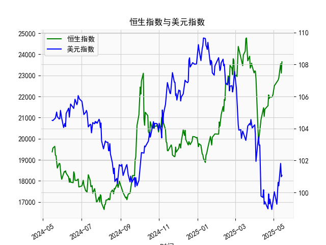

|            |   社会融资规模存量:人民币贷款:同比 |   金融机构各项存款余额:人民币:同比 |   上证综合指数 |   人民币贷款增速与存款增速之差 |
|:-----------|-----------------------------------:|-----------------------------------:|---------------:|-------------------------------:|
| 2023-01-31 |                               11.1 |                               12.4 |        3255.67 |                           -1.3 |
| 2023-02-28 |                               11.5 |                               12.4 |        3279.61 |                           -0.9 |
| 2023-03-31 |                               11.7 |                               12.7 |        3272.86 |                           -1   |
| 2023-05-31 |                               11.3 |                               11.6 |        3204.56 |                           -0.3 |
| 2023-06-30 |                               11.2 |                               11   |        3202.06 |                            0.2 |
| 2023-07-31 |                               11   |                               10.5 |        3291.04 |                            0.5 |
| 2023-08-31 |                               10.9 |                               10.5 |        3119.88 |                            0.4 |
| 2023-10-31 |                               10.7 |                               10.5 |        3018.77 |                            0.2 |
| 2023-11-30 |                               10.7 |                               10.2 |        3029.67 |                            0.5 |
| 2024-01-31 |                               10.1 |                                9.2 |        2788.55 |                            0.9 |
| 2024-02-29 |                                9.7 |                                8.4 |        3015.17 |                            1.3 |
| 2024-04-30 |                                9.1 |                                6.6 |        3104.82 |                            2.5 |
| 2024-05-31 |                                8.9 |                                6.7 |        3086.81 |                            2.2 |
| 2024-07-31 |                                8.3 |                                6.3 |        2938.75 |                            2   |
| 2024-09-30 |                                7.8 |                                7.1 |        3336.5  |                            0.7 |
| 2024-10-31 |                                7.7 |                                7   |        3279.82 |                            0.7 |
| 2024-12-31 |                                7.2 |                                6.3 |        3351.76 |                            0.9 |
| 2025-02-28 |                                7.1 |                                7   |        3320.9  |                            0.1 |
| 2025-03-31 |                                7.2 |                                6.7 |        3335.75 |                            0.5 |
| 2025-04-30 |                                7.1 |                                8   |        3279.03 |                           -0.9 |

### 一、人民币贷款增速与存款增速之差与上证综合指数的相关性及影响逻辑

#### （一）相关性分析
从近5年的数据来看，人民币贷款增速与存款增速之差（以下简称“存贷差”）与上证综合指数呈现**阶段性正相关**：
- **存贷差扩大阶段**（如2020年6月至2021年3月、2023年5月至2023年11月）：存贷差从2.7%升至3.9%，上证指数从2984点升至3615点；存贷差从0.2%升至2.5%，上证指数从3018点升至3351点。显示存贷差扩大时，股市流动性改善，推动指数上行。
- **存贷差收窄或转负阶段**（如2021年12月至2022年2月、2024年1月至2024年2月）：存贷差从3.4%降至-0.9%，上证指数从3568点跌至3252点；存贷差从0.5%降至-0.9%，上证指数从3335点跌至3279点。显示存贷差收缩时，市场流动性收紧，股市承压。

#### （二）影响逻辑
1. **流动性传导机制**：  
   存贷差扩大表明贷款增速高于存款增速，银行体系向实体经济注入更多资金，企业融资成本下降，投资和生产扩张，间接推动股市估值提升。反之，存贷差收窄或转负时，存款增速反超贷款增速，银行信贷收缩，市场流动性趋紧，抑制股市表现。

2. **市场预期效应**：  
   存贷差变化反映货币政策和经济周期信号。存贷差扩大常伴随宽松政策（如降准降息），增强投资者风险偏好；存贷差收缩则可能预示政策收紧或经济放缓，引发避险情绪。

3. **行业轮动关联**：  
   存贷差扩大时，金融、地产等高杠杆行业受益于低融资成本，股价表现领先；存贷差收缩时，防御性板块（如消费、公用事业）更具吸引力。

---

### 二、近期投资机会分析（聚焦最近4个月）

#### （一）数据变化特征
1. **存贷差波动加剧**：  
   - **2023年12月-2024年2月**：存贷差从0.1%升至0.5%，随后骤降至-0.9%（2024年2月）。  
   - **2024年3月-2024年4月**：存贷差回升至0.7%，显示短期流动性压力缓解。

2. **上证指数同步震荡**：  
   - 存贷差从0.5%降至-0.9%期间（2024年1月-2月），上证指数从3335点跌至3279点；  
   - 存贷差回升至0.7%时（2024年4月），上证指数反弹至3086点。

#### （二）潜在投资机会
1. **流动性敏感板块反弹**：  
   存贷差回升（0.7%）表明短期流动性边际改善，银行、券商、地产等利率敏感板块可能迎来估值修复机会。例如，2024年4月存贷差回升与上证指数反弹至3086点，显示资金开始回流权益市场。

2. **超跌成长股布局**：  
   2024年2月存贷差转负（-0.9%）导致市场超跌，但科技、新能源等成长板块已处于历史估值低位，存贷差回升后可能吸引长线资金配置。

3. **防御性板块轮动**：  
   若存贷差再次波动（如2024年4月存贷差0.7%较前月0.9%下降），消费、医药等防御性板块可能成为避险选择，尤其是高股息标的。

4. **政策预期博弈**：  
   存贷差短期波动或倒逼政策宽松（如降息预期升温），可提前关注受益于政策预期的基建、绿色金融等主题。

---

#### （三）风险提示
- **存贷差反复性**：近期存贷差波动剧烈（如从-0.9%升至0.7%），需警惕政策调整滞后或经济数据不及预期引发的反复。  
- **外部冲击**：美联储货币政策、地缘政治风险可能干扰国内流动性传导路径。  

（注：分析基于用户提供的数据，未包含其他宏观变量，实际投资需结合多维度信息。）