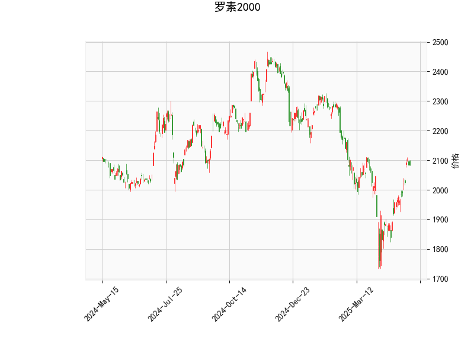

# 罗素2000指数技术分析及投资策略

## 一、技术指标解读

### 1. 核心指标分析
- **当前价格（2083.8）**：位于布林通道中轨（2008.18）与上轨（2207.62）之间，距离上轨仍有5.9%空间，显示价格处于上行通道但未触及超买压力位。
- **RSI（63.16）**：接近超买阈值70但未突破，暗示短期上涨动能持续但需警惕回调风险。
- **MACD（30.15 vs 8.21）**：快线与信号线呈现显著正偏离，柱状图（21.93）持续扩大，确认多头动能占优。
- **布林通道（2207/2008/1808）**：上下轨间距达19.8%，反映市场波动率较高，中轨持续上移显示中期趋势向好。

### 2. K线形态解析
- **CDLCLOSINGMARUBOZU（光头阳线）**：连续实体无影线，显示强势买盘主导市场。
- **CDLLONGLINE（长实体线）**：配合价格突破中轨，确认趋势延续性。
- **CDLMATCHINGLOW（平头底）**：出现在前期低位区域，构成底部反转验证信号。

## 二、投资机会与策略

### 1. 趋势跟踪策略
- **突破交易**：若价格突破布林上轨（2207），可建立多头头寸，目标位看至前高2250区域，止损设于中轨（2008）下方1-2%。
- **通道交易**：在布林中轨（2008）附近布局多单，利用通道震荡特性捕捉波段收益。

### 2. 动量套利策略
- **MACD背离交易**：关注RSI接近70区域时是否出现价格新高但MACD指标走弱，可建立反向头寸。
- **波动率套利**：利用IV（隐含波动率）与布林带宽度的相关性，当实际波动率低于预期时卖出宽跨式期权组合。

### 3. 风险警示
- **技术指标局限性**：当前MACD柱状图处于年度高位（21.93），需防范快速回调风险。
- **事件驱动风险**：美联储议息会议等宏观事件可能引发波动率骤增，建议9月FOMC会议前降低杠杆。

## 三、关键阈值监测
| 指标类型   | 多头触发位 | 空头触发位 | 监测周期 |
|------------|------------|------------|----------|
| 布林通道   | >2207      | <2008      | 日线     |
| MACD交叉   | 快线拐头   | 柱状图收缩 | 4小时线  |
| 成交量确认 | 突破放量   | 缩量上涨   | 实时     |

**注：** 建议结合VIX指数（当前值需补充）判断市场恐慌情绪，当VIX突破20时需重新评估策略有效性。