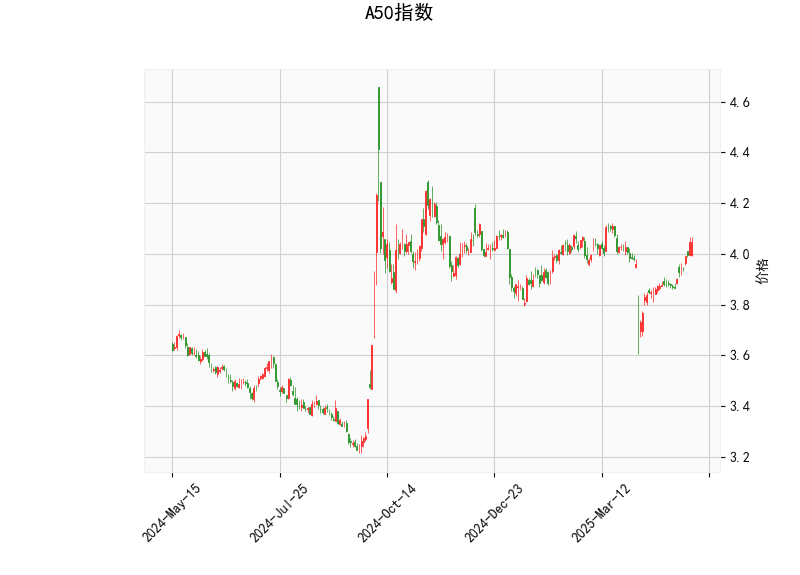

### A50指数技术分析结果解读

#### 1. 核心指标分析
- **RSI（71.3）**：当前RSI值高于70，进入超买区间，显示短期可能存在回调压力。但若市场处于强势趋势中，RSI可能持续高位钝化。
- **MACD（0.025）与信号线（0.0023）**：MACD线位于信号线上方且柱状图（0.0227）持续扩大，表明短期多头动能占优，但需警惕高位背离风险。
- **布林轨道**：
  - 当前价（4.045）贴近上轨（4.152），接近短期压力位；
  - 中轨（3.96）与当前价方向一致向上，但若价格跌破中轨可能触发技术性抛压。
- **K线形态（CDLBELTHOLD）**：该形态为“捉腰带线”，若出现在上涨趋势中，可能暗示短期见顶信号，需结合成交量验证。

#### 2. 投资机会与策略建议
**短期机会（1-3天）**：
- **回调风险**：RSI超买叠加价格接近布林上轨，若跌破4.04（当前价支撑），可能向下测试中轨3.96。激进者可轻仓试空，止损设于4.15上方。
- **突破博弈**：若价格站稳4.15且RSI维持高位，可能开启加速上涨，但需警惕假突破。

**中期策略（1-2周）**：
- **趋势跟踪**：MACD未出现死叉前，保持偏多思路，回调至中轨3.96附近可分批布局多单，止损参考下轨3.77。
- **套利机会**：若价格回落至下轨（3.77）附近且RSI回落至50以下，可关注均值回归机会。

#### 3. 风险提示
- **超买修正风险**：RSI高位可能引发技术性抛售，需严格止损。
- **K线形态失效**：CDLBELTHOLD若未伴随放量下跌，则反转信号可能弱化。
- **外部事件**：需同步关注A50成分股财报、人民币汇率及外围市场波动。