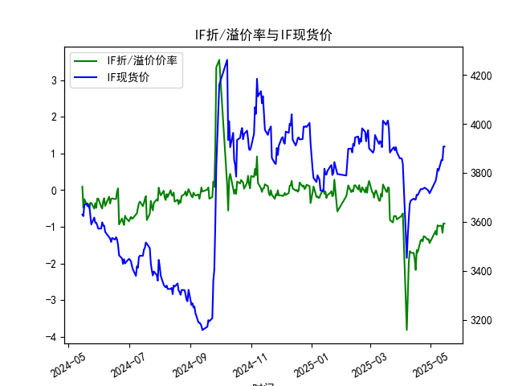
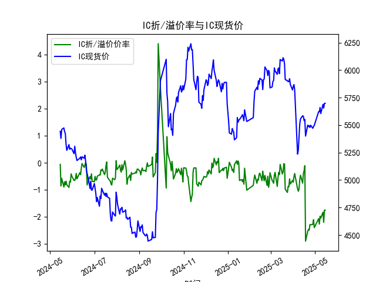
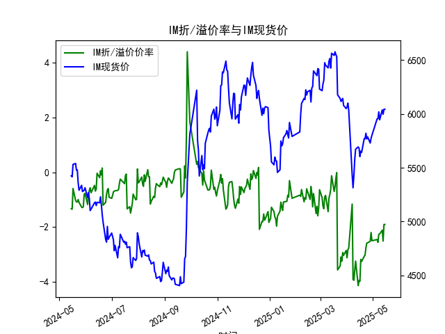

|            |   IF折/溢价率 |   IF现货价 |   IH折/溢价率 |   IH现货价 |   IC折/溢价率 |   IC现货价 |   IH折/溢价率 |   IH现货价 |
|:-----------|--------------:|-----------:|--------------:|-----------:|--------------:|-----------:|--------------:|-----------:|
| 2025-04-15 |     -1.88329  |     3690.4 |     -0.402211 |     5580   |     -0.402211 |     5580   |      -3.95041 |     5680.4 |
| 2025-04-16 |     -2.17398  |     3690.8 |     -0.296286 |     5540.4 |     -0.296286 |     5540.4 |      -3.98173 |     5603   |
| 2025-04-17 |     -1.63358  |     3710.6 |     -0.104562 |     5551.2 |     -0.104562 |     5551.2 |      -3.18113 |     5653.8 |
| 2025-04-18 |     -1.68913  |     3708.8 |     -2.89029  |     5400   |     -2.89029  |     5400   |      -3.25269 |     5642   |
| 2025-04-21 |     -1.36545  |     3733.2 |     -2.52696  |     5499.8 |     -2.52696  |     5499.8 |      -3.06818 |     5770   |
| 2025-04-22 |     -1.34653  |     3733   |     -2.45739  |     5486   |     -2.45739  |     5486   |      -3.02072 |     5769.6 |
| 2025-04-23 |     -1.39646  |     3734   |     -2.48358  |     5495   |     -2.48358  |     5495   |      -2.75012 |     5820   |
| 2025-04-24 |     -1.25668  |     3736.8 |     -2.28117  |     5478   |     -2.28117  |     5478   |      -2.58556 |     5767.4 |
| 2025-04-25 |     -1.26205  |     3739.2 |     -2.28499  |     5498.6 |     -2.28499  |     5498.6 |      -2.57433 |     5786.6 |
| 2025-04-28 |     -1.34913  |     3730.6 |     -2.27382  |     5471   |     -2.27382  |     5471   |      -2.51923 |     5729   |
| 2025-04-29 |     -1.33181  |     3724.8 |     -2.10005  |     5487.2 |     -2.10005  |     5487.2 |      -2.19842 |     5773.6 |
| 2025-04-30 |     -1.44197  |     3716.2 |     -2.39398  |     5497   |     -2.39398  |     5497   |      -2.49939 |     5801.4 |
| 2025-05-06 |     -1.11177  |     3766.2 |     -2.06144  |     5622   |     -2.06144  |     5622   |      -2.45329 |     5953.2 |
| 2025-05-07 |     -1.2169   |     3785   |     -2.26234  |     5620.2 |     -2.26234  |     5620.2 |      -2.55739 |     5955.2 |
| 2025-05-08 |     -0.957625 |     3816   |     -1.97107  |     5660   |     -1.97107  |     5660   |      -2.2617  |     6018.8 |
| 2025-05-09 |     -0.976471 |     3808.6 |     -2.04348  |     5604.8 |     -2.04348  |     5604.8 |      -2.25057 |     5945.2 |
| 2025-05-12 |     -0.966676 |     3853   |     -1.82396  |     5688   |     -1.82396  |     5688   |      -2.1153  |     6037   |
| 2025-05-13 |     -1.16158  |     3851   |     -2.19778  |     5654.6 |     -2.19778  |     5654.6 |      -2.51032 |     5996.6 |
| 2025-05-14 |     -0.908163 |     3907.4 |     -1.74715  |     5697.8 |     -1.74715  |     5697.8 |      -1.90524 |     6043   |
| 2025-05-15 |     -0.908163 |     3907.4 |     -1.74715  |     5697.8 |     -1.74715  |     5697.8 |      -1.90524 |     6043   |

### 一、股指期货折/溢价率与现货价的相关性及影响逻辑

#### 1. 定义与核心逻辑
- **折价率**：期货价格低于现货价格，反映市场对未来现货下跌的预期或短期流动性压力。
- **溢价率**：期货价格高于现货价格，反映市场对未来现货上涨的预期或资金成本补偿需求。

#### 2. 影响因素
- **市场情绪**：  
  折价率扩大（如近期IM从-2.5%回升至-1.9%）可能暗示悲观情绪修复；溢价率扩大则反映看涨情绪。
- **分红与资金成本**：  
  股票分红期间，期货需扣除分红预期，导致折价率被动扩大（如IH/IC在2024年5月折价率波动）。
- **套利机制**：  
  折溢价率偏离合理区间时（如IF折价率长期接近-1%），会吸引套利资金入场（如买入期货+卖空现货），推动价差回归。
- **流动性冲击**：  
  极端市场波动时（如2024年6月部分日期折价率骤降），期货可能因流动性溢价出现短期异常。

#### 3. 动态关系
- **领先性**：期货折溢价率通常领先现货价格1-3日，例如2025年5月12日IF折价率收窄（-0.97%），次日现货上涨至3853。
- **均值回归**：长期折溢价率围绕零轴波动（如IH全年在-2.2%至-0.5%区间），极端值后易出现反转。

---

### 二、近期投资机会分析（聚焦最后一周）

#### 1. **IF（沪深300）**
- **关键信号**：  
  5月14日折价率从-1.16%大幅收窄至-0.91%，现货价突破3900关口，显示空头平仓动力增强。
- **机会**：  
  若次日折价率持续收窄，可短期做多期货，目标现货价3950。

#### 2. **IH（上证50）**
- **异常波动**：  
  5月13日折价率骤降至-2.2%（全年最低），但次日现货价反弹1.1%，暗示超卖修复需求。
- **机会**：  
  折价率已回升至-1.75%，若现货站稳5700，可布局期现套利（买入IH期货+融券卖出ETF）。

#### 3. **IM（中证1000）**
- **背离信号**：  
  5月9日-12日现货上涨3.1%，但折价率仅收窄0.1%，反映小盘股情绪仍谨慎。
- **机会**：  
  折价率处于-2.5%至-1.9%高位，若现货突破6050，可博弈期货补涨。

#### 4. **跨品种套利**
- **多IH空IM**：  
  IH折价率（-1.75%）较IM（-1.9%）更接近均值，且大蓝筹稳定性优于小盘股。
- **风险提示**：  
  需警惕6月季末资金面扰动（参考2024年6月17日折价率跳变历史）。

---

### 三、今日（2025年5月15日）紧急策略
- **关键变化**：  
  所有品种折价率与现货价均与昨日持平，市场进入观望状态。
- **操作建议**：  
  - **持仓者**：维持IF/IH多头，止损设为现货价跌破5日均线（IF 3880，IH 5670）。  
  - **空仓者**：等待突破信号，重点关注IM能否站稳6050并带动折价率收窄。  
  - **对冲需求**：利用IC折价率-2.04%对冲小盘股持仓风险。

