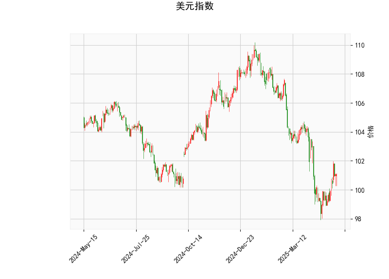

# 美元指数技术分析解读

### 1. 美元指数技术分析结果解析

#### （1）价格与布林轨道
- **当前价（101.0655）**位于布林下轨（97.52）与中轨（102.5）之间，且明显低于中轨，显示美元指数处于**弱势区间**。价格靠近下轨可能暗示短期存在技术性支撑，但需观察能否突破中轨以确认趋势反转。
- **布林带收窄**：上下轨间距（107.49→97.52）较宽但未明显扩张，表明当前波动率较低，市场可能处于方向选择前的盘整阶段。

#### （2）动量指标
- **RSI（51.37）**：接近中性区域（50），既无超买也无超卖信号，显示多空力量暂时平衡，但结合价格位置偏弱，需警惕向下突破风险。
- **MACD（-0.292）与信号线（-0.678）**：MACD柱状图转正（0.386）且快线（MACD）上穿慢线（信号线），形成**潜在金叉**，暗示短期可能出现反弹，但绝对值仍为负值，需关注反弹能否持续。

#### （3）K线形态
- **CDLHANGINGMAN（吊颈线）**：该形态通常出现在上升趋势末端，预示顶部反转风险。但当前美元指数处于下跌趋势中，此形态可能失效或需结合其他指标验证，需警惕假信号。

---

### 2. A股/港股潜在机会与策略

#### （1）美元走弱背景下的市场联动
- **汇率传导效应**：若美元指数延续弱势，人民币被动升值压力缓解，有利于外资流入A股/港股，尤其利好**高贝塔板块**（科技、消费、新能源）。
- **港股估值修复**：港股对美元流动性更敏感，美元走弱可能推动**恒生科技指数**及金融地产板块反弹。

#### （2）具体机会与策略
- **AH股溢价套利**：
  - 当前AH溢价指数（约140）处于历史高位，可关注**溢价率超过30%的H股**（如中信证券、中国平安），通过做多H股+做空A股进行价差收敛套利。
  - **风险提示**：需考虑两地市场流动性差异及汇率对冲成本。
  
- **顺周期板块轮动**：
  - **大宗商品相关股**（铜、铝）：美元弱势通常提振以美元计价的大宗商品价格，关注江西铜业（0358.HK）、紫金矿业（2899.HK）。
  - **出口型企业**：人民币升值压力缓解利好出口占比较高的家电（海尔智家）、汽车（比亚迪）等。

- **事件驱动策略**：
  - **中概股回归**：近期港股IPO回暖，可提前布局有回归预期的中概股影子股（如港交所0388.HK）。
  - **高股息防御**：若市场波动加剧，配置长江电力、中国移动等高股息标的对冲风险。

#### （3）风险对冲工具
- **期权策略**：买入恒指看跌期权（如行权价18,000点）保护多头仓位，或使用**跨式组合**捕捉市场波动率上升机会。
- **跨境ETF套利**：通过沪深300ETF（510300）与恒生ETF（513550）的联动性进行配对交易。

---

**结论**：美元指数的技术面显示短期或有反弹但趋势仍偏弱，建议A股/港股关注顺周期板块轮动及AH溢价收敛机会，同时利用衍生品工具对冲汇率及系统性风险。需密切跟踪美联储政策预期及中国经济数据验证复苏强度。