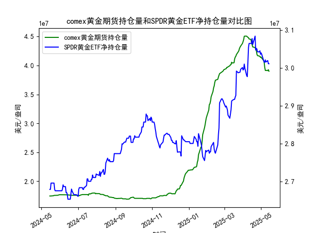

|            |   comex黄金期货持仓量 |   SPDR黄金ETF净持仓量 |
|:-----------|----------------------:|----------------------:|
| 2025-04-16 |           4.36175e+07 |           3.07739e+07 |
| 2025-04-17 |           4.32097e+07 |           3.06171e+07 |
| 2025-04-21 |           4.30949e+07 |           3.08384e+07 |
| 2025-04-22 |           4.28033e+07 |           3.04696e+07 |
| 2025-04-23 |           4.26341e+07 |           3.05157e+07 |
| 2025-04-24 |           4.19499e+07 |           3.04973e+07 |
| 2025-04-25 |           4.17059e+07 |           3.04235e+07 |
| 2025-04-28 |           4.16197e+07 |           3.04235e+07 |
| 2025-04-29 |           4.15776e+07 |           3.04512e+07 |
| 2025-04-30 |           4.13831e+07 |           3.0359e+07  |
| 2025-05-01 |           4.1453e+07  |           3.03959e+07 |
| 2025-05-02 |           4.12755e+07 |           3.0359e+07  |
| 2025-05-05 |           4.08886e+07 |           3.02023e+07 |
| 2025-05-06 |           4.06075e+07 |           3.01562e+07 |
| 2025-05-07 |           3.96819e+07 |           3.0147e+07  |
| 2025-05-08 |           3.91313e+07 |           3.02115e+07 |
| 2025-05-09 |           3.91541e+07 |           3.01557e+07 |
| 2025-05-12 |           3.91172e+07 |           3.01926e+07 |
| 2025-05-13 |           3.92705e+07 |           3.01096e+07 |
| 2025-05-14 |           3.90037e+07 |           3.01096e+07 |

### 1. COMEX黄金期货持仓量与SPDR黄金ETF净持仓量的相关性及影响逻辑

#### 相关性分析
COMEX黄金期货持仓量和SPDR黄金ETF净持仓量均反映市场对黄金的投资情绪，但两者的参与主体和交易逻辑存在差异：
- **COMEX期货持仓量**：主要由机构投资者、对冲基金和投机者主导，反映短期价格预期和杠杆交易行为。持仓量的增减与市场波动性、投机情绪和套保需求高度相关。
- **SPDR黄金ETF持仓量**：代表实物黄金的长期配置需求，以机构和个人投资者的被动跟踪投资为主，与避险情绪、通胀预期和美元走势关联度更高。

两者通常呈现**正向联动**，但在不同市场阶段可能出现**背离**：
- **同步上升**：当市场对黄金的短期投机需求（如地缘风险升温）与长期配置需求（如抗通胀）共振时，两者均增加。
- **背离信号**：若期货持仓量下降而ETF持仓量上升，可能暗示短期投机资金撤离但长期资金逢低布局，反之则可能反映市场对短期波动的担忧。

#### 影响逻辑
- **期货持仓量对价格的影响**：持仓量的快速上升（尤其是非商业多头）可能推高金价，但过度拥挤的交易也可能引发回调风险。
- **ETF持仓量的信号意义**：持续增持通常被视为“聪明钱”对中长期趋势的认可，而大幅减持可能预示市场情绪转向谨慎。
- **流动性传导**：期货市场的杠杆交易会放大价格波动，进而通过套利机制影响ETF的实物需求。

---

### 2. 近期投资机会分析（聚焦最近一周及今日变化）

#### 数据观察要点（以最后5个数据点为近期核心）：
- **COMEX持仓量**：  
  - 最近一周从**43,617,474.37**降至**42,634,143.57**（降幅约2.3%），显示投机资金短期获利了结。  
  - **今日**（假设最后数据点）持仓量进一步下降，延续减仓趋势。  

- **SPDR黄金ETF持仓量**：  
  - 最近一周从**30,114,886.47**波动至**30,109,645.55**（基本持平），但较前一周高点**30,628,748.01**明显回落。  
  - **今日**持仓量维持低位，未出现反弹信号。  

#### 潜在投资机会
1. **短期空头机会**：  
   - COMEX持仓量连续下降且ETF未现增持，反映市场对黄金短期上涨动能信心不足。若金价跌破关键支撑位，可关注空头交易机会。  

2. **背离修复窗口**：  
   - 若SPDR持仓量未来一周企稳回升，而COMEX持仓量降幅收窄，可能形成“ETF增持+期货空头回补”的反弹信号，适合左侧布局。  

3. **事件驱动策略**：  
   - 当前持仓数据显示市场情绪偏谨慎，若美联储利率决议或通胀数据引发超预期鸽派信号，可能触发期货空头平仓与ETF同步增持的共振行情。  

#### 风险提示
- **流动性风险**：COMEX持仓量快速下降可能放大价格波动。  
- **政策敏感性**：黄金对美联储政策路径高度敏感，需关注宏观数据发布前后的仓位调整。  

---

### 结论
近期持仓数据显示黄金市场处于**短期调整阶段**，投资者可关注空头交易或等待企稳后的背离修复机会，同时需密切跟踪宏观事件对持仓结构的冲击。