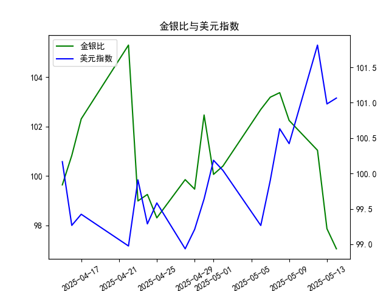

|            |    金价 |   银价 |   美元指数 |   金银比 |
|:-----------|--------:|-------:|-----------:|---------:|
| 2025-04-15 | 3219.6  | 32.31  |   100.167  |  99.6472 |
| 2025-04-16 | 3322.9  | 32.955 |    99.2667 | 100.831  |
| 2025-04-17 | 3305.65 | 32.31  |    99.424  | 102.31   |
| 2025-04-22 | 3433.55 | 32.61  |    98.9757 | 105.291  |
| 2025-04-23 | 3262.95 | 32.96  |    99.9096 |  98.9973 |
| 2025-04-24 | 3314.75 | 33.395 |    99.288  |  99.2589 |
| 2025-04-25 | 3277.3  | 33.335 |    99.5836 |  98.3141 |
| 2025-04-28 | 3296.3  | 33.01  |    98.9357 |  99.8576 |
| 2025-04-29 | 3305.05 | 33.225 |    99.21   |  99.4748 |
| 2025-04-30 | 3302.05 | 32.225 |    99.6403 | 102.469  |
| 2025-05-01 | 3214.75 | 32.125 |   100.187  | 100.07   |
| 2025-05-02 | 3249.7  | 32.365 |   100.042  | 100.408  |
| 2025-05-06 | 3391.45 | 33.025 |    99.2654 | 102.693  |
| 2025-05-07 | 3392.25 | 32.875 |    99.9006 | 103.186  |
| 2025-05-08 | 3352.3  | 32.43  |   100.633  | 103.37   |
| 2025-05-09 | 3324.55 | 32.515 |   100.422  | 102.247  |
| 2025-05-12 | 3235.4  | 32.02  |   101.814  | 101.043  |
| 2025-05-13 | 3227.95 | 32.98  |   100.983  |  97.876  |
| 2025-05-14 | 3191.95 | 32.885 |   101.066  |  97.064  |

### 1. 金银比与美元指数的相关性及影响逻辑

#### 相关性
金银比（黄金价格/白银价格）与美元指数通常呈现**负相关**，但具体关系受市场环境驱动：
- **美元走强时**：以美元计价的大宗商品（黄金、白银）价格承压，但黄金的避险属性可能使其跌幅小于白银（工业属性更强），导致金银比**上升**。
- **美元走弱时**：商品价格普遍上涨，白银因工业需求弹性可能涨幅大于黄金，推动金银比**下降**。

#### 影响逻辑
- **避险情绪主导**：经济风险上升时，黄金的避险需求强于白银，金银比上升；若美元同步走强（避险需求推升美元），两者可能呈现**正相关**。
- **通胀与增长预期**：经济复苏期，白银的工业需求推动其价格，金银比下降；若此时美元因宽松政策走弱，两者负相关性增强。
- **利率政策**：美联储加息周期中，美元走强可能压制贵金属价格，但黄金的抗通胀属性可能部分抵消压力，导致金银比波动分化。

---

### 2. 近期投资机会分析（聚焦最近一周）

#### 数据趋势（2025年5月8日-5月14日）
- **金银比**：从102.25（5月8日）快速降至97.06（5月14日），**单周跌幅超5%**，表明白银表现显著强于黄金。
- **美元指数**：从100.42（5月8日）升至101.07（5月14日），**微涨0.65%**，但与金银比形成明显背离。

#### 关键变化（5月13日→5月14日）
- **金银比**：从97.88→97.06（**单日降幅0.8%**），连续两日加速下行。
- **美元指数**：从100.98→101.07（**微升0.09%**），未压制白银涨势，凸显其独立强势。

#### 投资机会
1. **做多白银**：
   - 逻辑：金银比快速下行+美元微涨未压制白银，反映白银受工业需求或投机资金驱动。
   - 风险：需关注美元指数突发大幅走强或大宗商品整体回调。

2. **金银比套利（空黄金/多白银）**：
   - 逻辑：周内金银比趋势明确，可捕捉比值回归均值的机会。
   - 风险：地缘政治风险若推升黄金避险需求，可能逆转比值。

3. **对冲美元波动**：
   - 逻辑：美元指数短期震荡，若后续走弱或强化贵金属涨势，可提前布局白银多头。

#### 操作建议
- **短期**：重点跟踪白银突破性走势，若金银比跌破97（5月14日低点），可加仓白银。
- **中期**：观察美元指数能否站稳101关口，若回落至100.5以下，贵金属或开启新一轮上涨。