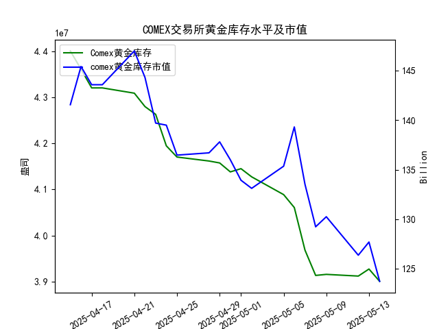

|            |   comex黄金库存量 |   comex黄金库存市值(billion) |   伦敦金现货价 |   上海金交所黄金现货价 |   美元兑人民币汇率 |
|:-----------|------------------:|-----------------------------:|---------------:|-----------------------:|-------------------:|
| 2025-04-17 |       4.32097e+07 |                       3323.1 |        3305.65 |                 786    |             7.2085 |
| 2025-04-18 |       4.32097e+07 |                       3323.1 |        3305.65 |                 788.62 |             7.2069 |
| 2025-04-21 |       4.30949e+07 |                       3411.1 |        3305.65 |                 804.11 |             7.2055 |
| 2025-04-22 |       4.28033e+07 |                       3371.6 |        3433.55 |                 825.8  |             7.2074 |
| 2025-04-23 |       4.26341e+07 |                       3276.9 |        3262.95 |                 786.99 |             7.2116 |
| 2025-04-24 |       4.19499e+07 |                       3325.5 |        3314.75 |                 792.47 |             7.2098 |
| 2025-04-25 |       4.17059e+07 |                       3272.2 |        3277.3  |                 785.6  |             7.2066 |
| 2025-04-28 |       4.16197e+07 |                       3284.5 |        3296.3  |                 778.4  |             7.2043 |
| 2025-04-29 |       4.15776e+07 |                       3314.5 |        3305.05 |                 780.05 |             7.2029 |
| 2025-04-30 |       4.13831e+07 |                       3286.4 |        3302.05 |                 780.19 |             7.2014 |
| 2025-05-01 |       4.1453e+07  |                       3231   |        3214.75 |                 780.19 |             7.2014 |
| 2025-05-02 |       4.12755e+07 |                       3225   |        3249.7  |                 780.19 |             7.2014 |
| 2025-05-05 |       4.08886e+07 |                       3310.1 |        3249.7  |                 780.19 |             7.2014 |
| 2025-05-06 |       4.06075e+07 |                       3430.9 |        3391.45 |                 792.2  |             7.2008 |
| 2025-05-07 |       3.96819e+07 |                       3364.7 |        3392.25 |                 798.51 |             7.2005 |
| 2025-05-08 |       3.91313e+07 |                       3302.1 |        3352.3  |                 786.5  |             7.2073 |
| 2025-05-09 |       3.91541e+07 |                       3326.3 |        3324.55 |                 785.5  |             7.2095 |
| 2025-05-12 |       3.91172e+07 |                       3230   |        3235.4  |                 759    |             7.2066 |
| 2025-05-13 |       3.92705e+07 |                       3251.4 |        3227.95 |                 763.9  |             7.1991 |
| 2025-05-14 |       3.90037e+07 |                       3171.7 |        3191.95 |                 758.38 |             7.1956 |

### 近期COMEX黄金库存与价格关联性分析及投资机会

#### 1. **COMEX黄金库存与价格的相关性验证**
   - **库存趋势**：近一个月COMEX黄金库存持续下降（从4月15日的4401万盎司降至5月14日的3900万盎司），但同期伦敦和上海现货黄金价格呈现震荡下行趋势（伦敦金价从3219美元跌至3191美元，上海金价从762元跌至758元），**库存减少与价格下跌短期存在背离**。
   - **长期逻辑修正**：研究员提出的“正相关”需结合宏观背景（如美元流动性、避险需求）和库存变化速度。当前库存下降但价格走弱，可能反映市场对美联储紧缩政策或经济衰退预期的担忧，抵消了库存减少的支撑效应。

---

#### 2. **近期（5月7日-5月14日）关键数据变化**
   - **COMEX库存加速下降**：近一周库存从3968万降至3900万（降幅1.7%），其中5月13日至14日单日减少26.7万盎司。
   - **金价表现分化**：
     - **伦敦金价**：5月7日（3392美元）至5月14日（3191美元）累计下跌5.9%，创近一个月新低。
     - **上海金价**：同期从798元跌至758元（跌幅5.0%），跌幅小于伦敦市场。
   - **汇率影响**：美元兑人民币汇率从7.2005降至7.1956（人民币升值0.07%），部分缓解国内金价压力。

---

#### 3. **今日（5月14日）关键信号**
   - **库存与价格背离加剧**：单日库存下降26.7万盎司，但伦敦金价下跌36美元（-1.1%）、上海金价下跌5.5元（-0.7%）。
   - **潜在驱动因素**：
     - **市场情绪偏空**：金价跌破关键支撑位（伦敦3200美元、上海760元）可能触发技术性抛售。
     - **套利窗口隐现**：上海金价较伦敦金价（按汇率折算）存在约2%溢价，需关注跨境套利机会。

---

#### 4. **潜在投资机会**
   - **短期超跌反弹机会**：
     - **伦敦市场**：若库存持续下降且金价企稳于3150-3200美元区间，可博弈空头回补驱动的反弹。
     - **上海市场**：人民币升值背景下，国内金价跌幅相对温和，关注760元附近支撑有效性。
   - **跨市场套利**：
     - **溢价收敛策略**：若上海-伦敦价差扩大至3%以上，可做空上海金、做多伦敦金（需考虑政策限制及交易成本）。
   - **中长期布局**：
     - **库存见底预期**：若库存降至3800万盎司以下且金价企稳，可能标志供需格局反转。

---

#### 5. **风险提示**
   - **宏观压制延续**：美联储加息预期或美元走强可能进一步打压金价。
   - **库存下降趋缓**：若未来一周库存降幅收窄，背离逻辑将被削弱。
   - **政策风险**：跨境套利需关注外汇管制及交易所规则限制。

---

**结论**：短期关注金价超跌反弹及跨市场价差修复机会，中长期需等待库存与价格背离的驱动因素（如宏观政策转向）确认。建议在3150-3200美元（伦敦）、750-760元（上海）区间分批建仓，止损参考前低。