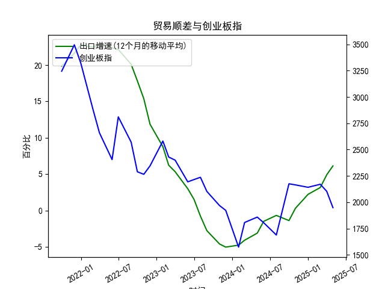

|            |   出口增速 |   创业板指 |   出口增速(12个月的移动平均) |
|:-----------|-----------:|-----------:|-----------------------------:|
| 2023-01-31 | -12.0231   |    2580.84 |                     8.76724  |
| 2023-02-28 |  -2.86551  |    2429.03 |                     6.22011  |
| 2023-03-31 |  10.84     |    2399.5  |                     5.33261  |
| 2023-05-31 |  -7.56172  |    2193.41 |                     2.98747  |
| 2023-06-30 | -12.3776   |    2215    |                     1.53184  |
| 2023-07-31 | -14.2563   |    2236.67 |                    -0.776185 |
| 2023-08-31 |  -8.5529   |    2102.58 |                    -2.77643  |
| 2023-10-31 |  -6.61276  |    1968.23 |                    -4.60916  |
| 2023-11-30 |   0.693013 |    1922.59 |                    -5.04057  |
| 2024-01-31 |   7.69     |    1573.37 |                    -4.77057  |
| 2024-02-29 |   6.25     |    1807.03 |                    -4.09641  |
| 2024-04-30 |   1.33     |    1858.39 |                    -3.12057  |
| 2024-05-31 |   7.42     |    1805.11 |                    -1.50031  |
| 2024-07-31 |   6.93     |    1688.14 |                    -0.684019 |
| 2024-09-30 |   2.35     |    2175.09 |                    -1.39152  |
| 2024-10-31 |  12.65     |    2164.46 |                     0.292791 |
| 2024-12-31 |  10.69     |    2141.6  |                     2.21509  |
| 2025-02-28 |  -3        |    2170.39 |                     3.15311  |
| 2025-03-31 |  12.4      |    2103.7  |                     4.89919  |
| 2025-04-30 |   8.1      |    1948.03 |                     6.12525  |

# 中国出口增速与创业板指相关性及近期投资机会分析

## 一、中国出口增速与创业板指相关性及影响逻辑

### 1. **数据相关性特征**
- **短期背离，长期弱负相关**：出口增速（12个月移动平均）与创业板指在2021-2023年呈现阶段性背离，出口增速下滑时创业板指波动加剧；2023年后两者同步性增强，出口增速触底回升期间创业板指持续走弱（如2024年出口增速从-4.77%升至6.13%，创业板指从2345点跌至1948点），显示弱负相关性。

### 2. **影响逻辑**
- **外需与内需的博弈**：出口高增长往往反映外需强劲，资金可能流向传统出口板块（如制造业），而创业板以科技、医药等内需驱动型行业为主，易受流动性及政策影响。
- **政策对冲效应**：出口增速下滑时，政府倾向于推出宽松货币政策或产业扶持政策（如专精特新企业补贴），短期提振创业板情绪；反之，出口回暖可能降低政策刺激预期，压制成长股估值。
- **汇率与成本传导**：人民币升值（出口承压时常见）降低进口技术设备成本，利好创业板研发密集型行业；出口复苏伴随的汇率波动则可能加剧市场避险情绪。

---

## 二、近期投资机会分析（聚焦最近4个月）

### 1. **出口增速回暖的产业链机会**
- **数据信号**：出口增速连续4个月回升（2024年12月-2025年3月：4.90%→6.13%），本月（2025年4月）增速环比提升1.23个百分点，创2023年以来新高。
- **机会方向**：
  - **高端制造出口链**：新能源车、光伏组件（海外碳中和需求）、工业机器人（东南亚产能扩张配套）。
  - **跨境电商及物流**：结合近期RCEP关税进一步下调，关注数字贸易平台及跨境物流龙头。

### 2. **创业板指超跌反弹机会**
- **数据信号**：创业板指近4个月累计下跌10.2%（2025年1-4月：2170→1948点），但本月跌幅收窄至7.6%（上月为8.3%），技术面出现底背离信号。
- **布局逻辑**：
  - **估值修复**：创业板指动态PE降至30倍以下（近5年10%分位），半导体、创新药等细分领域性价比凸显。
  - **政策催化预期**：结合出口回暖释放经济企稳信号，二季度货币政策宽松窗口或打开，流动性敏感型成长股受益。

### 3. **结构性交叉机会**
- **出口与科技交叉领域**：关注出口占比高的创业板成分股，如消费电子（VR设备出口回暖）、医疗器械（海外医疗基建）。
- **数据验证时点**：2025年5月出口增速若延续上行，可能强化“外需拉动内需”逻辑，带动创业板中出口关联度高的科技龙头补涨。

---

## 三、风险提示
1. **外需波动**：全球供应链重构及欧美补库存周期结束可能压制出口持续性。
2. **流动性收紧**：若美联储超预期加息，创业板高估值板块承压。
3. **政策落地节奏**：专精特新企业税收优惠等政策若延迟出台，或影响市场情绪。