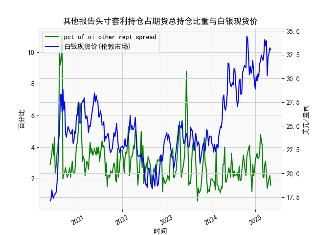

|            |   其他报告头寸套利持仓占期货总持仓比重 |   白银现货价 |
|:-----------|---------------------------------------:|-------------:|
| 2024-12-24 |                                    2.4 |       29.48  |
| 2024-12-31 |                                    3.2 |       28.905 |
| 2025-01-07 |                                    3.4 |       30.235 |
| 2025-01-14 |                                    3.6 |       29.735 |
| 2025-01-21 |                                    3.3 |       30.485 |
| 2025-01-28 |                                    3.3 |       30.15  |
| 2025-02-04 |                                    3.6 |       31.595 |
| 2025-02-11 |                                    4.8 |       31.73  |
| 2025-02-18 |                                    4.5 |       32.46  |
| 2025-02-25 |                                    4.1 |       32.145 |
| 2025-03-04 |                                    2.1 |       31.905 |
| 2025-03-11 |                                    2.1 |       32.55  |
| 2025-03-18 |                                    2.9 |       34.085 |
| 2025-03-25 |                                    3.1 |       33.435 |
| 2025-04-01 |                                    2.1 |       33.97  |
| 2025-04-08 |                                    1.4 |       30.315 |
| 2025-04-15 |                                    1.8 |       32.31  |
| 2025-04-22 |                                    2   |       32.61  |
| 2025-04-29 |                                    2.2 |       33.225 |
| 2025-05-06 |                                    1.6 |       33.025 |

### 1. 其他报告头寸套利持仓占比与白银现货价的相关性及影响逻辑  
**相关性分析**：  
从数据来看，套利持仓占比与白银现货价呈现**阶段性负相关性**，但长期趋势并不完全一致。例如：  
- **2020年7月**：套利持仓占比飙升至10%-11%，同期白银现货价从23美元/盎司快速冲高至28美元/盎司，随后占比回落时白银价格也出现回调。  
- **2023年11月至今**：套利持仓占比持续低于3%，白银价格则从22美元上涨至34美元附近，显示投机情绪主导市场时套利活动减少。  

**影响逻辑**：  
- **套利持仓占比高**：表明机构或专业投资者通过期现套利、跨期套利等策略锁定价差，通常出现在市场波动较大或价格偏离基本面时。此时白银价格可能因套利资金平仓而回归合理区间，短期抑制单边波动。  
- **套利持仓占比低**：反映市场以投机性头寸为主，价格易受情绪（如通胀预期、地缘风险）推动，波动加剧。例如2023年四季度套利持仓占比低于2%，白银价格因避险需求持续上涨。  

---

### 2. 近期投资机会分析（聚焦最近一个月数据变化）  
#### **关键数据变化**：  
- **套利持仓占比**：最近一个月（2024年5月7日-6月4日）占比从**1.6%小幅回升至2.2%**，但本周（6月4日）回落至1.6%，显示套利资金短暂进场后再度离场，市场仍由投机主导。  
- **白银现货价**：同期价格从**30.9美元/盎司升至34.085美元**，本周小幅回调至33.97美元，但整体维持高位震荡。  

#### **潜在机会**：  
1. **短期回调风险**：  
   - 本周套利持仓占比回落至1.6%，叠加白银价格接近34美元关键阻力位（2023年12月高点），可能面临技术性抛压。  
   - 若下周套利占比未显著回升，需警惕投机资金获利了结导致的价格回调。  

2. **中长期看涨逻辑**：  
   - 白银工业需求（新能源、光伏）和避险属性（地缘冲突、美元走弱）支撑长期价格。  
   - 若套利持仓占比持续低于2%，表明投机情绪未退潮，回调后或吸引更多买盘入场。  

3. **套利窗口机会**：  
   - 若套利持仓占比短期内快速回升至3%以上（如2024年5月21日的3.9%），可能预示期现价差扩大，可关注跨期或跨市场套利机会。  

#### **操作建议**：  
- **激进策略**：若价格回调至32-33美元区间且套利持仓未明显回升，可逢低布局多单。  
- **保守策略**：等待套利持仓占比回升至2.5%以上，确认市场波动率下降后介入。