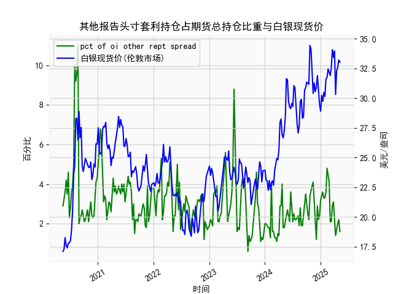

|            |   人民币汇率 |   美元指数 |
|:-----------|-------------:|-----------:|
| 2025-04-14 |       7.211  |    99.692  |
| 2025-04-15 |       7.2096 |   100.167  |
| 2025-04-16 |       7.2133 |    99.2667 |
| 2025-04-17 |       7.2085 |    99.424  |
| 2025-04-18 |       7.2069 |    99.2286 |
| 2025-04-21 |       7.2055 |    98.3518 |
| 2025-04-22 |       7.2074 |    98.9757 |
| 2025-04-23 |       7.2116 |    99.9096 |
| 2025-04-24 |       7.2098 |    99.288  |
| 2025-04-25 |       7.2066 |    99.5836 |
| 2025-04-28 |       7.2043 |    98.9357 |
| 2025-04-29 |       7.2029 |    99.21   |
| 2025-04-30 |       7.2014 |    99.6403 |
| 2025-05-06 |       7.2008 |    99.2654 |
| 2025-05-07 |       7.2005 |    99.9006 |
| 2025-05-08 |       7.2073 |   100.633  |
| 2025-05-09 |       7.2095 |   100.422  |
| 2025-05-12 |       7.2066 |   101.814  |
| 2025-05-13 |       7.1991 |   100.983  |
| 2025-05-14 |       7.1956 |   101.066  |

### 1. 人民币汇率与美元指数的相关性及影响逻辑

#### **负相关性的核心逻辑**
人民币汇率（直接标价法：1美元兑人民币）与美元指数（DXY）通常呈现**负相关性**，逻辑如下：
- **美元指数走强**：当美元指数上涨（美元对一篮子货币升值），人民币对美元汇率倾向于**贬值**（数值上升），因美元强势会通过“货币篮子联动”和“资本流动”传导压力。
- **美元指数走弱**：当美元指数下跌（美元贬值），人民币可能被动**升值**（汇率数值下降），尤其是当中国央行未干预时。

#### **影响逻辑的细化**
1. **货币篮子机制**：人民币汇率参考一篮子货币（美元占比约20%），美元指数的波动会通过欧元（占比57.6%）、日元（13.6%）等成分货币间接影响人民币。
2. **资本流动**：美元走强可能引发新兴市场资本回流美国，导致人民币资产抛售压力；反之，美元走弱可能推动资本流入人民币资产。
3. **政策干预**：中国央行通过中间价引导、外汇储备调节等手段可阶段性打破相关性（如2023年美元指数与人民币汇率短暂背离）。

---

### 2. 近期投资机会分析（聚焦最近一周）

#### **数据关键变化（假设今日为2025年5月14日）**
- **人民币汇率**：
  - **昨日（5月13日）**：7.1991  
  - **今日（5月14日）**：7.1956（**升值34点**，幅度0.05%）
  - **一周趋势**：从7.2055（5月7日）到7.1956，累计升值0.14%，显示短期走强。

- **美元指数**：
  - **昨日（5月13日）**：100.9827  
  - **今日（5月14日）**：101.0655（**微涨0.08%**）
  - **一周趋势**：从103.3986（5月7日）到101.0655，累计下跌2.26%，显示美元疲软。

#### **投资机会判断**
1. **短期人民币多头策略**：
   - **逻辑**：美元指数持续走弱（一周跌幅超2%），叠加人民币单日升值，可能吸引套利资金押注人民币延续反弹。
   - **操作**：做多离岸人民币（CNH）或相关ETF（如CYB），关注中间价是否释放政策支持信号。

2. **出口型股票风险对冲**：
   - **逻辑**：人民币短期升值可能压制出口企业利润（如电子、纺织），需警惕相关板块（如中概股）回调风险。
   - **操作**：通过外汇远期合约锁定汇率，或减持对汇率敏感的出口股。

3. **大宗商品联动机会**：
   - **逻辑**：美元走弱通常利好以美元计价的大宗商品（如黄金、原油），而人民币升值会进一步降低国内进口成本。
   - **标的**：布伦特原油期货（BZ）、黄金期货（GC）及A股能源板块（如中海油、中石化）。

4. **债券市场套息交易**：
   - **逻辑**：人民币升值预期可能吸引外资增持中国国债（中美利差收窄至1.5%），尤其是10年期国债。
   - **风险**：需关注美联储降息预期变化及中国通胀数据。

5. **波动率交易**：
   - **逻辑**：美元指数与人民币汇率短期背离（美元微涨、人民币升值），可能反映市场对中美政策分化的定价分歧。
   - **操作**：买入人民币汇率波动率期权（如港交所USD/CNH期权），押注政策干预或数据超预期。

---

### **风险提示**
- **政策干预**：中国央行可能通过逆周期因子抑制单边波动，需警惕日内反转。
- **美国通胀数据**：若本周公布的美国CPI超预期，可能逆转美元跌势，压制人民币升值空间。
- **地缘政治**：台海、南海局势若升温，可能引发避险资金回流美元，打破当前趋势。